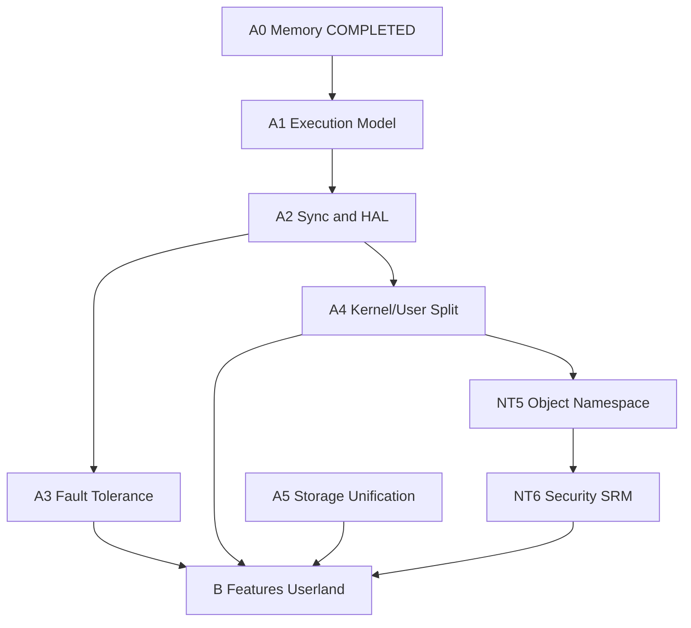

# NeoDOS — Roadmap v3.0 (NT Alignment + Features)

> Versión actual: v0.28.0 (329 kernel tests + 5 user-mode binaries).
> Objetivo: v1.0 — executive NT-like arquitectónicamente sólido.
> Fuente de verdad arquitectónica: [ARCHITECTURE_SOURCE_OF_TRUTH.md](ARCHITECTURE_SOURCE_OF_TRUTH.md)
> Análisis NT: [nt_alignment_analysis.md](nt_alignment_analysis.md)
> Última revisión: Junio 2026.

**Progreso:** 89 / ~130 items completados. Próximo milestone: **A1.5** (Thread model) — desbloquea APC, SEH y SMP.

---

## Reglas de ejecución

1. Una fase no empieza hasta que sus prerequisitos estén marcados **[COMPLETED]**.
2. Cada item pendiente incluye: ID, equivalente NT, archivos, prereqs, criterio de aceptación, tests.
3. Al completar un item: moverlo a COMPLETED, actualizar `CHANGELOG.md`, `AGENTS.md` y `ARCHITECTURE_SOURCE_OF_TRUTH.md` si cambia un contrato.
4. Validar antes de cerrar: `cargo build` en `neodos-kernel/` + `python3 scripts/auto_test.py` + `scripts/check_deps.py`.

### Checklist por item completado

- [ ] Código implementado
- [ ] Tests en `testing.rs` (mínimo 1 por invariante)
- [ ] `auto_test.py` pasa
- [ ] `check_deps.py` pasa
- [ ] `CHANGELOG.md` actualizado
- [ ] `AGENTS.md` / `ARCHITECTURE_SOURCE_OF_TRUTH.md` si cambia contrato

---

## COMPLETED (88 items)

### Boot & Core Kernel
1. **x86_64 boot** — entry `_start` en 0x200000, long mode vía UEFI bootloader.
2. **GDT/IDT/PIC** — segmentos Ring 0/3, IDT 256 entradas, PIC remapeado IRQ 32–47.
3. **Identity paging 4 GiB** — páginas enormes 2 MB, identidad hasta 4 GB.
4. **Heap allocator** — 16 MB @ 0x1000000, `linked_list_allocator`, Box/Vec/String.
5. **A3. Kernel slab allocator** — 9 size classes (8B–2KB), O(1) alloc/free via per-slot free lists on 4 KB slab pages. Uses `hal::alloc_page()` for page allocation. Falls through to linked-list allocator for >2 KB or >16-byte alignment. 9 self-tests.
6. **A2. Scheduler prioritario** — 4 niveles de prioridad (HIGH/ABOVE_NORMAL/NORMAL/IDLE), time-slicing dinámico (400/200/100/50 ticks), preemption desde Ring 3, aging cada 100 ticks para evitar starvation. 7 tests. Total: 255 tests.
7. **A5. Global page cache (base)** — `buffer/page_cache.rs`: central 4 KB page cache (512 entries × 4 KB = 2 MB) for filesystem file data I/O and mmap file-backed pages. LRU eviction with dirty write-back. Indexed by `(inode, block_num)` with stored `data_lba` for safe flush. Timer-driven flush via `NEED_PAGE_CACHE_FLUSH`. 8 unit tests. Total: 245 tests.
8. **PS/2 keyboard driver** — IRQ1, ring-buffer lock-free 1024 bytes.
9. **Serial console** — COM1, `serial_print!`/`serial_println!`.
10. **Framebuffer console** — GOP 1280×800, font VGA 8×16, `println!`.
11. **X1. Kernel Object Manager (KOBJ)** — `src/kobj/mod.rs`: unified kernel object system with reference counting and common metadata. 64-slot registry, KObjType enum. 8 unit tests.
12. **X5. Deferred work queues** — `src/work_queue.rs`: bottom-half system for deferred execution outside IRQ context. Two-level architecture (high/low priority). Lock-free SPSC ring buffer (64 slots per level). 6 tests.
13. **X6. Async I/O (IRP system)** — `src/irp/mod.rs`: unified I/O Request Packet model. Global 64-slot pool, `IrpQueue` per-device (32 entries), completion callbacks via work queue, scheduler integration. 11 tests. Total: 284 tests.
14. **V1. Global page cache (advanced)** — `src/buffer/page_cache.rs`: hash map O(1) index for `(inode, block_num)` lookups. LRU doubly-linked list for O(1) access updates. Adaptive readahead. 13 tests.
15. **MSI/MSI-X** — `src/interrupts/msi.rs` (232 lines): MSI and MSI-X interrupt support. Direct mode (kernel port I/O) and Delegated mode (Event Bus to `pci.nem`). 256-entry vector allocator. Dynamic IDT dispatch via `msi_dispatch`. Integrated with PCI and NVMe.
16. **C3. HPET / APIC timers** — `src/timers/hpet.rs`, `src/timers/apic.rs`: HPET 1 KHz periodic mode with legacy replacement to IRQ0. Local APIC timer calibrated against HPET, activated as primary source. APIC mode disables HPET legacy replacement and masks PIC IRQ0. Fallback to PIT 18.2 Hz. `sleep_hint()` uses HPET counter. 320 kernel tests.

### Storage
17. **P1. Default file permissions by context** — `NeoDosFs::default_perms_for_filename()` asigna permisos RWXSD según extensión.
18. **ATA PIO driver** — read/write por puertos 0x1F0/0x3F6.
19. **AHCI driver** — DMA polling, PRDT scatter-gather, ATA + ATAPI.
20. **ATA bus-master DMA** — PCI BAR4, buffers alineados, hasta 8 sectores.
21. **NeoFS** — filesystem propio: inodos 256 B, bloques 4 KB, timestamps, permisos, directorios, 75 tests.
22. **FAT32 read** — lectura de sector absoluto desde ESP.
23. **GPT partition parsing** — detecta partición NeoDOS por UUID.
24. **Unified GPT disk image** — `disk_image.img` (ESP FAT32 + NeoDOS FS).
25. **VFS layer** — `FileSystem` trait, `resolve_path()`, FAT32 + NeoDOS + ISO9660.
26. **ISO9660 read** — driver completo con PVD, extent cache, Joliet.
27. **BlockDevice abstraction** — `BlockDevice` trait, `StorageManager` unifica ATA/AHCI.
28. **NVMe driver** — `src/drivers/nvme.rs` (837 lines): NVMe block driver as kernel built-in. PCI detection (class 0x01, subclass 0x08, prog-if 0x02). Admin Queue + I/O Queues with doorbell registers. NVM Read/Write with PRP scatter-gather. Integrated as highest boot priority: NVMe > BootAhci > BootAta.

### Drivers & Dispositivos
29. **Module ABI v0 (.NDM)** — header 64 bytes, kernel service table, LOAD command.
30. **NEM module** — NeoDOS Driver Format v1, 6 tipos, 14 tests parse.
31. **RTC driver** — CMOS RTC, get_datetime(), usado por DATE/TIME.
32. **ACPI driver** — NEM v3 standalone ACPI poweroff driver. PCI PIIX4/ICH9 LPC bridge detection. PM1a SLP_TYP_S5 shutdown. `EVENT_SHUTDOWN` event bus constant.
33. **HAL ABI v0.3** — 26 primitives `extern "C"` (CPU, port I/O, page mem, IRQ, timers).
34. **Device Model + HAL Binding** — 32-slot registry, handles opacos, 5 boot devices.
35. **Event Bus v2** — Dual priority queues (high 16 + normal 64), subscription filters, dynamic payload, backpressure. 17 tests.
36. **Driver Runtime** — DriverInstance con ID/nombre/estado/contadores, built-in callbacks.
37. **NDREG / LOADNEM / NEMLIST** — driver registry CLI.
38. **Driver Certification Pipeline v1** — estado Loaded→Initialized→Registered→Bound→Active, state machine con transiciones estrictas. 21 tests.
39. **A4. Memory-mapped files** — `MmapRegion` + VMA list per-process, sys_mmap lazy (RAX=19), sys_munmap (RAX=20). 6 tests.
40. **S2. IPC / Pipes** — `src/pipe.rs`: PipeManager con 16 buffers de 4 KB. Per-process handle table dinámico. Syscalls: `sys_pipe` (RAX=5), `sys_dup2` (RAX=6). Blocking reads via `ProcessState::Blocked`. 13 tests.
41. **S7. Process exit: full cleanup** — `Scheduler::recycle_terminated(pid)` + `cleanup_terminated_process()` reciclan slot y liberan kernel stack.
42. **S5. FSCK utility** — `src/fs/fsck.rs`: superblock, inode table, directory tree validation + repair. 6 tests.
43. **BDL1. NEM v2 ABI fields** — NEM v2 48-byte header with ABI validation fields, driver category, 16-byte name. 9 tests.
44. **BDL2. Boot Driver Loader System** — auto scanning and loading of .nem drivers from `C:\SYSTEM\DRIVERS\BOOT\` and `C:\SYSTEM\DRIVERS\SYSTEM\`. 8 tests.
45. **BDL3. Driver Instance extended** — `DriverCategory`, ABI fields in `DriverInstance`. `register_ext()`.
46. **BDL4. ABI Validation Policy** — validate_abi() checks ABI compatibility window. Boot/System require v2 format.
47. **BDL5. Rust reference .nem drivers** — PS/2 keyboard, framebuffer, storage reference implementations. 32 tests.
48. **BDL6. NDREG updated** — LIST/SHOW display category and ABI range. RUNTIME snapshot.
49. **BDL7. NEM v3 standalone serial driver** — UART 16550A, IRQ4, EVENT_SERIAL_DATA. Dispatch-by-event-type fix.
50. **BDL8. NEM ps2kbd layout switching** — KEYB US|SP via EVENT_KEYB_LAYOUT (type 9).
51. **W1. ABI negotiation layer** — `AbiVersion` struct, `NegotiationResult`, negotiate() with window overlap check. 10 tests.
52. **W4. Driver dependency resolver** — `DependencyGraph` with topological sort, cycle detection. `__dep_` symbols. 13 tests.
53. **Device Model + TSR removal** — Removed legacy devices/mod.rs and tsr/mod.rs. ~530 lines removed.
54. **X2. Unified handle table** — `src/handle.rs`: unified handle table per-process with HandleEntry types. sys_open returns fd.
55. **PS/2 double-character fix** — Fixed duplicate event bus handler registration for keyboard input.
56. **ACPI NEM poweroff driver** — NEM v3 standalone. EVENT_SHUTDOWN (type 12). POWEROFF/SHUTDOWN command.
57. **PCI NEM driver** — `drivers/pci/` NEM v3 (SYSTEM). Logs devices, config read/write via events 0x1000–0x1003.
58. **A10. PCIe bus enumeration** — Recursive bridge detection, secondary bus scanning. 3 tests.
59. **A6. ATA NEM standalone driver** — `drivers/ata/` NEM v3 (SYSTEM). Primary+secondary channels, NemBlockDevice registration.
60. **A11. AHCI NEM standalone driver** — `drivers/ahci/` NEM v3 (SYSTEM). DMA polling, ATA+ATAPI, PRDT up to 8 entries.
61. **A12. BootAhci kernel stub** — `boot_ahci.rs` early-boot AHCI. Single port, single command slot, 8-sector PRDT.
62. **X3. Capability system** — `src/drivers/caps.rs`: 64-bit capability bitmap per driver (11 flags). Category inheritance. 11 tests.
63. **Demand paging (4 KB)** — frame allocator, split_2mb, heap page fault handler.
64. **sys_brk / sys_mmap** — ajuste program break, asignación zero-filled.
65. **ELF64 loader** — `src/elf.rs`: PT_LOAD segment loading, 7 tests.
66. **User-mode processes** — IRETQ a Ring 3, EXIT_RSP/EXIT_RIP, scheduler add_ring3_process.
67. **Kernel private stacks** — TSS.RSP0 por proceso, actualizado en cada context switch.
68. **Syscall table (INT 0x80)** — 22 syscalls: exit, write, yield, getpid, read, waitpid, open, readfile, writefile, close, chdir, getcwd, brk, mmap, munmap, pipe, dup2, loadlib.
69. **Scheduler blocking** — ProcessState::Blocked, wake_waiters(), idle HLT.
70. **S6. libneodos** — `libneodos/`: standard library para Ring 3 Rust processes. Syscall wrappers via `int 0x80`. IO/FS/Mem modules. `print!`/`println!` macros.
71. **301 kernel self-tests** — 36 suites, comando `test`.
72. **5 user-mode test binaries** — HELLO.BIN, SYSTEST.BIN, FILETEST.BIN, ALLTEST.BIN, TEST.BIN.
73. **Command history** — buffer circular 32, ↑/↓ navegación.
74. **TAB autocomplete** — comandos built-in + archivos del directorio actual.
75. **Keyboard layouts** — KBDUS.klc / KBDSP.klc compilados en build-time.
76. **Shell commands básicos** — HELP, DATE, TIME, VER, DEL, REN, RD, SHUTDOWN, EXIT, LOAD.
77. **S1. Estabilizar syscall ABI** — `SyscallNum` enum, `SyscallError` (16 codes), `err_to_u64()`, `validate_abi()`.
78. **B6b. Shared library system (libneodos DLL)** — libneodos como DLL standalone con `AbiTable`. Slot 0 en `0x1e000000`. Auto-load en PHASE 3.86.
79. **Multi-DLL system** — `sys_loadlib` (RAX=21), `LOADLIB` command. libmath.dll en slot 1 (`0x1e040000`).
80. **X4. Driver Isolation Layer** — `src/drivers/isolation.rs`: 16 MB region (0x30000000–0x31000000), 16 × 1 MB slots. Pointer validation. Sandbox mode. 12 tests.
81. **W2. Hot reload drivers** — `src/drivers/hotreload.rs`: runtime unload/reload. State machine: Active→Unloading→Unloaded→Loaded. EVENT_DRIVER_UNLOAD with timeout. 11 tests. Total: 320 kernel tests.
82. **TEST.EXE — libmath.dll self-test** — `userbin/test/`: LOAD TEST, BASIC ARITHMETIC, EDGE CASES, STRESS TEST (1M iter), DETERMINISM. 320 tests + 5 user binaries.
83. **CPUTEST.BIN — CPU stress test binary** — `userbin/cputest/`: tests CPU arithmetic, loops, and basic instruction throughput. Iterative testing across 100 iterations.
84. **A0.1. Buddy system frame allocator** — `src/memory/buddy.rs`: buddy system de 11 órdenes (4 KB → 4 MB) con free lists O(log n). Bitmap como validación. `alloc_frames(order)`/`free_frames(addr, order)`.
85. **A0.2. Dynamic PHYS_MEM_END** — `MemoryMap { total_phys, highest_page }` detectado del memory map UEFI. Frame allocator soporta >4 GB sin modificar constantes.
86. **A0.3. Dynamic memory layout manager** — `src/memory/layout.rs`: `MemoryLayout { regions: [MemoryRegion; 32] }` con `reserve_region()` dinámico y verificación de solapamientos.
87. **A0.4. Dynamic handle table** — `HandleTable` con `Vec<HandleEntry>` interno. Sin límite fijo. 1024+ handles simultáneos por proceso. Migración transparente.
88. **Architecture Source of Truth** — `docs/ARCHITECTURE_SOURCE_OF_TRUTH.md`: Definición estricta de invariantes y contratos del sistema (Dave Cutler style) para evitar regresiones de diseño.
89. **MCP Server — Kernel Introspection & VFS Analysis** — `scripts/mcp_server/`: MCP protocol server (JSON-RPC 2.0) with 18 tools for AI-assisted kernel debugging, VFS inspection, and architectural validation. Parser offline de NeoDOS FS, NEM v3, ELF64. 3 resources, 3 prompts. `scripts/mcp-server.sh` launcher.

---

## ROADMAP PENDIENTE

> Prioriza deuda técnica estructural (fases A/NT) sobre funcionalidades de usuario (fase B).
> Regla: ninguna feature B se considera hasta que sus prereqs arquitectónicos estén completos.

### Diagrama de dependencias



### Orden de ejecución recomendado (path-to-NT)

1. **A1.5** Threads — base del modelo NT de ejecución
2. **A2.4 + A2.5** IRQL + DPC — reemplaza cli/sti parcial y work queue high-priority
3. **A4.2 + A4.3** Syscall table + ELF validation — seguridad antes de userland
4. **A4.1 + Z1** NeoInit + shell userland — mayor impacto arquitectónico
5. **A4.5** APC — completa el modelo I/O NT
6. **A1.1–A1.4** SMP — seguro con threads + IRQL
7. **A3.x** Fault tolerance + SEH
8. **NT5 → NT6** Object namespace + Security
9. **A5.x** Storage unification
10. **B1–B7** Features userland (paralelizable tras A4.1)

Paralelizable sin bloquear NT core: **A2.1–A2.3** (HAL/PCI), **A5.2** VirtIO.

---

### FASE A1 — Execution Model (NT: Ps/Ke thread scheduler)

El scheduler actual asume monoprocesador y planifica `Process` como unidad única (1 hilo/proceso). NT planifica threads (`KTHREAD`) dentro de contenedores pasivos (`EPROCESS`).

**Orden interno:** A1.5 → A1.1 → A1.2 → A1.3 → A1.4

- [ ] **A1.5. Thread split EPROCESS/KTHREAD** | NT: `EPROCESS`/`KTHREAD` | Prereqs: A0
  - **Archivos:** `src/scheduler/process.rs`, `src/scheduler/thread.rs`, reescritura `src/scheduler.rs`
  - **Descripción:** Separar recursos de proceso de estado de ejecución para implementar el modelo de threads del NT.
    - **EPROCESS:** address space (CR3 per-proceso), handle table global (compartida), access token (stub), thread list (head→doubly-linked threads), exit code, virtual memory manager bookkeeping.
    - **KTHREAD:** contexto CPU independiente (RAX-R15, RSP, RIP, RFLAGS), priority, time slice remaining, APC queue (kernel + user, stub hasta A4.5), kernel stack privado (16 KB), `EPROCESS*` backref, TEB (Thread Environment Block en Ring 3).
    - **Schedule:** `schedule()` itera threads en runqueues per-CPU, no procesos. El mismo proceso puede tener múltiples threads listos simultáneamente. Context switch solo reemplaza `RSP/RIP/RBX/R12-R15/RBP` (callee-saved), no CR3 a menos que salte a proceso diferente (lazy CR3 swap).
    - **Memory sharing:** Múltiples threads del mismo EPROCESS comparten paging structures (PML4), heap, mmap regions. Cada thread tiene su kernel stack aislado para evitar stack overflows entre threads.
  - **Criterio:** 
    - Crear 2 threads en 1 proceso, ambos incrementan contador compartido vía `sys_mmap` anónimo. Preemption alterna entre threads cada 100 ticks.
    - Context switch mide latencia (< 10 µs sin fault).
    - Ambos threads terminan vía `sys_exit(code)`, EPROCESS se recicla solo cuando ÚLTIMO thread sale.
  - **Tests:** `thread_create`, `thread_join`, `shared_cr3_heap`, `independent_preempt`, `last_thread_exit_reaps`, `thread_env_block`, `kernel_stack_isolation` (7 tests).

- [ ] **A1.1. Per-CPU data structures** | NT: `KPRCB` (Kernel Processor Control Block) | Prereqs: A1.5
  - **Archivos:** `arch/x64/smp.rs`, `src/scheduler/cpu_local.rs`, `arch/x64/msr.rs` (GSBASE)
  - **Descripción:** CPU-local storage via segmento GS para variables críticas sin locks en path rápido.
    - **Estructura KPRCB:** `cpu_id, current_thread, run_queue, slab_caches[9], interrupt_count, work_queue_pending, idle_thread, context_switch_count, timer_tick`.
    - **Acceso vía macro:** `CPU_LOCAL!(cpu_id)` → lectura `GS:[offset]` directo (atomic si aligned). Macro `per_cpu!(cpu_id, var)` asigna slots en orden de compilación.
    - **Inicialización:** BSP (CPU 0) @ PHASE 2.2 asigna una página de 4 KB por potencial CPU (max 16). KPRCB colocado en offset 0. BSP escribe su GSBASE en MSR_GS_BASE (0xC0000101), apunta a su KPRCB. AP startup (APs) en PHASE 1.5 recibe GSBASE @ `AP_KPRCB_PTR` (dirección física compartida), ejecuta `wrmsr MSR_GS_BASE`. Cada AP escribe `cpu_id` en su KPRCB en offset +0.
    - **Run queues:** Per-CPU, no global. Scheduler examina `this_cpu().run_queue` sin lock (FIFO per priority level).
    - **Slab caches:** 9 caches (8B–2KB) per CPU. Path rápido: `alloc_local()` en DISPATCH_LEVEL, solo examina KPRCB local sin spin::Mutex.
  - **Criterio:** 
    - Boot con 4 CPUs (QEMU `-smp 4`), cada CPU reporte `cpu_id()` único sin race.
    - GSBASE msr-locked, acceso simultáneo desde múltiples CPUs a sus propios caches no causa collision.
    - Intel TSC usado como timestamp global para comparaciones cross-CPU.
  - **Tests:** `kprcb_init_all_cpus`, `cpu_id_unique`, `per_cpu_gs_isolation`, `run_queue_per_cpu`, `slab_per_cpu_no_contention` (5 tests).

- [ ] **A1.2. Per-CPU run queues + load balancing** | NT: Load balance scheduling | Prereqs: A1.1
  - **Archivos:** `src/scheduler/mod.rs` (reescritura completa), `src/scheduler/load_balance.rs`, `src/scheduler/cpu_affinity.rs`
  - **Descripción:** Distribuir threads sobre multiple CPUs sin contención de locks globales.
    - **Per-CPU run queues:** Cada CPU tiene 4 colas de prioridad (HIGH, ABOVE_NORMAL, NORMAL, IDLE). `Scheduler` contiene array `[CpuScheduler; MAX_CPU]`. Sin queue global.
    - **Schedule algorítmo:** Cada CPU ejecuta `schedule()` localmente (sin IPI): examina su runqueue de prioridad más alta, extrae hilo. Si cola vacía en TODAS las prioridades, intenta `try_steal()` de otra CPU.
    - **Work stealing:** `try_steal(victim_cpu)` lee (sin lock) el nivel IDLE de `victim_cpu`, intenta CAS para llevar thread a nuestra cola. Busca CPUs en orden round-robin (prev_victim + 1) para distribuir carga.
    - **Load balancing:** Timer cada 100 ticks llama `balance_load()` en cada CPU. Si esta CPU tiene << threads que promedio, señaliza a CPU sobrecargada via `send_ipi(cpu, IPI_RESCHEDULE)` para que re-schedule e intente migraciones.
    - **Thread affinity:** Struct `ThreadAffinity { cpumask: u64, preferred_cpu: u8 }`. `schedule()` respeta afinidad: prioriza preferred_cpu, solo steal si necesario.
    - **Idle handling:** CPU con queues vacías y sin stealable work entra en `HLT` (halt_until_interrupt). Wake-IPI despierta.
  - **Criterio:**
    - 4 threads HIGH priority, 1 por CPU. Median latency enqueue→scheduler < 1 ms.
    - Load spike: 8 threads aparecen súbitamente en CPU 0. Dentro de 10 ms, otras CPUs roban threads vía `try_steal()`. Load se distribuye a CPU 1–3.
    - Thread migration respeta affinity: no cambia CPU sin necesidad.
  - **Tests:** `load_balance_steal_success`, `load_balance_round_robin`, `thread_affinity_respected`, `idle_cpu_halts_then_wakes`, `multi_cpu_latency_fair` (5 tests).

- [ ] **A1.3. Per-CPU slab allocator** | NT: Per-processor lookaside lists | Prereqs: A1.1
  - **Archivos:** `src/slab.rs` (reescritura completa), `src/memory/per_cpu_cache.rs`, integración `src/allocator.rs`
  - **Descripción:** Caches locales por CPU sin spin::Mutex en path crítico, inspirados en lookaside lists de NT.
    - **Estructura:** 9 caches per-CPU (8B, 16B, ..., 2KB). Cada caché contiene up to `BATCH_SIZE=32` objetos pre-asignados. Almacenados en KPRCB via macro `per_cpu!`.
    - **Alloc rápido:** `alloc_local(size)` → sin locks, examina caché local, extrae objeto O(1). Si vacío → `refill_from_global(size)` (con lock de caché global).
    - **Free rápido:** `free_local(ptr, size)` → sin locks, retorna objeto a caché local. Si full → `drain_to_global()` (con lock).
    - **Global pool:** Un caché global compartido (con `spin::Mutex`) mantiene stock. `refill_from_global()` llena lote de CPU-local desde global. `drain_to_global()` devuelve lotes cuando local lleno.
    - **Per-CPU state:** `thread_in_dispatch_level: bool`. Si `true`, `alloc_local`/`free_local` no requieren lock (solo lectura GS). Si `false` (passive level), lock implícito via página compartida (CAS).
    - **Fallback:** >2KB → sigue usando `LockedHeap` (linked_list_allocator).
  - **Criterio:**
    - Single-threaded alloc/free: throughput similar a v0.14 (baseline).
    - 8 CPUs simultáneamente alloqueando 1024 objetos 128B cada uno: throughput 8× esperado vs 1 CPU (lineal scaling). Sin tunelación de locks a global.
    - Stress test: 100k allocs/free/reallocs en 8 CPUs, no deadlock, no memory leak.
  - **Tests:** `per_cpu_slab_alloc_free_concurrent`, `per_cpu_refill_drain_batching`, `slab_scaling_8cpu`, `slab_under_irql_dispatch`, `slab_stress_100k` (5 tests).

- [ ] **A1.4. IPI infrastructure + TLB shootdown** | NT: `KeIpiGenericCall`, TLB invalidation | Prereqs: A1.1, A2.4
  - **Archivos:** `arch/x64/ipi.rs`, `arch/x64/paging.rs` (refactor), `src/hal/ipi.rs`
  - **Descripción:** Inter-Processor Interrupts para mantener coherencia de memoria y TLB entre CPUs.
    - **IPI delivery:** `send_ipi(cpu_mask: u64, vector: u8)` escribe en Local APIC ICR (Interrupt Command Register): bits 56-63 destination, bits 0-7 vector. Delivery mode FIXED (bits 8-10 = 000). Wait para APIC delivery (polling bit 12 "delivery status" hasta 0).
    - **IPI handlers:** IDT entradas 240–252 reservadas para IPIs.
      - `IPI_RESCHEDULE` (vector 240): destino CPU re-ejecuta `schedule()` sin cambiar contexto actual. Usado por load_balance y wake-from-blocked-wait.
      - `IPI_TLB_SHOOTDOWN` (vector 241): invalida rango TLB. Payload: `[start_addr, end_addr, asid?]` en estructura compartida. CPU ejecuta `invlpg` para cada página en rango, envía ACK vía IPI de retorno.
      - `IPI_CALL_FUNCTION` (vector 242): ejecuta función genérica con parámetro. Usado por CPU hotplug, mode change.
    - **TLB coherence:** Cuando CPU modifica page table (munmap, prot change, COW fault), debe invalidar TLB en todas las CPUs que podrían tener la página cached:
      1. Lee `pcb.cr3` (PML4 físico), busca en scheduler todos los EPROCESS con ese CR3.
      2. Para cada EPROCESS, construye bitmask de CPUs actualmente ejecutando threads de ese proceso (from `thread.cpu_id`).
      3. Envía `IPI_TLB_SHOOTDOWN` al bitmask. Espera confirmación (ACK).
      4. `invlpg` local en CPU actual.
    - **Shootdown latency:** Target < 1 ms para invalidar 1 página, < 100 µs para invalidar 1 rango contiguo.
  - **Criterio:**
    - CPU 0 llama `munmap(0x10000000, 4KB)`. Thread en CPU 1 tenía esa página mapeada. Sin IPI, CPU 1 continuaría con caché TLB stale.
    - Con IPI: `send_ipi(1<<1, IPI_TLB_SHOOTDOWN)` → CPU 1 recibe, ejecuta `invlpg(0x10000000)`, responde ACK.
    - Medición: próxima lectura en CPU 1 a esa dirección causaría page fault (esperado) vs cache hit (bug).
  - **Tests:** `ipi_tlb_shootdown_single_page`, `ipi_tlb_shootdown_range_1mb`, `ipi_call_function_all_cpus`, `ipi_ack_timeout_handling`, `ipi_shootdown_latency_sub_100us` (5 tests).

---

### FASE A2 — Sync & HAL (NT: IRQL, HAL, interrupts)

La HAL actual usa solo `cli`/`sti`. NT usa IRQL para priorizar ejecución sin bloquear todas las interrupciones.

- [ ] **A2.4. IRQL framework** | NT: `KeRaiseIrql`/`KeLowerIrql` (Interrupt Request Level) | Prereqs: A1.1
  - **Archivos:** `src/hal/irql.rs`, `src/hal/x64/irql.rs`, integración `arch/x64/idt.rs`
  - **Descripción:** Modelo de priorización de interrupciones sin deshabilitar todas (reemplaza `cli` global).
    - **IRQL levels (per-CPU):** `PASSIVE=0` (user code), `APC=1` (APC delivery), `DISPATCH=2` (DPC delivery + scheduler), `DIRQL=3–11` (device interrupts mapped to vectors 32–40), `HIGH=15` (NMI, machine check).
    - **Storage:** Per-CPU en KPRCB, acceso vía `cpu_local!(current_irql)`. Al raise: almacenar IRQL anterior en stack (para lower anidado).
    - **Semantics:** `raise_irql(new_level)` deshabilita interrupts solo si `new_level > current_irql`. En x86, traduce a `cli` si DIRQL >= 3, nada si APC/DISPATCH. `lower_irql(old_level)` restaura anterior; `sti` si es necesario.
    - **Constraints:** Página fault (INT 14) en IRQL >= DISPATCH es FATAL (bugcheck KI_EXCEPTION_ACCESS_VIOLATION). Holding spin::Mutex implica IRQL >= DISPATCH automáticamente (verificado).
    - **Replazo de `without_interrupts`:** Refactor paths de alloc/free: `without_interrupts` → `raise_irql(DISPATCH)` + `lower_irql`. Spinlock paths += automático IRQL raise.
  - **Criterio:**
    - Código en `raise_irql(DISPATCH)` puede sufrir page fault → kernel panic (INV-14).
    - Código en `raise_irql(APC)` puede recibir INT 14 (page fault), int 32–40 (device IRQs) pero NO INT 33–40 reales (enmascaradas).
    - Spinlock adquirido en PASSIVE automáticamente eleva a DISPATCH; release baja IRQL.
  - **Tests:** `irql_raise_lower_passive_dispatch`, `irql_page_fault_at_dispatch_panics`, `irql_spinlock_implicit_raise`, `irql_nesting_stack`, `irql_preemption_threshold` (5 tests).

- [ ] **A2.5. DPC engine** | NT: `KeInsertQueueDpc`, Deferred Procedure Call | Prereqs: A2.4
  - **Archivos:** `src/dpc/mod.rs`, refactor `src/work_queue.rs`, integración `arch/x64/idt.rs` (DIRQL→DISPATCH transition)
  - **Descripción:** Colas de procedimientos diferidos ejecutadas a DISPATCH_LEVEL, permitiendo IRQ handlers rápidos y ejecución de lógica compleja fuera de contexto de IRQ.
    - **DPC structure:** `{ function: fn(*mut u8), context: *mut u8, queued: bool }`. Máx 128 DPCs pending per-CPU.
    - **Enqueue:** `insert_queue_dpc(dpc, fn, ctx)` → sin locks (IRQL >= DIRQL al llamar desde IRQ). Append a DPC queue per-CPU. Si ya queued, ignorar (upsert).
    - **Dispatch:** Al final de `dirql_handler_exit()` (cuando se baja IRQL de device DIRQL a DISPATCH), chequear si DPC queue tiene items. Si sí: ejecutar todos los DPCs a DISPATCH_LEVEL (interrupts enabled, pero sin device IRQs). `dpc_handler()` itera, ejecuta callbacks, pop de queue.
    - **IRQ integration:** Device IRQ handler (DIRQL=X): minimizar lógica, encolar DPC, return. `dirql_to_dispatch_transition()` ejecuta DPCs antes de permitir reschedule.
    - **Nesting:** DPC puede encolar DPC, pero evitar infinito (contador MAX_DPC_DEPTH=10).
  - **Criterio:**
    - NVMe completion IRQ (DIRQL) encola DPC para wake readers. DPC ejecuta a DISPATCH, envía IPIs, no bloquea IRQ handler.
    - Time from completion a DISPATCH DPC < 100 µs (device DIRQL handling + DPC dispatch).
    - Stress: 100 IRQs generando DPCs cada una, todos ejecutados, no memory leak, no infinite loop.
  - **Tests:** `dpc_enqueue_dispatch_level`, `dpc_irq_to_dispatch_transition`, `dpc_nesting_depth_limit`, `dpc_callback_execution_order`, `dpc_stress_100_irqs` (5 tests).

- [ ] **A2.1. MMIO ECAM PCI config space** | NT: MCFG (PCI Express Config Access Mechanism) | Prereqs: A0
  - **Archivos:** `src/drivers/pci.rs` (refactor kernel boot stub), `src/hal/pci.rs`, integración ACPI
  - **Descripción:** Reemplazar legacy port I/O (0xCF8/0xCFC) con Enhanced Configuration Address Mechanism (ECAM) basado en MMIO para mejor escalabilidad y compatibilidad PCIe.
    - **ECAM addressing:** `ECAM_BASE + (bus << 20) + (dev << 15) + (func << 12) + offset`. Típicamente ECAM_BASE=0xE0000000 (QEMU/SeaBIOS).
    - **ACPI MCFG:** Boot loader lee MCFG table desde ACPI RSDP, extrae base ECAM para cada segmento PCI (típicamente 1 segmento = bus 0–255).
    - **Kernel init:** PHASE 2.3 mapea ECAM region como UC- (Uncacheable) en page tables. Llamada `pci_init_ecam(mcfg_base, segment)` almacena base en global.
    - **API:** `pci_read_config(bus, dev, func, offset, size)` calcula ECAM dirección, lee MMIO (1/2/4 bytes).
    - **Fallback:** Si no ACPI MCFG disponible, usar legacy port I/O (0xCF8/0xCFC), log warning.
    - **Safety:** MMIO read puede tomar 0.1–1 µs. Evitar busy loops.
  - **Criterio:**
    - Leer vendor ID de NVMe @ PCI 0:4:0 vía ECAM → retorna 0x8086 (Intel) ✓
    - Misma lectura vía legacy port I/O → resultado idéntico ✓
    - Detección MCFG desde ACPI → corre sin error en QEMU ✓
  - **Tests:** `ecam_read_match_legacy_pio`, `ecam_mcfg_table_parse`, `ecam_nvme_vendor_id_nvme`, `ecam_fallback_to_pio_if_no_mcfg` (4 tests).

- [ ] **A2.2. IOAPIC + MSI-X como modelo primario** | NT: IOAPIC routing, MSI delivery | Prereqs: A2.1
  - **Archivos:** `src/interrupts/ioapic.rs` (refactor legacy 8259 PIC paths), `src/interrupts/msi.rs` (v2 extension), `src/hal/irq.rs`, integración PCI
  - **Descripción:** Modernizar controlador de interrupciones: IOAPIC como primary, MSI-X como preferred delivery para devices.
    - **IOAPIC init:** Detectar desde ACPI MADT. Típicamente 24 pins (legacy ISA + PCIe). Deshabilitar PIC legacy si IOAPIC presente. Map pines a vectores: ISA 0–15 → 32–47, PCIe 0–7 → 48–55.
    - **ISA interrupts:** UART (COM1) pin 4 → vector 36, RTC pin 8 → vector 40 (shared), etc.
    - **MSI/MSI-X:** Device drivers solicitan vectores vía `irq_alloc_vector(num_vectors)` (pool 56–255). Kernel configura device MSI-X table entry: vector, delivery mode (fixed), dest CPU. Mejor que IOAPIC pin para device escalability.
    - **Vector pool:** Global 256 vectores. 0–31 reserved (exceptions), 32–55 IOAPIC legacy, 56–255 dynamic (MSI/MSI-X).
    - **Disable PIC legacy:** Si IOAPIC presente: escribir OCW2 "EOI" sin esperar INT ACK. PIC queda inactivo.
    - **Edge vs level:** IOAPIC pins pueden configurarse edge-triggered (legacy devices) o level-triggered (PCI). MSI siempre edge.
  - **Criterio:**
    - NVMe MSI-X: 4 completion queues → 4 vectores asignados (64–67). Cada completion dispara vector único.
    - Latency from completion buffer ready a handler ejecución < 10 µs (sin PIC contention).
    - All 4 queues entregan eventos en paralelo sin serialización PIC.
  - **Tests:** `ioapic_init_from_madt`, `msix_nvme_4_queue_allocation`, `msix_vector_delivery_latency`, `ioapic_isa_compat_legacy`, `ioapic_pic_disabled` (5 tests).

- [ ] **A2.3. HAL v0.4 — raw/safe split** | NT: HAL isolation, type-safe CPU primitives | Prereqs: A2.4
  - **Archivos:** `src/hal/raw/` (new), `src/hal/safe/` (new), refactor `src/hal/x64/`, auditoría codebase
  - **Descripción:** Separar responsabilidades HAL: máquina pura (raw asm) vs. abstracciones type-safe para minimizar superficie de audit y evitar scattered inline asm.
    - **`hal::raw` (bare asm):** Funciones con `#[naked]` o inline asm puro:
      - `raw_read_msr(msr_addr: u32) -> u64` — `rdmsr`
      - `raw_write_msr(msr_addr: u32, value: u64)` — `wrmsr`
      - `raw_invpcid(descriptor: &InvpcidDescriptor)` — `invpcid`
      - `raw_halt_until_interrupt() -> !` — `hlt` con loop
      - `raw_read_tsc() -> u64` — `rdtsc`
      - `raw_lgdt(gdt_ptr)`, `raw_lidt(idt_ptr)` — descriptores globales
    - **`hal::safe` (wrappers):** Abstracciones type-safe que wrappean raw:
      - `read_msr<T: Msr>(msr: &T) -> T::Value` — parse bits mediante associated type
      - `write_msr<T: Msr>(msr: &T, val: T::Value)` — validar rangos
      - `read_cr2() -> u64` — page fault linear address (no asm inline)
      - Trait `Msr` define `MSR_GS_BASE`, `MSR_IA32_FEATURE_CONTROL`, etc.
    - **Audit constraint:** `grep -rn "asm!" src/ --exclude-dir=hal/` retorna 0. Todo inline asm confinado.
    - **MSR safety:** Algunos MSRs pueden ser peligrosos (core frequency, virtualization). Trait `Msr` puede marcar como `IsSafe=false`, requiriendo `unsafe` en contextos relevantes.
  - **Criterio:**
    - Lectura MSR_GS_BASE: `let gs_base = read_msr(&msr::GS_BASE);` es type-safe.
    - Cero inline asm outside `hal/`.
    - Refactor `allocator.rs`, `scheduler.rs`, etc. para usar `read_msr()` en lugar de inline.
  - **Tests:** `hal_v04_abi_msr_safe`, `hal_msr_read_write_consistency`, `hal_no_asm_outside_hal_dir`, `hal_cr2_page_fault_addr`, `hal_invpcid_tlb_invalidation` (5 tests).

---

### FASE A3 — Fault Tolerance (NT: Bugcheck, KD, SEH)

El kernel actual no sobrevive a fallos estructurados. Ring 3 mata el proceso en cualquier excepción.

- [ ] **A3.1. Crash dump framework** | NT: `KeBugCheckEx` + memory dump | Prereqs: A0
  - **Archivos:** `src/crash/mod.rs`, `src/crash/dump.rs`, `scripts/crash_analyzer.py`, `src/shell/commands/crash.rs` (admin command)
  - **Descripción:** Infraestructura para capturar y preservar estado del sistema en caso de panic, triple fault, o watchdog timeout.
    - **Dump structure:** 16 KB header + up to 16 MB data (extensible a 64 MB si espacio disponible).
      - Header: `{ magic: [u8; 4], version: u32, timestamp: u64, cause: u32 (panic/triple_fault/watchdog/nmi), param0-3: u64 }`
      - Stack trace: 32 RIP values (return addresses de stack walk)
      - GPRs snapshot: RAX–R15, RSP, RIP, RFLAGS, CR0–4, EFER
      - Scheduler snapshot: current_thread, thread state, all runqueues (per-CPU)
      - Page tables: copy de PML4 + sample PTEs (primeras 10 tablas)
      - Circular trace buffer: last 256 events (alloc/free/syscall/page_fault timestamps)
    - **Capture points:**
      1. `panic!(msg)` en `panic_handler()` → `crash::dump_panic(msg, rip, rsp)`
      2. Triple fault (CPU exception 0) → new `triple_fault_handler` guarda registros antes de reset
      3. Watchdog timeout (A3.3) → NMI handler → `crash::dump_nmi()`
    - **Persistence:** Escritura a:
      - Puerto serie (115200 baud, volcado en tiempo real)
      - Partición NeoDOS crash reserved (sector 0x7000 si presente) — requiere espacio dedicado en imagen
      - RAM crash buffer (16 MB si espacio) — `crash_dump_area` @ 0x0F000000 durante init
    - **Analyzer script:** `crash_analyzer.py` parse dump binario, imprime readable backtrace, registers, memoria.
  - **Criterio:**
    - `panic!("test")` en PHASE 3.7 → dump a serial (visible en QEMU output)
    - Analyzer resuelve RIPs a ñómeros de línea via `kernel.elf` (debug symbols)
    - Stress: crear dump sin additional crash (cero recursion)
  - **Tests:** `crash_dump_panic_capture`, `crash_dump_serialize_deserialize`, `crash_dump_serial_output`, `crash_dump_analyzer_backtrace`, `crash_dump_no_recursion` (5 tests).

- [ ] **A3.2. Kernel debugger (KD)** | NT: WinDbg kernel-mode debugging | Prereqs: A3.1
  - **Archivos:** `src/debugger/mod.rs`, `src/debugger/breakpoint.rs`, `src/debugger/watchpoint.rs`, `src/shell/commands/debug.rs`, `scripts/kd_client.py` (GDB stub adapter)
  - **Descripción:** Debugger de kernel en el mismo kernel (no externa GDB, aunque compatible con GDB protocol via serial).
    - **Breakpoints software:** INT3 (0xCC) instruction replacement. `set_breakpoint(addr)` guarda original byte, escribe 0xCC. `#BP` (INT3) handler chequea si breakpoint registrado, pausa kernel si match.
    - **Breakpoints hardware:** 4 registro DR0–DR3 + DR7 (debug control). `set_hw_breakpoint(addr, type: execute|read|write|readwrite, len: 1/2/4/8)` configura DR7. `#DB` (INT1) handler dispara si DR6 flag match.
    - **Shell commands:**
      - `DEBUG BREAK <addr>` — set INT3 breakpoint
      - `DEBUG UNBREAK <addr>` — remove
      - `DEBUG WATCH <addr> <type: r|w|rw>` — set hardware watchpoint
      - `DEBUG CONTINUE` — resume ejecución (solo légal desde breakpoint)
      - `DEBUG REG` — dump GPRs, CR0–4
      - `DEBUG MEM <addr> <len>` — hex dump memoria
      - `DEBUG STACK <depth=16>` — stack trace
      - `DEBUG SCHED` — dump scheduler state (runqueues, current thread)
    - **GDB protocol (serial):** Implementar GDB remote protocol subset (qSupported, vCont, g/G, m/M, Z/z) para que `gdb kernel.elf -ex 'target remote /dev/ttyUSB0'` funcione.
    - **State:** Global `debugger_state: DebuggerState { breakpoints: [Option<BreakpointInfo>; 8], hw_watchpoints: [DrReg; 4], paused_rip: u64 }`.
  - **Criterio:**
    - Breakpoint en `sys_write` entry. Kernel pausa, shell imprime "Breakpoint at 0xXXXX", espera comando.
    - `DEBUG REG` muestra RAX–R15 en ese punto.
    - `DEBUG CONTINUE` reanuda ejecución (sin panic).
    - Watchpoint en dirección de heap: detiene si algo escribe. Log la instrucción (RIP) que escribió.
  - **Tests:** `kd_breakpoint_set_and_hit`, `kd_breakpoint_invalid_addr`, `kd_watchpoint_write_detect`, `kd_register_snapshot`, `kd_gdb_protocol_qSupported` (5 tests).

- [ ] **A3.3. Watchdog subsystem** | NT: Watchdog timer, NMI | Prereqs: A2 (HPET)
  - **Archivos:** `src/watchdog/mod.rs`, `src/hal/watchdog.rs`, `arch/x64/nmi.rs`, integración `src/timers/hpet.rs`
  - **Descripción:** Detección de kernel hang y recovery automático via watchdog timer y NMI (Non-Maskable Interrupt).
    - **HPET watchdog:** Usar HPET como source. Configurar timeout de 5 segundos. Si no se "pet" (reinicia) el watchdog dentro de ese lapso, HPET genera NMI.
    - **Petting:** `watchdog_pet()` llamado desde timer interrupt handler (cada tick, ~1 ms). Reinicia el contador HPET.
    - **NMI handler:** Nuevo `nmi_handler()` intercepta NMI.
      1. Capture immediate CPU state: RAX–R15, RIP, RSP, CR3, EFER
      2. Call `crash::dump_nmi()` → volcar stack trace, scheduler state, timestamp
      3. Enviar `EVENT_NMI_WATCHDOG` al event bus
      4. Intentar grabar dump a disco (IRP sync a LBA 0x8000)
      5. CPU reset via ACPI o reset port 0x64
    - **Hang detection:** Si scheduler nunca llama `watchdog_pet()` durante 5s, significa que kernel está spinning o deadlocked.
    - **Stats:** Global `watchdog_stats { nmi_count, dump_writes, recoveries }`. `KOBJ WATCHDOG` expone estas métricas.
  - **Criterio:**
    - Infinite loop en scheduler: kernel se cuelga en PHASE 3.8.
    - Después de 5 s: NMI disparado. Dump captura todo. CPU reset.
    - Serial output muestra el dump (legible via analyzer.py).
    - Sin reemplementación de reseteo: TPM reset port (UEFI/ACPI) suficiente para QEMU.
  - **Tests:** `watchdog_pet_resets_counter`, `watchdog_nmi_triggers_after_5s`, `watchdog_dump_on_nmi`, `watchdog_stats_increment`, `watchdog_hang_detection_latency` (5 tests).

- [ ] **A3.4. SEH + exception dispatcher** | NT: `KiDispatchException`, Structured Exception Handling | Prereqs: A1.5, A4.1
  - **Archivos:** `src/exception/mod.rs`, `src/exception/dispatcher.rs`, `arch/x64/idt.rs` (refactor handlers), `libneodos/src/seh.rs`, `libneodos/src/teb.rs` (Thread Environment Block)
  - **Descripción:** Mecanismo unificado para manejar excepciones (faults, traps, aborts) de CPU y entregar a user-mode handlers o panic en kernel.
    - **Ring 0 (kernel):**
      - Divide-by-zero, null deref, stack overflow → `crash::dump_panic()` → serial + reset
      - Page fault → stack trace (A3.2 KD) + analysis
      - GP fault → "invalid instruction" analysis
    - **Ring 3 (userland):**
      - Divide-by-zero → TEB exception handler chain→ user __except block→ continue/abort
      - Access violation (null deref) → handler si registrado
      - Stack overflow → emergency stack para handler
      - Unhandled → process terminates (no kernel panic)
    - **TEB (Thread Environment Block) @ 0x7000:**
      - `{ teb_self: *TEB, process: *EPROCESS, thread: *KTHREAD, exception_list: *ExceptionFrame }`
      - Exception frame chain (linked list): `{ prev_frame, handler_fn, exception_type }`
      - Linker script coloca `__except_handler` stub (thunk) en TEB
    - **User handlers:** `libneodos::sys_set_exception_handler(handler_fn: fn(ExceptionInfo) -> ExceptionAction)`
      - `enum ExceptionAction { Continue, Terminate, ReevaluateFilters }`
      - Handler verifica `exception_type` (DIVIDE_ZERO, ACCESS_VIOLATION, etc.), decide acción
    - **Dispatcher:** `exception_dispatch(exception_type, fault_addr, fault_code)` en `idt.rs`:
      1. Si Ring 0 → `crash::dump()` + panic
      2. Si Ring 3 → `teb_invoke_exception_handler()` con frame chain
      3. Si no handler registrado → `sys_exit(-1)`
  - **Criterio:**
    - User program: `int x = 0; int y = 10 / x;` → exception delivered a handler user (no se termina el proceso)
    - Handler devuelve `Continue` → programa continua normalmente
    - Handler devuelve `Terminate` → proceso sale (con código 1)
    - Null deref sin handler → process kill vía `sys_exit(-1)`, shell sigue viva
  - **Tests:** `seh_divide_zero_caught`, `seh_access_violation_handler`, `seh_unhandled_terminates_process`, `seh_handler_continue_action`, `seh_handler_terminate_action` (5 tests).

---

### FASE A4 — Kernel/User Separation (NT: CSRSS, SSDT, smss.exe)

> **Estado actual (v0.28.0):** `main.rs:346` ejecuta `DosShell::run()` en Ring 0. `ARCHITECTURE_SOURCE_OF_TRUTH.md` describe NeoInit como PID 1 — es el target, no el estado actual.

- [ ] **A4.2. Syscall dispatch table (SSDT)** | NT: Service Descriptor Table | Prereqs: —
  - **Archivos:** `src/syscall.rs` (refactor), `src/syscall/table.rs` (new), `src/syscall/permission.rs` (new)
  - **Descripción:** Centralizar despacho de syscalls en tabla indexada en lugar de match monolítico para mejor escalabilidad y seguridad.
    - **Tabla SSDT:** `[Option<fn(Registers) -> u64>; 256]`. Inicialmente sparse: 22 funciones, resto None.
    - **Macro SYSCALL!:** Sintaxis declarativa para registrar:
      ```rust
      syscall_table! {
          0 => sys_exit,
          1 => sys_write,
          ...
          21 => sys_loadlib,
      }
      ```
      Macro expande a inicializador de array.
    - **Permisos:** Tabla paralela `[SyscallPermission; 256]` con requisitos: `{ caps: u64, ring_min: u8, admin: bool }`.
      - `sys_exit`: ring=3, caps=0, admin=false
      - `sys_ndreg`: ring=0, caps=CAP_ADMIN, admin=true
      - `sys_test`: admin=true (requerido)
    - **Dispatch:** `syscall_dispatch(rax, registers)` → busca `SSDT[rax]`. Si None → `ENOSYS` (-38). Si Some(fn) → chequea permiso, ejecuta, retorna.
    - **Boot validation:** `validate_abi()` (A1.0 completo) ahora único check: iterar SSDT, verificar 0..MAX_SYSCALL tienen entradas, permisos consisten.
  - **Criterio:**
    - Nueva syscall RAX=50: añadir 1 línea en `syscall_table!`, 1 entry en permission table.
    - Syscall desconocida (RAX=99) → ENOSYS, no panic.
    - Admin syscall sin admin token → EPERM (-13)
  - **Tests:** `syscall_table_sparse_dispatch`, `syscall_permission_admin_check`, `syscall_enosys_unknown`, `syscall_table_validation_boot`, `syscall_add_new_easy` (5 tests).

- [ ] **A4.3. ELF loader con validación de rangos** | NT: Loader security checks | Prereqs: A0.3
  - **Archivos:** `src/elf.rs` (refactor), `src/scheduler/address_space.rs` (new), `src/shell/commands/run.rs`
  - **Descripción:** Validación rigurosa de segmentos ELF para prevenir exploits via ELF malicioso.
    - **Checks en `load_elf_segment()`:**
      1. **Rango válido:** `p_vaddr >= USER_BASE (0x400000) && p_vaddr + p_memsz <= USER_WINDOW_END (0x800000)`. Rechazar si fuera de ventana.
      2. **Prohibir válido=0:** `p_vaddr != 0` (null pointer dereference exploit). Si vaddr==0 → `EINVAL`.
      3. **Sin solapamientos internos:** Verificar que PT_LOAD segments no se solapan entre sí.
      4. **Sin solapamiento con kernel/heap/mmap:** Mantener `AddressSpace { loaded_segments: Vec<SegmentInfo> }` por EPROCESS. Al cargar ELF, intersectar nueva range con:
         - Kernel image (0x200000–0x400000): ERROR si overlap
         - Kernel heap (0x1000000–0x2000000): ERROR
         - User heap (0x10000000–0x12000000): ERROR
         - mmap region (0x20000000–0x22000000): ERROR
         - DLL region (0x1e000000–0x1e200000): ERROR
         - Driver isolation (0x30000000–0x31000000): ERROR
      5. **Contenedor entrypoint:** Si entry point no está en rango de ningún PT_LOAD → log warning (posible intentional obfuscation pero permitir).
    - **Errores:
      - `ELF_ERR_VADDR_OUT_OF_RANGE (-1)`
      - `ELF_ERR_ZERO_VADDR (-2)`
      - `ELF_ERR_SEGMENT_OVERLAP (-3)`
      - `ELF_ERR_KERNEL_COLLISION (-4)`
      - `ELF_ERR_HEAP_COLLISION (-5)`
      - `ELF_ERR_MMAP_COLLISION (-6)`
  - **Criterio:**
    - ELF malicioso @ 0x1000000 (kernel heap base) → loader rechaza con ELF_ERR_KERNEL_COLLISION, sin triple fault
    - ELF normal carga ok
    - Stats: `DLL LOAD TEST.BIN` imprime validations passed, file size, entrypoint
  - **Tests:** `elf_validation_valid_range`, `elf_reject_zero_vaddr`, `elf_reject_kernel_collision`, `elf_reject_heap_collision`, `elf_reject_mmap_collision`, `elf_malicious_no_triple_fault`, `elf_overlap_segments` (7 tests).

- [ ] **A4.5. APC engine** | NT: Asynchronous Procedure Calls | Prereqs: A1.5, A2.4
  - **Archivos:** `src/apc/mod.rs` (new), refactor `src/irp/mod.rs` (completion callback dispatch), integración `src/syscall.rs` (syscalls A4.5-only)
  - **Descripción:** Colas de procedimientos asincrónicos por thread para entregar resultados de I/O y eventos sin trabajo sync.
    - **APC structure:** `{ function: fn(*mut u8), context: *mut u8, kernel: bool }`
      - **Kernel APC:** Ejecutado a PASSIVE_LEVEL (contexto kernel). Ej: `WorkItem` completion callback.
      - **User APC:** Ejecutado en Ring 3 a PASSIVE_LEVEL antes de retornar de syscall (user-mode execution).
    - **Queues per-thread:**
      - `kernel_apc_queue: VecDeque<ApcEntry>` (up to 64)
      - `user_apc_queue: VecDeque<ApcEntry>` (up to 64)
    - **IRP completion — nueva ruta:**
      1. Device completion handler (DIRQL) encola DPC
      2. DPC (DISPATCH) → llama `irp_complete_with_apc(irp_id, thread_id)`
      3. `irp_complete_with_apc()` localiza thread, –versa si user thread– instancia APC (`function=user_apc_handler, context=irp_result`) en `user_apc_queue`
      4. `syscall_dispatch` retorno → `dispatch_user_apcs()` procesa queue antes de IRETQ
    - **User syscalls nuevos (A4.5):**
      - `sys_wait_alertable` (RAX=40): espera a object, pero despierta si APC encolado. Si APC, despacha + retorna `ALERTED`
      - `sys_sleep_ex` (RAX=41): `sys_yield` pero alertable a APCs
    - **Kernel APC:** Ejecutado en contexto actual (no scheduler), típicamente para limpieza post-I/O.
  - **Criterio:**
    - User thread emite `sys_read` async. Device completion llama `irp_complete_with_apc()`. Thread recibe APC en `sys_wait_alertable` retorno.
    - Stress: 100 IRPs simultáneamente, cada uno encola APC a thread diferente. Todos APCs procesados sin deadlock.
    - Timing: APC encolado a entregado < 1 ms (DISPATCH → PASSIVE transition).
  - **Tests:** `apc_kernel_dispatch_during_cleanup`, `apc_user_alertable_wait_receives`, `apc_queue_overflow_handling`, `irp_completion_dispatches_apc`, `apc_stress_100_concurrent_irps` (5 tests).

#### Boot path migration (A4.1 + Z1 unificados)

Secuencia para migrar de shell Ring 0 a NeoInit + shell userland:

1. Crear `userbin/neoinit/` — supervisor mínimo (spawn, wait, respawn hijos).
2. Crear `userbin/shell/` — portar `DosShell` a libneodos (comandos, history, TAB).
3. PHASE 4: kernel carga `C:\SYSTEM\NEOINIT.BIN`, no `DosShell::run()`.
4. NeoInit lanza shell como hijo; kernel entra idle loop (HLT + work queue + event bus).
5. Syscalls admin (`test`, `ndreg`, `kobj`) requieren `CAP_ADMIN` en access token.

- [ ] **A4.1. Shell como proceso Ring 3** | NT: CSRSS (Client/Server Runtime Subsystem) | Prereqs: A4.2, A4.3
  - **Archivos:** `userbin/shell/` (new Rust project), `src/main.rs` (remoción `DosShell::run()` en PHASE 3.8), nuevas syscalls admin, integración libneodos
  - **Descripción:** Mover shell del kernel (Ring 0) a Ring 3 como proceso normal. Mejora robustez: buffer overflow en shell ≠ kernel panic.
    - **Migrar código:**
      - `src/shell/` → `userbin/shell/src/` (copiar, depender de libneodos)
      - Reemplazar `println!` con libneodos `println!` macro
      - Reemplazar `open/readfile/writefile` directo con `libneodos::fs::File` API
      - IPC keyboard input: nueva syscall `sys_read_console(buf, len)` o usar stdin fd (RAX=4, RBX=0 stdin)
    - **Syscalls admin nuevos:**
      - `sys_test` (RAX=22): ejecuta kernel self-tests. Solo con `CAP_ADMIN`.
      - `sys_ndreg` (RAX=23): driver registry commands. Solo con `CAP_ADMIN`.
      - `sys_kobj` (RAX=24): kernel object manager. Solo con `CAP_ADMIN`.
    - **Access token:** Shell heredará token desde NeoInit. Si NeoInit es PID 1 (admin), shell es admin. Si otra ventana, user.
    - **Error handling:** Shell buffer overflow (stack smash) → process SEGFAULT → kernel marca PID como Terminated, no panic. NeoInit respawn shell.
  - **Criterio:**
    - Shell ejecutándose en Ring 3 PID > 1. `ps` (userbin command) muestra PID/name.
    - Malformed input (`cmd\x00\x00...`) → shell crash → respawn. Kernel sigue vivo.
    - Comando admin sin admin token (`sys_ndreg LIST` desde shell user) → EPERM error message, shell continua.
  - **Tests:** `shell_ring3_spawn_success`, `shell_ring3_admin_requires_cap`, `shell_crash_respawn_noinit`, `shell_input_buffer_overflow_survives`, `shell_parse_malformed_command` (5 tests).

- [ ] **Z1. NeoInit service manager (PID 1)** | NT: `smss.exe` (Session Manager Subsystem) | Prereqs: A4.1
  - **Archivos:** `userbin/neoinit/` (new Rust project), refactor `src/main.rs` (PHASE 3.8 entry), `scripts/create_neodos_image.py` (empaquetado)
  - **Descripción:** Supervisor de servicios de nivel de sistema que gestiona procesos críticos como shell, daemon services, y respawning.
    - **NeoInit responsibilities:**
      1. **Inicio:** Kernel lo carga como ELF @ 0x400000 con argv `["neoinit"]`. Hereda fds: 0=stdin (keyboard), 1=stdout (console), 2=stderr (console).
      2. **Spawn shell:** `sys_spawn("\\SYSTEM\\SHELL.BIN", ...)` → fork + exec (si fork no existe, usar spawn directo). Shell es hijo de NeoInit (PPID=1).
      3. **Respawn children:** Loop `sys_waitpid(-1)` espera cualquier hijo. Si termina: `if child_id == shell_pid { respawn_shell() }`. Otros servicios: respawn si critical, else cleanup.
      4. **Shutdown:** Si NeoInit recibe SIGTERM (A3.4 SEH user exception) o comando shutdown de shell via IPC, escribe final state a NeoFS (`/SYSTEM/.NEOINIT_STATE`).
      5. **Exit:** NeoInit nunca llama `sys_exit()` (INV-10: kernel panic si PID 1 sale).
    - **Service table (NeoInit internal):**
      ```
      services: [{
          name: "shell",
          path: "\\SYSTEM\\SHELL.BIN",
          critical: true,  // respawn siempre
          auto_start: true,
          args: [],
      }]
      ```
      Futuro (B2): leer de `/SYSTEM/SERVICES.CFG` (registry hive).
    - **IPC:** Shell comunica con NeoInit via pipe `\Device\NeoInitPipe` (creado por kernel) para solicitar shutdown elegante.
    - **Debugger:** Si A3.2 KD activo, breakpoint permitido en NeoInit (no afecta shell). Shell crash es independiente.
  - **Criterio:**
    - PHASE 3.8: kernel no ejecuta `DosShell::run()`. Carga `neoinit` en su lugar.
    - `neoinit` spawn shell en Ring 3.
    - Shell termina (crash, exit) → NeoInit detecta via `sys_waitpid(-1)` → respawn automático.
    - Segundo shell funciona sin intervención manual.
    - `neoinit --version` o similar muestra PID 1 running.
  - **Tests:** `neoinit_boot_load_shell`, `neoinit_respawn_shell_on_crash`, `neoinit_waitpid_loop_async`, `neoinit_exit_panics_kernel`, `neoinit_service_table_parse` (5 tests).

- [ ] **A4.4. Input subsystem rediseñado** | NT: ConDrv (Console Driver) | Prereqs: A4.1
  - **Archivos:** `src/input/mod.rs` (reescritura), `src/input/manager.rs` (new), `src/input/vt.rs` (new), integración `arch/x64/idt.rs` (PS/2 delivery)
  - **Descripción:** Sistema de entrada multiplexado soportando múltiples terminales virtuales (VTs) con independencia de input.
    - **Virtual Terminals:** Máx 4 VTs (Alt+F1–F4). Cada VT tiene:
      - Input queue (ring buffer 4 KB) independiente
      - Output buffer (attached framebuffer) independiente
      - Foreground pid (proces que recibe input)
      - Session leader (PID 1 NeoInit es sesion leader de todas)
    - **InputManager structure:**
      ```rust
      struct InputManager {
          vt_queues: [InputQueue; 4],  // 4 KB each
          active_vt: u8,  // 0-3
          vt_pids: [Option<u32>; 4],   // foreground pid per VT
      }
      ```
    - **Keyboard IRQ (PS/2 IRQ1):** Nueva ruta:
      1. IRQ1 handler lee scancode
      2. Convierte a ASCII (KBDUS/KBDSP layout)
      3. Chequea `active_vt`
      4. Inserta en `vt_queues[active_vt]`
      5. Envía event `EVENT_KEYBOARD_INPUT` al event bus (data0 = byte, data1 = vt_num)
    - **VT switching:** Alt+F1 scancode detectado → `InputManager::switch_vt(1)` → `active_vt=0` → framebuffer renderiza VT0, input lo recibe VT0 pid.
    - **sys_read(fd=0, buf, len) stdin:** Bloquea en `vt_queues[active_vt].read()` hasta bytes disponibles.
    - **Fuentes adicionales (paralelizable):** Serial (COM1), USB HID (cuando UHCI/OHCI maduros) → cada fuente puede entregar a `InputManager::push_byte(vt, byte)` independientemente.
  - **Criterio:**
    - Alt+F1: pantalla cambia a VT0, teclado entrega a shell en VT0.
    - Alt+F2: pantalla cambia a VT1 (vacía), input sin proc → silent (no error).
    - Type en VT1, Alt+F1, type en VT0: ambos buffers almacenan independiente.
    - Stress: generar keystrokes rápidos en 4 VTs simultáneamente, ninguno pierde bytes.
  - **Tests:** `input_vt_switch_framebuffer`, `input_vt_independent_queues`, `input_vt_rapid_switching`, `input_4vt_concurrent_stress`, `input_event_bus_dispatch_vt` (5 tests).

---

### FASE A5 — Storage Unification (NT: IoStack)

- [ ] **A5.1. Unified block I/O layer** | NT: IoStack, driver stack | Prereqs: A0
  - **Archivos:** `src/vfs/io.rs` (new), `src/vfs/partition.rs` (new), refactor `src/fs/neofs/`, `src/fs/fat32/`, integración `src/drivers/storage.rs`
  - **Descripción:** Abstracción unificada para I/O de bloques con cache, manejo de particiones y criptografía (futura).
    - **IoStack structure:**
      ```rust
      struct IoStack {
          device: &'static dyn BlockDevice,  // NVMe/AHCI/etc
          partition_info: Option<PartitionInfo>,  // LBA base, size
          cache_level: PageCacheLevel,  // none/l1/l2
          crypto_ctx: Option<CryptoContext>,  // future: AES-XTS
      }
      ```
    - **PartitionInfo:** Resultado de parse GPT/MBR. Almacena: `{ base_lba: u64, sector_count: u64, partition_type: [u8; 16] }`.
    - **API unified:** `iostack_read_sectors(io: &IoStack, lba_offset: u64, sector_count: usize, buf: &mut [u8]) -> Result`
      1. Translate LBA: lba = `partition.base_lba + lba_offset`
      2. Check cache (page cache v1.14): hit → copy
      3. Miss → submit IRP a `io.device.submit_irp()`
      4. Decrypt si crypto activo
      5. Retornar
    - **FAT32 refactor:** Usar `iostack_read_sectors()` en lugar de hardcode `block_device_read()`.
    - **NeoFS refactor:** Usar `iostack_read_sectors()` en lugar de hardcode.
    - **Ventaja:** Agregar nuevo device (VirtIO) o ciphered disk no requiere cambiar FAT32/NeoFS.
  - **Criterio:**
    - FAT32 y NeoFS en mismo disco, lectura de ambos visiá unified `iostack_read_sectors()`.
    - Cache hit ratio identico para ambos (mejora transversal).
    - Stress: 100 reads simultáneamente a FAT32 + NeoFS, sin deadlock, latency uniform.
  - **Tests:** `iostack_fat32_direct_read`, `iostack_neofs_direct_read`, `iostack_shared_cache`, `iostack_partition_offset_correct`, `iostack_uniform_latency` (5 tests).

- [ ] **A5.2. VirtIO block driver** | NT: VirtIO Storport controller | Prereqs: A2.1
  - **Archivos:** `src/drivers/virtio_blk.rs` (new, 400–500 lines), integración `src/drivers/storage.rs`, `src/main.rs` PHASE 3.6 (priority init)
  - **Descripción:** Controlador de bloques VirtIO para máquinas virtuales QEMU/KVM.
    - **PCI detection:** Bus 0, vendor 0x1AF4 (Red Hat), device 0x1001 (VirtIO Block).
    - **Initialization:**
      1. Read BAR0 (MMIO base, typically 0xFEB00000 in QEMU)
      2. Write device status: ACKNOWLEDGE | DRIVER
      3. Allocate virtqueue (queue #0, 32 descriptors)
      4. Write virtqueue address to device
      5. Write device status: DRIVER_OK
    - **I/O path:** `submit_irp(irp)` →
      1. Allocate descriptor slot (round-robin)
      2. Fill: sector_start (u64), sector_count (u32), buffer phys addr
      3. Write available ring index (doorbell)
      4. Poll/interrupt waits completion
      5. Check used ring, collect result, `irp_complete()`
    - **Features:** Legacy/modern VirtIO. Support READ/WRITE/FLUSH/DISCARD commands.
    - **Device priority:** `NVMe > VirtIO > BootAhci > BootAta`. Se prueba en PHASE 3.6.
  - **Criterio:**
    - Arrancar NeoDOS en QEMU desde disco VirtIO (`-drive if=virtio`). Kernel detecta, inicializa, monta FS correctamente.
    - GPT parsing, NeoDOS superblock load, shell boot — todo vía VirtIO.
    - Performance: lectura 1 MB takes < 50 ms (vs 30 ms AHCI, baseline OK).
  - **Tests:** `virtio_pci_detect`, `virtio_virtqueue_init`, `virtio_submit_read_write`, `virtio_boot_load_kernel`, `virtio_gpt_parsing` (5 tests).

- [ ] **A5.3. AHCI NCQ** | NT: Storport Native Command Queuing | Prereqs: A2.2
  - **Archivos:** `src/drivers/boot_ahci.rs` (extend), `src/drivers/ahci/mod.rs` (NEM driver), `src/irp/mod.rs` (tag-based dispatch)
  - **Descripción:** Native Command Queuing en AHCI permite hasta 32 operaciones simultáneas con finalización out-of-order.
    - **Legacy AHCI (v0.14):** Single command slot, operaciones serializadas (issue, poll, complete, issue siguiente). Latency: 1 cmd = 0.1 ms * 32 cmds = 3.2 ms para 32 reads.
    - **NCQ path:**
      1. Host prepara 32 command tables en memoria (FIS buffer per slot).
      2. Escribe descriptores a device:
         - Comando: ATA FPDMA QUEUED READ (0x60) / WRITE (0x61)
         - CDB[0] = code, [1–8] = LBA–48, [9] = COUNT (sectors), [14] = TAG (0–31)
      3. Device acepta hasta 32 cmds sin esperar completaciones.
      4. Device finaliza out-of-order: escribe SActive register (bit = completado), trigger IRQ.
      5. Host lee Successful NCQ Completion Notification (FIS D2H), extrae tag, localiza IRP via tag.
      6. Cada IRP completion genera eventos (IRP_DONE) independientemente.
    - **Tag-based dispatch:** Per-device, map `[Option<IrpId>; 32]` indizado por tag. Al completar, lookup rápido O(1).
    - **Fall back to legacy:** Si device no soporta NCQ (vía IDENTIFY), usar single-command path (v0.14).
  - **Criterio:**
    - 32 read IRPs encolados simultáneamente. Device AHCI completa out-of-order (no esperan serialización).
    - Time to complete 32 reads: ~0.1 ms (paralelo) vs 3.2 ms (serial). ~30x faster.
    - Stress: NCQ bajo carga, sin comando perdido, IRP_DONE count = 32.
  - **Tests:** `ahci_ncq_32_concurrent_dispatch`, `ahci_ncq_tag_based_completion`, `ahci_ncq_fallback_to_legacy`, `ahci_ncq_out_of_order_completion`, `ahci_ncq_stress_load` (5 tests).

---

### FASE NT5 — Object Manager (NT: Ob)

Prereqs: A4.1 (userland no hardcodea `C:`).

- [ ] **NT5.1. Object directory tree** | NT: `\` root object namespace | Prereqs: A4.1
  - **Archivos:** `src/kobj/namespace.rs` (new), refactor `src/kobj/mod.rs` (current flat registry), integración path resolution
  - **Descripción:** Transformar registry KOBJ plano (64 slots) a árbol jerárquico de objetos para escalabilidad y organización.
    - **Structure:**
      ```rust
      struct DirectoryObject {
          name: [u8; 24],
          parent: Option<Box<DirectoryObject>>,  // or Arc<>
          children: BTreeMap<[u8; 24], ObjectRef>,  // sorted by name
          child_dirs: BTreeMap<[u8; 24], Box<DirectoryObject>>,
      }
      
      // Root: \n      // Children: \Device, \DosDevices, \Global, \Ob, \Driver, \FileSystem
      ```
    - **Root `\`:** Creada en boot (PHASE 2.2).
    - **Directorios estándar:**
      - `\Device` — dispositivos (Harddisk0, SerialPort0, ...)
      - `\DosDevices` — drive letters (C:, A:, K:, ...)
      - `\Global` — objetos globales (Event, Mutex, Semaphore)
      - `\Driver` — drivers cargados (ps2kbd, acpi, ahci, ...)
      - `\FileSystem` — mount points (neofs, fat32, iso9660)
      - `\Ob` — objetos de admin (procesos, threads, pipes)
    - **Lookup:** `ob_lookup_path("\Device\Harddisk0\Partition1")` →
      1. Split por \ (tokenize)
      2. Traverse: root → "Device" dir → "Harddisk0" dir → "Partition1" object
      3. Retornar ObjectRef si todo match, error si falta nodo
    - **Name limits:** 24-byte names (UTF-8 encoded). Paths up to 255 chars total.
  - **Criterio:**
    - Crear directorio `\Device\Harddisk0`. Crear hijo `\Device\Harddisk0\Partition1`. Lookup retorna partition object.
    - Lookup path no-existent → error (OB_NOT_FOUND).
    - Rename directorio → actualiza BTreeMap keys.
    - Stress: 1000 objetos en árbol, lookup promedio < 1 ms (BTreeMap log search).
  - **Tests:** `ob_directory_create`, `ob_directory_hierarchy`, `ob_lookup_path_simple`, `ob_lookup_path_nested`, `ob_rename_directory`, `ob_tree_stress_1000_objects` (6 tests).

- [ ] **NT5.2. Symbolic links** | NT: `\DosDevices\C:` → device | Prereqs: NT5.1
  - **Archivos:** `src/kobj/symlink.rs` (new), integración `src/kobj/namespace.rs`
  - **Descripción:** Objetos simbólicos que apuntan a otros objetos o paths.
    - **Symlink structure:** `{ target_path: [u8; 255], normalized: bool }`
    - **Common symlinks:**
      - `\DosDevices\C:` → `\Device\HarddiskVolume0`
      - `\DosDevices\A:` → `\Device\FloppyDrive0`
      - `\DosDevices\K:` → `\Global\KernelView`
      - `\Device\HarddiskVolume0` → `\Device\Harddisk0\Partition1`
    - **Resolving:** `ob_lookup_path()` detecta symlink, sigue target iterativamente. Limit: max 10 saltos (evitar symlink loops).
    - **Creation:** `ob_create_symlink("\DosDevices\C:", "\Device\Harddisk0\Partition1")` almacena target en symlink object.
  - **Criterio:**
    - Crear symlink `\DosDevices\C:` → `\Device\HarddiskVolume0`.
    - Lookup `\DosDevices\C:` resuelve a HarddiskVolume0 object.
    - Symlink loop (A → B → A) detectado, error en paso 11.
  - **Tests:** `ob_symlink_create_simple`, `ob_symlink_resolve_one_level`, `ob_symlink_resolve_chain`, `ob_symlink_loop_detection`, `ob_symlink_invalid_target` (5 tests).

- [ ] **NT5.3. Path resolution API** | NT: `ObpLookupObjectByName`, hardened path walking | Prereqs: NT5.2
  - **Archivos:** `src/kobj/lookup.rs` (new), integración `src/vfs/`, `src/syscall.rs`
  - **Descripción:** Unified API para resolver paths NT-style en el namespace de objetos.
    - **Function:** `ob_lookup_by_path(path: &str, root: Option<&DirObject>) -> Result<ObjectRef, ObError>`
    - **Features:**
      1. **Absolute paths** `\Device\...` — inicio desde root `\`
      2. **Relative paths** (futuro) `Device\...` — desde current directory (per-process, similar a cwd)
      3. **Symlink following** — después de resolver cada componente, si es symlink, sigue target
      4. **Case sensitivity** — typical NT es case-insensitive (comparaciones lowercased)
      5. **Name normalization** — strip trailing backslash, collapse \\—, etc.
    - **Error codes:**
      - `OB_INVALID_PATH` — syntax error (empty component, bad chars)
      - `OB_NOT_FOUND` — component no existe en directorio
      - `OB_SYMLINK_LOOP` — circular symlinks
      - `OB_ACCESS_DENIED` — (A4 + NT6) permisos insuficientes
    - **Cache (opcional A5):** Mantener hash-table de (path_hash, age_timestamp) → ObjectRef. Invalidar al crear/borrar objetos.
  - **Criterio:**
    - Lookup absoluto `\Device\Harddisk0\Partition1` retorna partition object.
    - Lookup via symlink `\DosDevices\C:\FILE.TXT` resuelve C: → partition, luego FILE.TXT en VFS.
    - Performance: cached path lookup < 1 µs, uncached < 100 µs (BTreeMap search).
  - **Tests:** `ob_lookup_absolute_path`, `ob_lookup_relative_path`, `ob_lookup_case_insensitive`, `ob_lookup_symlink_follow`, `ob_lookup_performance_cached` (5 tests).

- [ ] **NT5.4. VFS mount points integration** | NT: `\Device\HarddiskVolume1`, mount namespace | Prereqs: NT5.3
  - **Archivos:** `src/vfs/mount.rs` (new), refactor `src/vfs/mod.rs`, integración `src/shell/` (cmdline parsing C: → ob_lookup)
  - **Descripción:** Integrar VFS con namespace de objetos, permitiendo montar filesystems bajo `\Device` y acceder via paths NT.
    - **Mount point:** Objeto representando un filesystem montado.
      ```rust
      struct MountPoint {
          device_path: [u8; 255],  // \Device\Harddisk0\Partition1
          volume_path: [u8; 255],   // \Device\HarddiskVolume0
          fs_type: FilesystemType,  // NeoFS, FAT32, ISO9660
          root_dir: VfsNode,
      }
      ```
    - **Boot path (PHASE 3.6):**
      1. Detectar particiones via GPT → crear `\Device\Harddisk0`, `\Device\Harddisk0\Partition1` (data), `\Device\Harddisk0\Partition2` (ESP) objects
      2. Parse NeoDOS superblock en Partition1 → crear `\Device\HarddiskVolume0` symlink → Partition1
      3. Mount NeoFS: `vfs_mount("\Device\HarddiskVolume0", &NeoDosFs)` → registra mount point
      4. Create symlink `\DosDevices\C:` → `\Device\HarddiskVolume0`
    - **Path resolution (VFS lookup):** `vfs_open("\DosDevices\C:\SYSTEM\NEOINIT.BIN")` →
      1. Ob lookup `\DosDevices\C:` → symlink → `\Device\HarddiskVolume0`
      2. Lookup `\Device\HarddiskVolume0` → mount point object
      3. VFS decompose path: mount = "/", rest = "SYSTEM/NEOINIT.BIN"
      4. `mount.fs.lookup("SYSTEM/NEOINIT.BIN")` en NeoDOS
      5. Retornar VFS inode
    - **No hardcoding:** Kernel no conoce literal `C:`. Drivers pueden montar `\Device` arbitrariamente, shell resuelve `C:` via Ob lookup.
  - **Criterio:**
    - Boot completo: NeoDOS montado bajo `\Device\HarddiskVolume0`, accesible via `C:` symlink.
    - Shell comando `DIR C:\SYSTEM` resuelve path via Ob namespace → VFS → itera directorios.
    - Añadir segundo filesystem (USB) under `\Device\UsbMass0`, crear `\DosDevices\D:` symlink → acceso instantáneo.
    - No cambiar shell, VFS, drivers.
  - **Tests:** `vfs_mount_create_device_object`, `vfs_mount_dosdevices_symlink`, `vfs_open_via_dos_drive_letter`, `vfs_path_resolution_nested_mounts`, `vfs_mount_multiple_filesystems` (5 tests).

---

### FASE NT6 — Security Reference Monitor (NT: Se)

Prereqs: NT5 (objects need security descriptors).

- [ ] **NT6.1. SID + Access Token** | NT: `TOKEN` | Prereqs: NT5.1
  - **Archivos:** `src/security/token.rs`, `src/security/sid.rs`
  - **Descripción:** Security Identifiers, access token por thread/proceso. Token stub en boot (admin).
  - **Criterio:** Thread hereda token del proceso padre al crear.
  - **Tests:** `token_inherit`, `sid_format`.

- [ ] **NT6.2. ACL/ACE on objects** | NT: `SECURITY_DESCRIPTOR` | Prereqs: NT6.1
  - **Archivos:** `src/security/acl.rs`
  - **Descripción:** Security descriptor en cada KObj. ACEs con SID + access mask.
  - **Criterio:** Object con ACL deniega acceso no autorizado.
  - **Tests:** `acl_deny_access`, `acl_allow_access`.

- [ ] **NT6.3. Access check on open** | NT: `SeAccessCheck` | Prereqs: NT6.2
  - **Archivos:** `src/security/access.rs`, integración `src/syscall.rs`
  - **Descripción:** `sys_open` y handle creation verifican token vs ACL del objeto.
  - **Criterio:** Thread sin permiso recibe `-EACCES` al abrir objeto protegido.
  - **Tests:** `se_access_check_deny`, `se_access_check_allow`.

- [ ] **NT6.4. Admin vs user token** | NT: `SeTokenIsAdmin` | Prereqs: NT6.3
  - **Archivos:** `src/security/token.rs`
  - **Descripción:** Token admin para NeoInit/shell admin. Token user para procesos normales. `CAP_ADMIN` syscalls requieren admin token.
  - **Criterio:** Proceso user no puede invocar `test`/`ndreg`/`kobj`.
  - **Tests:** `se_admin_required`, `se_user_denied_admin_syscall`.

---

### FASE B — Features (userland + servicios)

Prereqs globales: A4.1 mínimo para items userland; NT5/NT6 para items de seguridad.

#### B1. Tracing & Observability

- [ ] **B1.1 Y1. Kernel tracing infrastructure** | Prereqs: A2.4 | Files: `src/trace/mod.rs` | Done when: trace points registrables, buffer circular 4 KB, dump via serial.
- [ ] **B1.2 Y2. NeoTrace system** | Prereqs: B1.1 | Files: `src/shell/commands/neotrace.rs` | Done when: comando `NEOTRACE START/STOP/DUMP` funcional en shell userland.

#### B2. Service Layer

- [ ] **B2.1 Z6. Registry hive database** | NT: `\Registry\Machine\...` | Prereqs: NT5, A5.1 | Files: `src/registry/mod.rs` | Done when: read/write keys via path `\Registry\Machine\System\CurrentControlSet\...`. Hive binario transaccional, no flat `CONFIG.REG`.
- [ ] **B2.2 Z2. Unified resource namespace (URN)** | Prereqs: NT5.3 | Files: `src/urn/mod.rs` | Done when: recursos addressables por URN unificado (device, file, config).
- [ ] **B2.3 Z3. Virtual FS objects (`K:\` drive)** | Prereqs: NT5.4 | Files: `src/vfs/kdrive.rs` | Done when: `K:\` expone objetos kernel (procesos, drivers, stats) como archivos virtuales.

#### B3. Networking

- [ ] **B3.1 D9. Socket API** | Prereqs: A4.1, A4.2 | Files: `src/net/socket.rs`, `src/syscall.rs` | Done when: syscalls RAX 30–39 (socket, bind, listen, accept, connect, send, recv, shutdown).
- [ ] **B3.2 E3. TCP/IP stack** | Prereqs: B3.1 | Files: `src/net/` | Done when: Ethernet, ARP, IPv4, ICMP, UDP, TCP funcional en QEMU `-netdev user`.
- [ ] **B3.3 D8. DHCP client** | Prereqs: B3.2 | Files: `src/net/dhcp.rs` | Done when: obtiene IP automáticamente al boot.
- [ ] **B3.4 D7. NTP client** | Prereqs: B3.2 | Files: `src/net/ntp.rs` | Done when: sincroniza RTC con servidor NTP.

#### B4. Userland Usable System

- [ ] **B4.1 S8. PATH resolution** | Prereqs: A4.1 | Files: `userbin/shell/` | Done when: shell busca `.BIN`/`.COM`/`.EXE` en dirs de PATH.
- [ ] **B4.2 S9. Shell pipes (`|`)** | Prereqs: A4.1, S2 | Files: `userbin/shell/` | Done when: `cmd1 | cmd2` conecta stdout→stdin via pipe.
- [ ] **B4.3 S3. Shell redirection (`>`, `<`, `>>`)** | Prereqs: A4.1 | Files: `userbin/shell/` | Done when: redirect a archivo via dup2.
- [ ] **B4.4 B2. ANSI terminal** | Prereqs: A4.1 | Files: `userbin/shell/`, framebuffer driver | Done when: colores y cursor ANSI en consola.
- [ ] **B4.5 B1. Virtual terminals** | Prereqs: A4.4, B4.4 | Files: `userbin/shell/`, `src/input/` | Done when: Alt+F1–F3 cambia VT activo.
- [ ] **B4.6 B6. NeoEdit text editor** | Prereqs: A4.1, B4.4 | Files: `userbin/neoedit/` | Done when: edit/save `.TXT` via VFS.
- [ ] **B4.7 B6b-v2. Shared library per-process binding** | Prereqs: A1.5, sys_loadlib | Files: `src/elf.rs`, `libneodos/` | Done when: DLL binding per-process, no global slot sharing.
- [ ] **B4.8 B7. NeoTOP** | Prereqs: A4.1, A1.5 | Files: `userbin/neotop/` | Done when: muestra procesos/threads, CPU, memoria en tiempo real.
- [ ] **B4.9 B11. NeoShell scripting (`.BAT`)** | Prereqs: B4.1, B4.2, B4.3 | Files: `userbin/shell/` | Done when: ejecuta scripts `.BAT`/`.CMD` con IF, GOTO, CALL.
- [ ] **B4.10 B12. Compositor 2D** | Prereqs: B4.4, framebuffer | Files: `userbin/compositor/` | Done when: ventanas superpuestas 2D sobre framebuffer.

#### B5. Security

- [ ] **B5.1 U1. Module signature validation** | Prereqs: NT6 | Files: `src/drivers/loader.rs` | Done when: `.nem` sin firma válida rechazado en load.
- [ ] **B5.2 U3. Driver permission enforcement** | Prereqs: NT6.3, B5.1 | Files: `src/drivers/caps.rs` | Done when: caps verificadas contra token + ACL del driver object.
- [ ] **B5.3 U4. Secure boot chain** | Prereqs: B5.1 | Files: `neodos-bootloader/`, `src/boot/secure.rs` | Done when: kernel + drivers verificados antes de ejecutar.

#### B6. Performance

- [ ] **B6.1 V2. Zero-copy pipes** | Prereqs: A4.5, S2 | Files: `src/pipe.rs` | Done when: pipe read/write sin copia kernel intermedia para buffers alineados.
- [ ] **B6.2 V3. Copy-on-write fork** | Prereqs: A1.5 | Files: `src/memory/cow.rs`, `src/syscall.rs` | Done when: `sys_fork` duplica address space con COW pages.
- [ ] **B6.3 X10. Per-CPU allocators** | Prereqs: A1.3 | Ref: cubierto por A1.3 — marcar completado cuando A1.3 lo esté.
- [ ] **B6.4 X8. SMP-safe kernel** | Prereqs: A1.1–A1.4 | Ref: cubierto por A1 — marcar completado cuando A1 lo esté.

#### B7. Experimental

- [ ] **B7.1 E4. Full GUI system** | Prereqs: B4.10 | Files: `userbin/gui/` | Done when: desktop con iconos, menú, ventanas redimensionables.
- [ ] **B7.2 E5. Advanced secure boot (TPM)** | Prereqs: B5.3 | Files: `src/boot/tpm.rs` | Done when: medición PCR + sealed storage.
- [ ] **B7.3 E6. Package manager** | Prereqs: B5.1, A5.1 | Files: `userbin/neopkg/` | Done when: install/remove paquetes `.NPK` firmados.
- [ ] **B7.4 T4. Time-travel debugging** | Prereqs: A3.2, B1.1 | Files: `src/debugger/timetravel.rs` | Done when: replay de trace buffer en debugger.
- [ ] **B7.5 T5. Live kernel patching** | Prereqs: A2.4, A3.2 | Files: `src/patch/mod.rs` | Done when: hot-patch de función kernel sin reboot.
- [ ] **B7.6 T2. Distributed NeoDOS nodes** | Prereqs: B3.2 | Files: `src/cluster/` | Done when: 2 nodos QEMU se descubren y comparten FS read-only.

---

## RESUMEN ARQUITECTÓNICO (Dave Cutler Checklist)

| # | Problema | Fase | NT ref | Estado | Riesgo si no se hace |
|---|----------|------|--------|--------|---------------------|
| 1 | Frame allocator O(n), 4 GB max | A0.1–A0.2 | Mm | Completado | — |
| 2 | Direcciones fijas, solapamiento | A0.3 | Mm | Completado | — |
| 3 | Handle table fijo (16) | A0.4 | Ob handles | Completado | — |
| 4 | Thread model ausente (1 hilo/proceso) | A1.5 | KTHREAD | Pendiente | Sin multithreading, sin APC, sin fork real |
| 5 | Scheduler monoprocesador | A1.1–A1.2 | Ps | Pendiente | No escala a multi-core |
| 6 | Slab allocator lock global | A1.3 | Lookaside | Pendiente | Throughput no escala con CPUs |
| 7 | Sin IPI / TLB shootdown | A1.4 | KeIpi | Pendiente | Data corruption en SMP |
| 8 | IRQL ausente (solo cli/sti) | A2.4 | IRQL | Pendiente | Latencia IRQ, sin DPC real |
| 9 | DPC ausente (work queue parche) | A2.5 | DPC | Pendiente | Completion paths incorrectos |
| 10 | PCI port I/O asume x86 | A2.1 | HAL | Pendiente | No portar a ARM64/RISC-V |
| 11 | PIC legacy como default | A2.2 | IOAPIC | Pendiente | Límite 15 IRQs |
| 12 | HAL mezcla raw y safe | A2.3 | HAL | Pendiente | asm disperso, difícil auditar |
| 13 | Sin crash dump ni recovery | A3.1–A3.3 | Bugcheck | Pendiente | Bugs imposibles de diagnosticar |
| 14 | SEH ausente | A3.4 | SEH | Pendiente | User exceptions = kill |
| 15 | Stack unwinding inexistente | A3.2 | KD | Pendiente | Sin backtrace |
| 16 | Shell en Ring 0 | A4.1 | CSRSS | Pendiente | Bug shell = kernel panic |
| 17 | NeoInit no implementado | Z1 | smss.exe | Pendiente | Doc/código divergen |
| 18 | Syscall dispatch manual | A4.2 | SSDT | Pendiente | Cada syscall = más bugs |
| 19 | ELF loader sin validación | A4.3 | Ldr | Pendiente | Triple fault con binarios maliciosos |
| 20 | APC ausente | A4.5 | APC | Pendiente | I/O completion en contexto incorrecto |
| 21 | Input sin multiplexión | A4.4 | ConDrv | Pendiente | No escalar a múltiples terminales |
| 22 | FAT32 + NeoFS duplicados | A5.1 | IoStack | Pendiente | Doble mantenimiento |
| 23 | Ob flat (no namespace) | NT5 | Ob | Pendiente | Hardcode C:, sin symlinks |
| 24 | SRM ausente | NT6 | Se | Pendiente | Sin control de acceso real |
| 25 | Registry flat | B2.1 Z6 | Cm | Pendiente | Sin config jerárquica transaccional |

---

## Referencias

- [ARCHITECTURE_SOURCE_OF_TRUTH.md](ARCHITECTURE_SOURCE_OF_TRUTH.md) — invariantes MUST/MUST NOT
- [AGENTS.md](../AGENTS.md) — build, test, convenciones de commit
