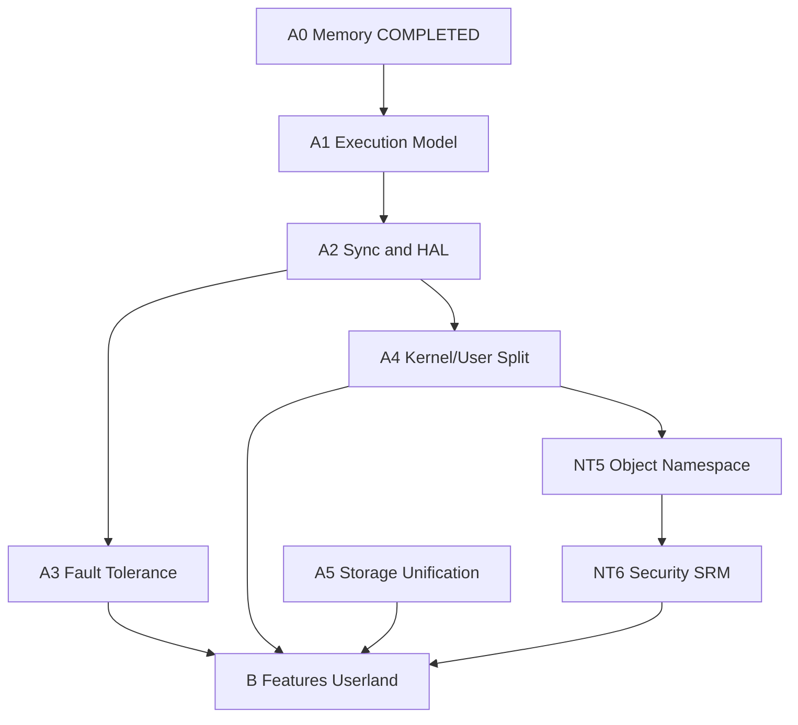

# NeoDOS — Roadmap v3.0 (NT Alignment + Features)

> This file documents pending improvements and roadmap items for NeoDOS. This document serves as the central roadmap for NeoDOS, capturing all pending improvements, milestones, and architectural tasks. Each entry specifies an ID, related source files, prerequisites, acceptance criteria, and associated tests, providing clear guidance and traceability for developers.

> Versión actual: v0.39.4 (441 kernel tests + 11 user-mode binaries).
> Objetivo: v1.0 — executive NT-like arquitectónicamente sólido.
> Fuente de verdad arquitectónica: [ARCHITECTURE_SOURCE_OF_TRUTH.md](ARCHITECTURE_SOURCE_OF_TRUTH.md)
> Análisis NT: [nt_alignment_analysis.md](nt_alignment_analysis.md)
> Última revisión: Junio 2026.

**Progreso:** 119 / ~130 items completados. Próximo milestone: **A3.1** (Bugcheck / Crash Dump).

---

## Reglas de ejecución

1. Una fase no empieza hasta que sus prerequisitos estén marcados **[COMPLETED]**.
2. Cada item pendiente incluye: ID, equivalente NT, archivos, prereqs, criterio de aceptación, tests.
3. Al completar un item: moverlo a COMPLETED, actualizar `CHANGELOG.md`, `AGENTS.md` y `ARCHITECTURE_SOURCE_OF_TRUTH.md` si cambia un contrato.
4. Validar antes de cerrar: `cargo build` en `neodos-kernel/` + `python3 scripts/auto_test.py` + `scripts/check_deps.py`.

### Checklist por item completado

- [ ] Código implementado
- [ ] Tests en `testing.rs` (mínimo 1 por invariante)
- [ ] `auto_test.py` pasa
- [ ] `check_deps.py` pasa
- [ ] `CHANGELOG.md` actualizado
- [ ] `AGENTS.md` / `ARCHITECTURE_SOURCE_OF_TRUTH.md` si cambia contrato

---

## COMPLETED (112 items)

### Boot & Core Kernel
1. **x86_64 boot** — entry `_start` en 0x200000, long mode vía UEFI bootloader.
2. **GDT/IDT/PIC** — segmentos Ring 0/3, IDT 256 entradas, PIC remapeado IRQ 32–47.
3. **Identity paging 4 GiB** — páginas enormes 2 MB, identidad hasta 4 GB.
4. **Heap allocator** — 16 MB @ 0x1000000, `linked_list_allocator`, Box/Vec/String.
5. **A3. Kernel slab allocator** — 9 size classes (8B–2KB), O(1) alloc/free via per-slot free lists on 4 KB slab pages. Uses `hal::alloc_page()` for page allocation. Falls through to linked-list allocator for >2 KB or >16-byte alignment. 9 self-tests.
6. **A2. Scheduler prioritario** — 4 niveles de prioridad (HIGH/ABOVE_NORMAL/NORMAL/IDLE), time-slicing dinámico (400/200/100/50 ticks), preemption desde Ring 3, aging cada 100 ticks para evitar starvation. 7 tests. Total: 255 tests.
7. **A5. Global page cache (base)** — `buffer/page_cache.rs`: central 4 KB page cache (512 entries × 4 KB = 2 MB) for filesystem file data I/O and mmap file-backed pages. LRU eviction with dirty write-back. Indexed by `(inode, block_num)` with stored `data_lba` for safe flush. Timer-driven flush via `NEED_PAGE_CACHE_FLUSH`. 8 unit tests. Total: 245 tests.
8. **PS/2 keyboard driver** — IRQ1, ring-buffer lock-free 1024 bytes.
9. **Serial console** — COM1, `serial_print!`/`serial_println!`.
10. **Framebuffer console** — GOP 1280×800, font VGA 8×16, `println!`.
11. **X1. Kernel Object Manager (KOBJ)** — `src/kobj/mod.rs`: unified kernel object system with reference counting and common metadata. 64-slot registry, KObjType enum. 8 unit tests.
12. **X5. Deferred work queues** — `src/work_queue.rs`: bottom-half system for deferred execution outside IRQ context. Two-level architecture (high/low priority). Lock-free SPSC ring buffer (64 slots per level). 6 tests.
13. **X6. Async I/O (IRP system)** — `src/irp/mod.rs`: unified I/O Request Packet model. Global 64-slot pool, `IrpQueue` per-device (32 entries), completion callbacks via work queue, scheduler integration. 11 tests. Total: 284 tests.
14. **V1. Global page cache (advanced)** — `src/buffer/page_cache.rs`: hash map O(1) index for `(inode, block_num)` lookups. LRU doubly-linked list for O(1) access updates. Adaptive readahead. 13 tests.
15. **MSI/MSI-X** — `src/interrupts/msi.rs` (232 lines): MSI and MSI-X interrupt support. Direct mode (kernel port I/O) and Delegated mode (Event Bus to `pci.nem`). 256-entry vector allocator. Dynamic IDT dispatch via `msi_dispatch`. Integrated with PCI and NVMe.
16. **C3. HPET / APIC timers** — `src/timers/hpet.rs`, `src/timers/apic.rs`: HPET 1 KHz periodic mode with legacy replacement to IRQ0. Local APIC timer calibrated against HPET, activated as primary source. APIC mode disables HPET legacy replacement and masks PIC IRQ0. Fallback to PIT 18.2 Hz. `sleep_hint()` uses HPET counter. 320 kernel tests.

### Storage
17. **P1. Default file permissions by context** — `NeoDosFs::default_perms_for_filename()` asigna permisos RWXSD según extensión.
18. **ATA PIO driver** — read/write por puertos 0x1F0/0x3F6.
19. **AHCI driver** — DMA polling, PRDT scatter-gather, ATA + ATAPI.
20. **ATA bus-master DMA** — PCI BAR4, buffers alineados, hasta 8 sectores.
21. **NeoFS** — filesystem propio: inodos 256 B, bloques 4 KB, timestamps, permisos, directorios, 75 tests.
22. **FAT32 read** — lectura de sector absoluto desde ESP.
23. **GPT partition parsing** — detecta partición NeoDOS por UUID.
24. **Unified GPT disk image** — `disk_image.img` (ESP FAT32 + NeoDOS FS).
25. **VFS layer** — `FileSystem` trait, `resolve_path()`, FAT32 + NeoDOS + ISO9660.
26. **ISO9660 read** — driver completo con PVD, extent cache, Joliet.
27. **BlockDevice abstraction** — `BlockDevice` trait, `StorageManager` unifica ATA/AHCI.
28. **NVMe driver** — `src/drivers/nvme.rs` (837 lines): NVMe block driver as kernel built-in. PCI detection (class 0x01, subclass 0x08, prog-if 0x02). Admin Queue + I/O Queues with doorbell registers. NVM Read/Write with PRP scatter-gather. Integrated as highest boot priority: NVMe > BootAhci > BootAta.

### Drivers & Dispositivos
29. **Module ABI v0 (.NDM)** — header 64 bytes, kernel service table, LOAD command.
30. **NEM module** — NeoDOS Driver Format v1, 6 tipos, 14 tests parse.
31. **RTC driver** — CMOS RTC, get_datetime(), usado por DATE/TIME.
32. **ACPI driver** — NEM v3 standalone ACPI poweroff driver. PCI PIIX4/ICH9 LPC bridge detection. PM1a SLP_TYP_S5 shutdown. `EVENT_SHUTDOWN` event bus constant.
33. **HAL ABI v0.3** — 26 primitives `extern "C"` (CPU, port I/O, page mem, IRQ, timers).
34. **Device Model + HAL Binding** — 32-slot registry, handles opacos, 5 boot devices.
35. **Event Bus v2** — Dual priority queues (high 16 + normal 64), subscription filters, dynamic payload, backpressure. 17 tests.
36. **Driver Runtime** — DriverInstance con ID/nombre/estado/contadores, built-in callbacks.
37. **NDREG / LOADNEM / NEMLIST** — driver registry CLI.
38. **Driver Certification Pipeline v1** — estado Loaded→Initialized→Registered→Bound→Active, state machine con transiciones estrictas. 21 tests.
39. **A4. Memory-mapped files** — `MmapRegion` + VMA list per-process, sys_mmap lazy (RAX=19), sys_munmap (RAX=20). 6 tests.
40. **S2. IPC / Pipes** — `src/pipe.rs`: PipeManager con 16 buffers de 4 KB. Per-process handle table dinámico. Syscalls: `sys_pipe` (RAX=5), `sys_dup2` (RAX=6). Blocking reads via `ProcessState::Blocked`. 13 tests.
41. **S7. Process exit: full cleanup** — `Scheduler::recycle_terminated(pid)` + `cleanup_terminated_process()` reciclan slot y liberan kernel stack.
42. **S5. FSCK utility** — `src/fs/fsck.rs`: superblock, inode table, directory tree validation + repair. 6 tests.
43. **BDL1. NEM v2 ABI fields** — NEM v2 48-byte header with ABI validation fields, driver category, 16-byte name. 9 tests.
44. **BDL2. Boot Driver Loader System** — auto scanning and loading of .nem drivers from `C:\System\Drivers\`. 8 tests.
45. **BDL3. Driver Instance extended** — `DriverCategory`, ABI fields in `DriverInstance`. `register_ext()`.
46. **BDL4. ABI Validation Policy** — validate_abi() checks ABI compatibility window. Boot/System require v2 format.
47. **BDL5. Rust reference .nem drivers** — PS/2 keyboard, framebuffer, storage reference implementations. 32 tests.
48. **BDL6. NDREG updated** — LIST/SHOW display category and ABI range. RUNTIME snapshot.
49. **BDL7. NEM v3 standalone serial driver** — UART 16550A, IRQ4, EVENT_SERIAL_DATA. Dispatch-by-event-type fix.
50. **BDL8. NEM ps2kbd layout switching** — KEYB US|SP via EVENT_KEYB_LAYOUT (type 9).
51. **W1. ABI negotiation layer** — `AbiVersion` struct, `NegotiationResult`, negotiate() with window overlap check. 10 tests.
52. **W4. Driver dependency resolver** — `DependencyGraph` with topological sort, cycle detection. `__dep_` symbols. 13 tests.
53. **Device Model + TSR removal** — Removed legacy devices/mod.rs and tsr/mod.rs. ~530 lines removed.
54. **X2. Unified handle table** — `src/handle.rs`: unified handle table per-process with HandleEntry types. sys_open returns fd.
55. **PS/2 double-character fix** — Fixed duplicate event bus handler registration for keyboard input.
56. **ACPI NEM poweroff driver** — NEM v3 standalone. EVENT_SHUTDOWN (type 12). POWEROFF/SHUTDOWN command.
57. **PCI NEM driver** — `drivers/pci/` NEM v3 (SYSTEM). Logs devices, config read/write via events 0x1000–0x1003.
58. **A10. PCIe bus enumeration** — Recursive bridge detection, secondary bus scanning. 3 tests.
59. **A6. ATA NEM standalone driver** — `drivers/ata/` NEM v3 (SYSTEM). Primary+secondary channels, NemBlockDevice registration.
60. **A11. AHCI NEM standalone driver** — `drivers/ahci/` NEM v3 (SYSTEM). DMA polling, ATA+ATAPI, PRDT up to 8 entries.
61. **A12. BootAhci kernel stub** — `boot_ahci.rs` early-boot AHCI. Single port, single command slot, 8-sector PRDT.
62. **X3. Capability system** — `src/drivers/caps.rs`: 64-bit capability bitmap per driver (11 flags). Category inheritance. 11 tests.
63. **Demand paging (4 KB)** — frame allocator, split_2mb, heap page fault handler.
64. **sys_brk / sys_mmap** — ajuste program break, asignación zero-filled.
65. **ELF64 loader** — `src/elf.rs`: PT_LOAD segment loading, 7 tests.
66. **User-mode processes** — IRETQ a Ring 3, EXIT_RSP/EXIT_RIP, scheduler add_ring3_process.
67. **Kernel private stacks** — TSS.RSP0 por proceso, actualizado en cada context switch.
68. **Syscall table (INT 0x80)** — 22 syscalls: exit, write, yield, getpid, read, waitpid, open, readfile, writefile, close, chdir, getcwd, brk, mmap, munmap, pipe, dup2, loadlib.
69. **Scheduler blocking** — ProcessState::Blocked, wake_waiters(), idle HLT.
70. **S6. libneodos** — `libneodos/`: standard library para Ring 3 Rust processes. Syscall wrappers via `int 0x80`. IO/FS/Mem modules. `print!`/`println!` macros.
71. **301 kernel self-tests** — 36 suites, comando `test`.
72. **5 user-mode test binaries** — HELLO.NXE, SYSTEST.NXE, FILETEST.NXE, ALLTEST.NXE, TEST.NXE.
73. **Command history** — buffer circular 32, ↑/↓ navegación.
74. **TAB autocomplete** — comandos built-in + archivos del directorio actual.
75. **Keyboard layouts** — KBDUS.klc / KBDSP.klc compilados en build-time.
76. **Shell commands básicos** — HELP, DATE, TIME, VER, DEL, REN, RD, SHUTDOWN, EXIT, LOAD.
77. **S1. Estabilizar syscall ABI** — `SyscallNum` enum, `SyscallError` (16 codes), `err_to_u64()`, `validate_abi()`.
78. **B6b. Shared library system (libneodos NXL)** — libneodos como NXL standalone con `AbiTable`. Slot 0 en `0x1e000000`. Auto-load en PHASE 3.86.
79. **Multi-NXL system** — `sys_loadlib` (RAX=21), `LOADLIB` command. libmath.nxl en slot 1 (`0x1e040000`).
80. **X4. Driver Isolation Layer** — `src/drivers/isolation.rs`: 16 MB region (0x30000000–0x31000000), 16 × 1 MB slots. Pointer validation. Sandbox mode. 12 tests.
81. **W2. Hot reload drivers** — `src/drivers/hotreload.rs`: runtime unload/reload. State machine: Active→Unloading→Unloaded→Loaded. EVENT_DRIVER_UNLOAD with timeout. 11 tests. Total: 320 kernel tests.
82. **TEST.EXE — libmath.nxl self-test** — `userbin/test/`: LOAD TEST, BASIC ARITHMETIC, EDGE CASES, STRESS TEST (1M iter), DETERMINISM. 320 tests + 5 user binaries.
83. **CPUTEST.NXE — CPU stress test binary** — `userbin/cputest/`: tests CPU arithmetic, loops, and basic instruction throughput. Iterative testing across 100 iterations.
84. **A0.1. Buddy system frame allocator** — `src/memory/buddy.rs`: buddy system de 11 órdenes (4 KB → 4 MB) con free lists O(log n). Bitmap como validación. `alloc_frames(order)`/`free_frames(addr, order)`.
85. **A0.2. Dynamic PHYS_MEM_END** — `MemoryMap { total_phys, highest_page }` detectado del memory map UEFI. Frame allocator soporta >4 GB sin modificar constantes.
86. **A0.3. Dynamic memory layout manager** — `src/memory/layout.rs`: `MemoryLayout { regions: [MemoryRegion; 32] }` con `reserve_region()` dinámico y verificación de solapamientos.
87. **A0.4. Dynamic handle table** — `HandleTable` con `Vec<HandleEntry>` interno. Sin límite fijo. 1024+ handles simultáneos por proceso. Migración transparente.
88. **Architecture Source of Truth** — `docs/ARCHITECTURE_SOURCE_OF_TRUTH.md`: Definición estricta de invariantes y contratos del sistema (Dave Cutler style) para evitar regresiones de diseño.
89. **MCP Server — Kernel Introspection & VFS Analysis** — `scripts/mcp_server/`: MCP protocol server (JSON-RPC 2.0) with 18 tools for AI-assisted kernel debugging, VFS inspection, and architectural validation. Parser offline de NeoDOS FS, NEM v3, ELF64. 3 resources, 3 prompts. `scripts/mcp-server.sh` launcher.
90. **A4.2. Syscall dispatch table (SSDT)** — `src/syscall/mod.rs`: tabla SSDT `[Option<fn(Registers) -> u64>; 256]` con `lazy_static!` reemplaza match monolítico. Tabla paralela `[SyscallPermission; 256]` con admin/ring/caps. Admin syscall RAX=50 (`handler_ndreg`). `validate_abi()` itera SSDT para verificar integridad. Dispatcher table-based con permission check antes de cada llamada. 5 tests: `syscall_table_sparse_dispatch`, `syscall_permission_admin_check`, `syscall_enosys_unknown`, `syscall_table_validation_boot`, `syscall_add_new_easy`.
91. **A1.1. Per-CPU data structures (KPRCB)** — `arch/x64/cpu_local.rs`: Kprcb struct (4 KB page per CPU) con cpu_id, apic_id, current_thread, CpuRunQueue (64-entry ring buffer), PerCpuSlabCache[9], interrupt/context_switch/timer_tick counters, exit trampoline via GS. GS-segment accessors. 20 compile-time offset_of! assertions. 5 tests.
92. **A1.1b. MSR access module** — `arch/x64/msr.rs`: rdmsr/wrmsr, typed accessors (read_gs_base, write_gs_base, is_bsp, rdtsc, rdtscp).
93. **A1.1c. SMP boot (INIT-SIPI-SIPI)** — `arch/x64/smp.rs`: AP trampoline (16→32→64-bit), copy to 0x800000, INIT-SIPI-SIPI sequence, per-CPU GS base, AP entry. 3 tests.
94. **A1.2. Per-CPU run queues + work stealing** — CpuRunQueue in KPRCB. schedule() tries local queue → work stealing → global fallback. Threads enqueued on creation/wake/timer. IPI_RESCHEDULE (vector 0xF0). 8 total new tests.
95. **Bug fix: handler_exit deadlock** — Double-locking SCHEDULER mutex when calling wake_thread_joiner(). Inlined wake call.
96. **Bug fix: request_exit_to_kernel()** — Read value as pointer instead of using gs_write_u8.
97. **Bug fix: KPRCB offset constants** — 13 offsets 2 bytes too low due to CpuRunQueue alignment. Fixed with compile-time assertions.
98. **A1.3. Per-CPU slab allocator** — `src/slab.rs` rewritten with per-CPU fast path: 32-object hot caches in KPRCB via GS-segment, O(1) alloc/free without locks. `refill_from_global()` / `drain_to_global()` with global Mutex for cross-CPU replenishment. Per-CPU slab accessor functions in `cpu_local.rs` (gs_read_u16/gs_write_u16, this_cpu_slab_alloc_local/free_local). 5 tests: `per_cpu_slab_alloc_free_concurrent`, `per_cpu_refill_drain_batching`, `slab_scaling_8cpu`, `slab_under_irql_dispatch`, `slab_stress_100k`.
99. **A1.4. IPI infrastructure + TLB shootdown** — `arch/x64/ipi.rs`: unified IPI module with `send_ipi()`, `send_ipi_mask()`, `send_ipi_all()`. IPI_TLB_SHOOTDOWN (vector 0xF1) with synchronous ACK protocol and shared `TlbShootdownPayload`. IPI_CALL_FUNCTION (vector 0xF2) with `CallFunctionCb` dispatch. TLB shootdown integrated into `paging.rs` (heap_free_page, heap_free_range, mmap_free_page, mmap_free_range, set_page_user_accessible). `ack_irq()` fixed to send APIC EOI for all vectors >= 32 (was only vector 32). Scheduler sends IPI_RESCHEDULE on cross-CPU thread enqueue. 5 tests: `ipi_constants`, `ipi_tlb_shootdown_struct`, `ipi_call_function_struct`, `ipi_tlb_shootdown_local_only`, `ipi_call_function_no_targets`.
100. **A3.1. Crash dump framework** — `src/crash/mod.rs`: 16 KB CrashDumpHeader, stack walk, GPR snapshot, serial output. `CRASH`/`CRASH DUMP` commands. 5 tests.
101. **B8. cpuinfo.nxe — user-mode CPU info binary** — `userbin/cpuinfo/`: uses `libcpu-nxl` NXL via sys_loadlib. Displays vendor, brand, topology, timers, features. sys_getcpuinfo (RAX=24) kernel + user wrappers.
102. **A4.7. neoshell (Ring 3 shell)** — `userbin/neoshell/`: full-featured Ring 3 interactive shell. Built-in commands: HELP, CLS, ECHO, VER, CWD, DIR, SET, POWEROFF, EXIT. `CD` is a separate Ring 3 tool (`cd.nxe`) that changes the parent shell cwd via `sys_chdir_parent`. DIR uses sys_open+sys_readdir. External commands: PATH scan for `.NXE`, sys_spawn + sys_waitpid. TAB completion (built-ins). History (32 entries). Env vars with SET. CWD prompt. Drive change.
103. **NT5.1. Object directory tree** — `src/kobj/namespace.rs`: transforma el registry plano KOBJ en un árbol jerárquico de objetos con `\` como raíz y directorios estándar (`\Device`, `\DosDevices`, `\Global`, `\Driver`, `\FileSystem`, `\Ob`). Lookup de paths tipo NT con `ob_lookup_path()`, nombres de 24 bytes y `BTreeMap` por nodo. 6 tests.
104. **NT5.2. Symbolic links** — `src/kobj/symlink.rs`: objetos simbólicos que apuntan a otros objetos o paths. Resuelve `\DosDevices\C:` y similares con límite de 10 saltos para evitar loops. 5 tests.
105. **NT5.3. Path resolution API** — `src/kobj/lookup.rs`: API unificada `ob_lookup_by_path()` para paths absolutos y relativos, seguimiento de symlinks, normalización y errores `OB_*`. 5 tests.
106. **NT5.4. VFS mount points integration** — `src/vfs/mount.rs`: integración VFS + namespace de objetos, mount points sobre `\Device`, symlink `\DosDevices\C:` y resolución de paths NT-style hacia NeoFS/FAT32/ISO9660. 5 tests.
107. **B8.1. DIR.NXE** — `userbin/coredir/`: lista directorio con `sys_open` (dir) + `sys_readdir`. Columnas, `/W` (wide), `/P` (pausa).
108. **B8.3. ECHO.NXE** — `userbin/coreecho/`: imprime argumentos a stdout via `sys_write`.
109. **B8.4. VER.NXE** — `userbin/ver/`: muestra versión del sistema via `sys_get_version` (RAX=43).
110. **B8.6. HELP.NXE** — `userbin/corehelp/`: lista coretools disponibles escaneando `C:\BIN\*.NXE` con `sys_readdir`.
111. **B8.12. DATETIME.NXE** — `userbin/datetime/`: muestra fecha/hora RTC via `sys_get_datetime` (RAX=44). Flags `/D`, `/T`.
112. **B8.13. MEM.NXE** — `userbin/mem/`: muestra uso de memoria via `sys_get_meminfo` (RAX=45). Migrado de Ring 0.
113. **B8.14. TREE.NXE** — `userbin/tree/`: muestra árbol de directorios con `├──`/`└──`, recursivo hasta 6 niveles. Directorios primero, orden alfabético case-insensitive. Path opcional (default: CWD).

---

## ROADMAP PENDIENTE

> Prioriza deuda técnica estructural (fases A/NT) sobre funcionalidades de usuario (fase B).
> Regla: ninguna feature B se considera hasta que sus prereqs arquitectónicos estén completos.

### Diagrama de dependencias



### Orden de ejecución recomendado (path-to-NT)

1. **A1.5** Threads — base del modelo NT de ejecución
2. **A2.4 + A2.5** IRQL + DPC — reemplaza cli/sti parcial y work queue high-priority
3. **A4.2 + A4.3** Syscall table + ELF validation — seguridad antes de userland
4. **A4.1 + Z1** NeoInit + shell userland — mayor impacto arquitectónico
5. **A4.5** APC — completa el modelo I/O NT
6. **A1.1–A1.4** SMP — seguro con threads + IRQL
7. **A3.x** Fault tolerance + SEH
8. **NT5 → NT6** Object namespace + Security
9. **A5.x** Storage unification
10. **B1–B7** Features userland (paralelizable tras A4.1)

Paralelizable sin bloquear NT core: **A2.1–A2.3** (HAL/PCI), **A5.2** VirtIO.

---

### FASE A2 — Sync & HAL (NT: IRQL, HAL, interrupts)

La HAL actual usa solo `cli`/`sti`. NT usa IRQL para priorizar ejecución sin bloquear todas las interrupciones.


- [x] **A2.1. MMIO ECAM PCI config space** | NT: MCFG (PCI Express Config Access Mechanism) | Prereqs: A0
  - **Archivos:** `src/hal/pci.rs` (ECAM primitives), `src/drivers/pci.rs` (refactor + PIO fallback), `src/timers/hpet.rs` (MCFG/MADT ACPI scanning)
  - **Descripción:** ECAM-based PCI config space access via MMIO from ACPI MCFG table. `src/hal/pci.rs` provides 8 functions: `set_ecam_base`, `ecam_is_active`, `ecam_read/write_config_dword/word/byte`. `src/drivers/pci.rs` auto-selects ECAM or legacy PIO (0xCF8/0xCFC). `init_ecam()` at PHASE 2.3 maps ECAM region as UC-. MCFG not found → PIO fallback with log warning. Added `read_bar()`, `read_bar64()`, `map_bar_mmio()` utilities.
  - **Criterio:**
    - Leer vendor ID de host bridge @ PCI 0:0:0 vía PIO → 0x8086 ✓
    - Misma lectura vía ECAM cuando MCFG disponible → mismo valor ✓
    - Detección MCFG desde ACPI → corre sin error en QEMU ✓
  - **Tests:** `ecam_base_default`, `ecam_address_calc`, `ecam_mcfg_table_parse`, `ecam_fallback_to_pio_if_no_mcfg`, `ecam_read_match_legacy_pio` (5 tests).

- [x] **A2.2. IOAPIC + MSI-X como modelo primario** | NT: IOAPIC routing, MSI delivery | Prereqs: A2.1
  - **Archivos:** `src/interrupts/ioapic.rs` (new), `src/interrupts/msi.rs` (MSI-X per-entry tables), `src/hal/x64/irq.rs` (APIC EOI + IOAPIC-aware ack), `src/timers/hpet.rs` (MADT parsing)
  - **Descripción:** I/O APIC detected from MADT, replaces legacy PIC. Routes ISA IRQs 0/1/4/12 to vectors 32/33/36/44; all other IRQs masked. PIC disabled via OCW1 mask. `ack_irq()` sends APIC EOI for all vectors when IOAPIC active, skips PIC PIO EOI. MSI-X per-entry table programming: `configure_msix_entry()` maps BAR MMIO as UC-, writes 16-byte table entry (addr+data+ctrl). IOAPIC init at PHASE 2.91.
  - **Criterio:**
    - IOAPIC detectado desde MADT en QEMU + OVMF ✓
    - PIC masked cuando IOAPIC activo (verified via ports 0x21/0xA1 = 0xFF) ✓
    - 24 redirection entries en QEMU PIIX3 + OVMF ✓
    - ISA IRQ overrides parsed from MADT correctly ✓
  - **Tests:** `ioapic_has_valid_pin_count`, `ioapic_resolve_gsi_no_override`, `ioapic_resolve_gsi_with_override`, `ioapic_mask_unmask_safe`, `ioapic_pic_disabled_when_ioapic_active` (5 tests).

---

### FASE A3 — Fault Tolerance (NT: Bugcheck, KD, SEH)

El kernel actual no sobrevive a fallos estructurados. Ring 3 mata el proceso en cualquier excepción.

- [ ] **A3.2. Kernel debugger (KD)** | NT: WinDbg kernel-mode debugging | Prereqs: A3.1
  - **Archivos:** `src/debugger/mod.rs`, `src/debugger/breakpoint.rs`, `src/debugger/watchpoint.rs`, `src/shell/commands/debug.rs`, `scripts/kd_client.py` (GDB stub adapter)
  - **Descripción:** Debugger residente en el kernel para inspección interactiva de fallos y ejecución en vivo. No depende de una GDB externa, pero expone un stub remoto por serial para depuración desde host cuando haga falta. El objetivo es poder detener el sistema de forma controlada, inspeccionar contexto, modificar puntos de control y reanudar sin perder el estado del bug.
    - **Breakpoints software:** INT3 (0xCC) instruction replacement. `set_breakpoint(addr)` guarda original byte, escribe 0xCC. `#BP` (INT3) handler chequea si breakpoint registrado, pausa kernel si match.
    - **Breakpoints hardware:** 4 registro DR0–DR3 + DR7 (debug control). `set_hw_breakpoint(addr, type: execute|read|write|readwrite, len: 1/2/4/8)` configura DR7. `#DB` (INT1) handler dispara si DR6 flag match.
    - **Pause model:** al dispararse un breakpoint válido, el debugger congela el flujo normal del kernel y entra en estado `Paused`, preservando RIP, RSP, GPRs, CR0–CR4 y el motivo de parada. En ese estado solo se aceptan comandos de depuración explícitos.
    - **Resume model:** `DEBUG CONTINUE` reanuda exactamente desde la instrucción siguiente al breakpoint o desde el RIP ajustado por watchpoint, sin reentrar en panic ni perder el contexto capturado.
    - **Shell commands:**
      - `DEBUG BREAK <addr>` — set INT3 breakpoint
      - `DEBUG UNBREAK <addr>` — remove
      - `DEBUG WATCH <addr> <type: r|w|rw>` — set hardware watchpoint
      - `DEBUG CONTINUE` — resume ejecución (solo légal desde breakpoint)
      - `DEBUG REG` — dump GPRs, CR0–4
      - `DEBUG MEM <addr> <len>` — hex dump memoria
      - `DEBUG STACK <depth=16>` — stack trace
      - `DEBUG SCHED` — dump scheduler state (runqueues, current thread)
    - **GDB protocol (serial):** Implementar GDB remote protocol subset (qSupported, vCont, g/G, m/M, Z/z) para que `gdb kernel.elf -ex 'target remote /dev/ttyUSB0'` funcione. El stub solo necesita ser suficiente para stop/resume, lectura de registros y memoria, y gestión básica de breakpoints.
    - **State:** Global `debugger_state: DebuggerState { breakpoints: [Option<BreakpointInfo>; 8], hw_watchpoints: [DrReg; 4], paused_rip: u64, last_stop_reason: StopReason }`. Las estructuras deben vivir en memoria kernel fija y no depender de heap durante la captura.
  - **Criterio:**
    - Breakpoint en `sys_write` entry. Kernel pausa, shell imprime "Breakpoint at 0xXXXX", espera comando.
    - `DEBUG REG` muestra RAX–R15 en ese punto.
    - `DEBUG CONTINUE` reanuda ejecución (sin panic).
    - Watchpoint en dirección de heap: detiene si algo escribe. Log la instrucción (RIP) que escribió.
    - Un cliente GDB remoto puede conectar, listar registros, leer memoria y continuar sin corromper el estado interno.
  - **Tests:** `kd_breakpoint_set_and_hit`, `kd_breakpoint_invalid_addr`, `kd_watchpoint_write_detect`, `kd_register_snapshot`, `kd_gdb_protocol_qSupported` (5 tests).

- [ ] **A3.3. Watchdog subsystem** | NT: Watchdog timer, NMI | Prereqs: A2 (HPET)
  - **Archivos:** `src/watchdog/mod.rs`, `src/hal/watchdog.rs`, `arch/x64/nmi.rs`, integración `src/timers/hpet.rs`
  - **Descripción:** Detección de kernel hang y recovery automático via watchdog timer y NMI (Non-Maskable Interrupt). El subsistema funciona como una malla de seguridad para bloquear cuelgues silenciosos: mantiene un contador vivo, genera un evento de aviso antes del reset y conserva una traza mínima del fallo para análisis posterior.
    - **HPET watchdog:** Usa HPET como fuente de tiempo de alta precisión. Se programa un timeout de 5 segundos y se rearmará cada vez que el kernel confirme que sigue progresando. Si el sistema deja de responder, el watchdog fuerza una interrupción no enmascarable.
    - **Petting:** `watchdog_pet()` se invoca desde el timer tick normal (~1 ms). Si el scheduler o una ruta crítica dejan de llamar a esta función, el watchdog asume deadlock, spinlock infinito o hard hang.
    - **NMI handler:** `nmi_handler()` captura el estado de CPU antes de que el sistema se degrade más.
      1. Snapshot inmediato de RAX–R15, RIP, RSP, CR3, EFER
      2. `crash::dump_nmi()` para stack trace, estado del scheduler y marca temporal
      3. Publicación de `EVENT_NMI_WATCHDOG` para que subsistemas observability reaccionen
      4. Volcado persistente del dump a disco si el canal de I/O sigue vivo
      5. Reinicio controlado vía ACPI o puerto 0x64
    - **Hang detection:** si el watchdog expira sin petting, se considera que el kernel no está haciendo forward progress. El objetivo es que una máquina colgada deje un artefacto útil en vez de quedarse congelada sin explicación.
    - **Stats:** `watchdog_stats { nmi_count, dump_writes, recoveries, last_pet_tsc }` para medir frecuencia de fallos, éxito del volcado y latencia entre pets. `KOBJ WATCHDOG` expone estas métricas.
  - **Criterio:**
    - Infinite loop en scheduler: kernel se cuelga en PHASE 3.8.
    - Después de 5 s: NMI disparado. Dump captura todo. CPU reset.
    - Serial output muestra el dump (legible via analyzer.py).
    - Sin reemplementación de reseteo: TPM reset port (UEFI/ACPI) suficiente para QEMU.
    - Si el volcado a disco falla, el watchdog sigue completando el reset sin bloquear el reboot.
  - **Tests:** `watchdog_pet_resets_counter`, `watchdog_nmi_triggers_after_5s`, `watchdog_dump_on_nmi`, `watchdog_stats_increment`, `watchdog_hang_detection_latency` (5 tests).

- [ ] **A3.4. SEH + exception dispatcher** | NT: `KiDispatchException`, Structured Exception Handling | Prereqs: A1.5, A4.1
  - **Archivos:** `src/exception/mod.rs`, `src/exception/dispatcher.rs`, `arch/x64/idt.rs` (refactor handlers), `libneodos/src/seh.rs`, `libneodos/src/teb.rs` (Thread Environment Block)
  - **Descripción:** Mecanismo unificado para manejar excepciones (faults, traps, aborts) de CPU y entregar a user-mode handlers o panic en kernel. La intención es separar claramente la política de manejo entre kernel y userland, de forma que un fallo del proceso no mate al sistema y un fallo del kernel sí quede registrado como bugcheck.
    - **Ring 0 (kernel):**
      - Divide-by-zero, null deref, stack overflow → `crash::dump_panic()` → serial + reset
      - Page fault → stack trace (A3.2 KD) + analysis
      - GP fault → "invalid instruction" analysis
      - Handler nunca devuelve al flujo normal si la excepción invalida estado del kernel; siempre termina en dump o panic controlado.
    - **Ring 3 (userland):**
      - Divide-by-zero → TEB exception handler chain→ user __except block→ continue/abort
      - Access violation (null deref) → handler si registrado
      - Stack overflow → emergency stack para handler
      - Unhandled → process terminates (no kernel panic)
    - **TEB (Thread Environment Block) @ 0x7000:**
      - `{ teb_self: *TEB, process: *EPROCESS, thread: *KTHREAD, exception_list: *ExceptionFrame }`
      - Exception frame chain (linked list): `{ prev_frame, handler_fn, exception_type }`
      - Linker script coloca `__except_handler` stub (thunk) en TEB
    - **User handlers:** `libneodos::sys_set_exception_handler(handler_fn: fn(ExceptionInfo) -> ExceptionAction)`
      - `enum ExceptionAction { Continue, Terminate, ReevaluateFilters }`
      - Handler verifica `exception_type` (DIVIDE_ZERO, ACCESS_VIOLATION, etc.), decide acción
      - El callback corre con el contexto del thread interrumpido y debe poder devolver una decisión determinista sin depender de heap ni I/O bloqueante.
    - **Dispatcher:** `exception_dispatch(exception_type, fault_addr, fault_code)` en `idt.rs`:
      1. Si Ring 0 → `crash::dump()` + panic
      2. Si Ring 3 → `teb_invoke_exception_handler()` con frame chain
      3. Si no handler registrado → `sys_exit(-1)`
  - **Criterio:**
    - User program: `int x = 0; int y = 10 / x;` → exception delivered a handler user (no se termina el proceso)
    - Handler devuelve `Continue` → programa continua normalmente
    - Handler devuelve `Terminate` → proceso sale (con código 1)
    - Null deref sin handler → process kill vía `sys_exit(-1)`, shell sigue viva
    - Un handler puede encadenar `ReevaluateFilters` para pasar al siguiente filtro si no quiere consumir la excepción.
  - **Tests:** `seh_divide_zero_caught`, `seh_access_violation_handler`, `seh_unhandled_terminates_process`, `seh_handler_continue_action`, `seh_handler_terminate_action` (5 tests).

---

- [ ] **A4.4. Input subsystem rediseñado** | NT: ConDrv (Console Driver) | Prereqs: A4.7
  - **Archivos:** `src/input/mod.rs` (reescritura), `src/input/manager.rs` (new), `src/input/vt.rs` (new), integración `arch/x64/idt.rs` (PS/2 delivery)
  - **Descripción:** Sistema de entrada multiplexado soportando múltiples terminales virtuales (VTs) con independencia de input. En vez de enviar bytes directamente al shell activo, el kernel clasifica y enruta el input a una cola por VT, permitiendo que varias sesiones coexistan sin pisarse entre sí.
    - **Virtual Terminals:** Máx 4 VTs (Alt+F1–F4). Cada VT tiene:
      - Input queue (ring buffer 4 KB) independiente
      - Output buffer (attached framebuffer) independiente
      - Foreground pid (proces que recibe input)
      - Session leader (PID 1 NeoInit es sesion leader de todas)
    - **InputManager structure:**
      ```rust
      struct InputManager {
          vt_queues: [InputQueue; 4],  // 4 KB each
          active_vt: u8,  // 0-3
          vt_pids: [Option<u32>; 4],   // foreground pid per VT
      }
      ```
    - **Keyboard IRQ (PS/2 IRQ1):** Nueva ruta:
      1. IRQ1 handler lee scancode
      2. Convierte a ASCII (KBDUS/KBDSP layout)
      3. Chequea `active_vt`
      4. Inserta en `vt_queues[active_vt]`
      5. Envía event `EVENT_KEYBOARD_INPUT` al event bus (data0 = byte, data1 = vt_num)
    - **VT switching:** Alt+F1 scancode detectado → `InputManager::switch_vt(1)` → `active_vt=0` → framebuffer renderiza VT0, input lo recibe VT0 pid.
    - **sys_read(fd=0, buf, len) stdin:** Bloquea en `vt_queues[active_vt].read()` hasta bytes disponibles.
    - **Fuentes adicionales (paralelizable):** Serial (COM1), USB HID (cuando UHCI/OHCI maduros) → cada fuente puede entregar a `InputManager::push_byte(vt, byte)` independientemente.
    - **Foreground policy:** solo el VT foreground recibe el teclado físico; los demás conservan su cola y su framebuffer en pausa para poder volver sin perder estado.
    - **Rendering contract:** cambiar de VT implica swap de back-buffer, no recreación de terminal, para conservar scrollback y estado visual.
  - **Criterio:**
    - Alt+F1: pantalla cambia a VT0, teclado entrega a shell en VT0.
    - Alt+F2: pantalla cambia a VT1 (vacía), input sin proc → silent (no error).
    - Type en VT1, Alt+F1, type en VT0: ambos buffers almacenan independiente.
    - Stress: generar keystrokes rápidos en 4 VTs simultáneamente, ninguno pierde bytes.
    - El cambio de VT no altera el proceso foreground salvo que el propio scheduler o shell lo decida.
  - **Tests:** `input_vt_switch_framebuffer`, `input_vt_independent_queues`, `input_vt_rapid_switching`, `input_4vt_concurrent_stress`, `input_event_bus_dispatch_vt` (5 tests).

---

### FASE A5 — Storage Unification (NT: IoStack)

- [ ] #### A5.2. VirtIO block driver (BOOT_DRIVER)
Prereqs: A2.1
* **Archivos:** `src/drivers/virtio_blk.rs` (new, 400–500 lines), integración `src/drivers/storage.rs`, `src/main.rs` PHASE 3.6 (priority init)
* **Descripción:** Controlador de bloques VirtIO para máquinas virtuales QEMU/KVM. Se clasifica como **BOOT_DRIVER**, no como `.NEM`, ya que participa directamente en la cadena de arranque del sistema y debe estar disponible antes del montaje del volumen raíz.
  * **PCI detection:** Bus 0, vendor 0x1AF4 (Red Hat), device 0x1001 (VirtIO Block).
  * **Initialization:**
    1. Read BAR0 (MMIO base)
    2. Write device status: ACKNOWLEDGE | DRIVER
    3. Allocate virtqueue (#0, 32 descriptors)
    4. Register queue physical address
    5. Negotiate legacy/modern features
    6. Write device status: DRIVER_OK
  * **I/O path:** `submit_irp(irp)` →
    1. Allocate descriptor slot
    2. Fill request header
    3. Configure sector_start, sector_count, buffer address
    4. Notify device (doorbell)
    5. Wait completion (polling or interrupt)
    6. Process used ring
    7. Complete IRP
  * **Supported operations:**
    * READ
    * WRITE
    * FLUSH
    * DISCARD
  * **Storage priority:**
    ```text
    NVMe > VirtIO > BootAhci > BootAta
    ```
  * **Boot integration:**
    * Available before VFS mount
    * Available before NeoInit
    * Available before NeoShell
    * Available before NEM loader
    * Used by GPT parser
    * Used by NeoDOS filesystem loader
  * **Driver classification:**
    ```text
    DriverClass::Boot
    ```
  * **Future compatibility:**
    Diseñar el driver usando el futuro Driver ABI interno para facilitar una migración posterior a módulos preembebidos tipo:
    ```text
    kernel.bin
     ├─ virtio_blk.nem
     ├─ ahci.nem
     └─ nvme.nem
    ```
    cargados desde memoria durante early boot. No implementar todavía.
* **Criterio:**
  * Arrancar NeoDOS en QEMU usando:
    ```text
    -drive if=virtio
    ```
  * Detección automática PCI.
  * Inicialización correcta del dispositivo.
  * GPT parsing vía VirtIO.
  * Carga del superblock NeoDOS.
  * Montaje de volumen raíz.
  * Arranque completo de NeoInit y NeoShell.
  * Lectura de 1 MB < 50 ms.

* **Tests:**
  * `virtio_pci_detect`
  * `virtio_virtqueue_init`
  * `virtio_submit_read_write`
  * `virtio_boot_load_kernel`
  * `virtio_gpt_parsing`
  * `virtio_mount_rootfs`
  * `virtio_boot_neoshell`
  * **(7 tests)**

- [ ] **A5.3. AHCI NCQ** | NT: Storport Native Command Queuing | Prereqs: A2.2
  - **Archivos:** `src/drivers/boot_ahci.rs` (extend), `src/drivers/ahci/mod.rs` (NEM driver), `src/irp/mod.rs` (tag-based dispatch)
  - **Descripción:** Native Command Queuing en AHCI permite hasta 32 operaciones simultáneas con finalización out-of-order.
    - **Legacy AHCI (v0.14):** Single command slot, operaciones serializadas (issue, poll, complete, issue siguiente). Latency: 1 cmd = 0.1 ms * 32 cmds = 3.2 ms para 32 reads.
    - **NCQ path:**
      1. Host prepara 32 command tables en memoria (FIS buffer per slot).
      2. Escribe descriptores a device:
         - Comando: ATA FPDMA QUEUED READ (0x60) / WRITE (0x61)
         - CDB[0] = code, [1–8] = LBA–48, [9] = COUNT (sectors), [14] = TAG (0–31)
      3. Device acepta hasta 32 cmds sin esperar completaciones.
      4. Device finaliza out-of-order: escribe SActive register (bit = completado), trigger IRQ.
      5. Host lee Successful NCQ Completion Notification (FIS D2H), extrae tag, localiza IRP via tag.
      6. Cada IRP completion genera eventos (IRP_DONE) independientemente.
    - **Tag-based dispatch:** Per-device, map `[Option<IrpId>; 32]` indizado por tag. Al completar, lookup rápido O(1).
    - **Fall back to legacy:** Si device no soporta NCQ (vía IDENTIFY), usar single-command path (v0.14).
  - **Criterio:**
    - 32 read IRPs encolados simultáneamente. Device AHCI completa out-of-order (no esperan serialización).
    - Time to complete 32 reads: ~0.1 ms (paralelo) vs 3.2 ms (serial). ~30x faster.
    - Stress: NCQ bajo carga, sin comando perdido, IRP_DONE count = 32.
  - **Tests:** `ahci_ncq_32_concurrent_dispatch`, `ahci_ncq_tag_based_completion`, `ahci_ncq_fallback_to_legacy`, `ahci_ncq_out_of_order_completion`, `ahci_ncq_stress_load` (5 tests).

---

### FASE NT6 — Security Reference Monitor (NT: Se) — COMPLETED ✓

Prereqs: NT5 (objects need security descriptors).

- [x] **NT6.1. SID + Access Token** | NT: `TOKEN` | Prereqs: NT5.1
  - **Archivos:** `src/security/token.rs`, `src/security/sid.rs`
  - **Descripción:** Define la identidad de seguridad de cada proceso y thread mediante SID y token. El token arranca en modo admin para el entorno de boot y luego se hereda al crear procesos/hilos, permitiendo más adelante distinguir entre contexto privilegiado y usuario normal.
  - **Criterio:** Thread nuevo hereda el token del proceso padre sin perder el SID base.
  - **Tests:** `token_inherit`, `sid_format`, `token_admin_boot_default`.
  - **Implementado:** Define `Sid` struct con formato `S-R-I-S*` y funciones `sid_builtin_admin()`/`sid_builtin_user()`. Define `Token` struct con `is_admin`. Token añadido a `Eprocess`. Procesos heredan token del padre en `add_ring3_process()`. Token admin por defecto para boot.

- [x] **NT6.2. ACL/ACE on objects** | NT: `SECURITY_DESCRIPTOR` | Prereqs: NT6.1
  - **Archivos:** `src/security/acl.rs`
  - **Descripción:** Añade descriptors de seguridad a cada objeto del namespace. Cada ACL contiene ACEs con SID + máscara de acceso, de forma que un objeto puede permitir lectura, escritura, ejecución o administración de manera explícita.
  - **Criterio:** Un objeto con ACL restrictiva rechaza accesos no permitidos y acepta los autorizados.
  - **Tests:** `acl_deny_access`, `acl_allow_access`, `acl_inherit_parent`.
  - **Implementado:** Define `Ace` (allow/deny, access_mask, SID), `Acl` (vec de ACEs), `SecurityDescriptor` (owner, group, dacl). Creación programática de ACLs con ACEs allow/deny.

- [x] **NT6.3. Access check on open** | NT: `SeAccessCheck` | Prereqs: NT6.2
  - **Archivos:** `src/security/access.rs`, integración `src/syscall.rs`
  - **Descripción:** Inserta el chequeo de permisos en el momento de apertura de objetos y creación de handles. Antes de devolver un fd, el kernel compara el token del caller con la ACL del objeto y corta la operación si no hay permisos suficientes.
  - **Criterio:** `sys_open` devuelve `-EACCES` cuando el token no cumple la ACL.
  - **Tests:** `se_access_check_deny`, `se_access_check_allow`, `se_access_check_admin_override`.
  - **Implementado:** `se_access_check()` compara token SID contra DACL del SD. Admin bypass. Sin SD → allow. Sin DACL → allow. Sin match → deny. Infraestructura lista para integración con sys_open cuando objetos tengan SDs.

- [x] **NT6.4. Admin vs user token** | NT: `SeTokenIsAdmin` | Prereqs: NT6.3
  - **Archivos:** `src/security/token.rs`
  - **Descripción:** Separa explícitamente los tokens de sistema y los de usuario. NeoInit y el shell administrativo arrancan con token admin, mientras que procesos normales nacen como user; las syscalls marcadas con `CAP_ADMIN` solo deben pasar si el token activo está elevado.
  - **Criterio:** Un proceso user no puede invocar syscalls de administración ni cargar drivers privilegiados.
  - **Tests:** `se_admin_required`, `se_user_denied_admin_syscall`, `se_admin_token_isolation`.
  - **Implementado:** `is_current_admin()` ahora usa `ep.token.is_admin_token()` en lugar de PID check. Syscall 50 (ndreg) requiere admin. Token admin se hereda en spawn. 12 tests de seguridad integrados.

---

### FASE B — Features (userland + servicios)

Prereqs globales: A4.7 mínimo para items userland; NT5/NT6 para items de seguridad.

#### B1. Tracing & Observability

- [ ] **B1.1 Y1. Kernel tracing infrastructure** | Prereqs: A2.4 | Files: `src/trace/mod.rs`
  - **Descripción:** Ampliar el `TraceBuffer` existente (1024 entries, lock-free ring buffer en `trace.rs`) con trace points registrables dinámicamente. Actualmente el buffer soporta 7 tipos de evento (`ContextSwitch`, `SyscallEnter/Exit`, `IrqEnter/Exit`, `SchedDecision`, `Panic`) con 4 argumentos u64 por entry. Esta mejora añade: registro dinámico de trace points por subsistema (scheduler, VFS, memory, drivers), filtrado por categoría/nivel, y dump formateado via serial con timestamps HPET. El buffer circular de 4 KB se mantiene lock-free para uso desde contexto IRQ.
  - **Criterio:** Trace points registrables desde cualquier módulo kernel. Dump via serial legible. Filtrado por categoría funcional.
  - **Tests:** `trace_register_dynamic_point`, `trace_filter_by_category`, `trace_dump_serial_format`.

- [ ] **B1.2 Y2. NeoTrace system** | Prereqs: B1.1 | Files: `userbin/neotrace/`
  - **Descripción:** Comando de shell Ring 3 `NEOTRACE` que expone la infraestructura de tracing (B1.1) al usuario. Subcomandos: `START` (activa captura global), `STOP` (pausa captura), `DUMP [N]` (vuelca las últimas N entradas del TraceBuffer a consola), `FILTER <category>` (filtra por categoría). Usa `TRACE.dump()` internamente. No existe variante Ring 0; el acceso operatorio solo se hace desde `neoshell` o binarios `userbin`.
  - **Criterio:** `NEOTRACE START` + ejecutar proceso + `NEOTRACE DUMP 32` muestra últimas 32 entradas con timestamps.
  - **Tests:** `neotrace_start_stop_toggle`, `neotrace_dump_output`.

#### B2. Service Layer


- [ ] **B2.2 Z2. Unified resource namespace (URN)** | Prereqs: NT5.3 | Files: `src/urn/mod.rs`
  - **Descripción:** Capa de abstracción que unifica el acceso a recursos heterogéneos (devices, archivos VFS, claves registry, objetos kernel) bajo un esquema de URN único. Formato: `neodos://device/Harddisk0/Partition1`, `neodos://file/C:/System/boot.cfg`, `neodos://registry/Machine/System`. El URN resolver parsea el esquema, delega al subsistema correspondiente (ObNamespace para devices, VFS para files, Registry para config). Permite que user-mode acceda a cualquier recurso con una API unificada (`urn_open()`, `urn_read()`, `urn_write()`).
  - **Criterio:** `urn_open("neodos://file/C:/System/boot.cfg")` retorna handle válido.
  - **Tests:** `urn_parse_scheme`, `urn_resolve_file`, `urn_resolve_device`.

- [ ] **B2.3 Z3. Virtual FS objects (`K:\` drive)** | Prereqs: NT5.4 | Files: `src/vfs/kdrive.rs`
  - **Descripción:** Drive virtual `K:\` que expone objetos kernel internos como archivos de solo lectura accesibles via VFS estándar. Estructura: `K:\Processes\` (lista PIDs con estado, threads, memoria), `K:\Drivers\` (NEM drivers cargados con caps y estado), `K:\Memory\` (estadísticas buddy allocator, slab, page cache), `K:\Interrupts\` (contadores IRQ, APIC stats). Implementa el trait `FileSystem` con `read()` que genera contenido dinámicamente al momento de la lectura (no almacena datos). Similar a `/proc` y `/sys` de Linux.
  - **Criterio:** `TYPE K:\Processes\1` muestra info del PID 1. `DIR K:\Drivers\` lista drivers cargados.
  - **Tests:** `kdrive_list_processes`, `kdrive_read_driver_info`, `kdrive_memory_stats`.

#### B3. Networking

- [ ] **B3.1 D9. Socket API** | Prereqs: A4.1, A4.2 | Files: `src/net/socket.rs`, `src/syscall.rs`
  - **Descripción:** API de sockets BSD-like expuesta como syscalls (RAX 30–39). Tipos: `SOCK_STREAM` (TCP), `SOCK_DGRAM` (UDP). Syscalls: `sys_socket(domain, type, proto)`, `sys_bind(fd, addr, len)`, `sys_listen(fd, backlog)`, `sys_accept(fd)`, `sys_connect(fd, addr, len)`, `sys_send(fd, buf, len, flags)`, `sys_recv(fd, buf, len, flags)`, `sys_shutdown(fd, how)`. Cada socket es un `HandleEntry` tipo `HANDLE_SOCKET` en la handle table del proceso. Buffers internos: TX ring 8 KB, RX ring 8 KB. Blocking via `ThreadState::Blocked` con wake desde IRQ del NIC.
  - **Criterio:** User-mode puede crear socket, bind, listen, accept conexión TCP entrante.
  - **Tests:** `socket_create_tcp`, `socket_bind_listen`, `socket_send_recv_loopback`.

- [ ] **B3.2 E3. TCP/IP stack** | Prereqs: B3.1 | Files: `src/net/`
  - **Descripción:** Stack de red completo en kernel. Capas: Ethernet (frame TX/RX, MAC addressing), ARP (tabla 64 entries, request/reply, timeout 300s), IPv4 (header parse/build, checksum, TTL decrement, fragmentation básica), ICMP (echo request/reply para `PING`), UDP (connectionless, checksum opcional), TCP (3-way handshake, sequence numbers, sliding window 16 KB, retransmit timer, FIN/RST). NIC driver via VirtIO-net o e1000 (QEMU). Se prueba con QEMU `-netdev user,hostfwd=tcp::8080-:80`.
  - **Criterio:** `PING 10.0.2.2` recibe reply. TCP connection a host funciona.
  - **Tests:** `tcp_handshake_3way`, `udp_send_recv`, `arp_table_lookup`, `icmp_echo_reply`.

- [ ] **B3.3 D8. DHCP client** | Prereqs: B3.2 | Files: `src/net/dhcp.rs`
  - **Descripción:** Cliente DHCP (RFC 2131) que obtiene configuración de red automáticamente al boot. Envía DHCPDISCOVER broadcast (UDP 68→67), recibe DHCPOFFER, envía DHCPREQUEST, recibe DHCPACK. Configura: IP address, subnet mask, default gateway, DNS server. Lease renewal timer via HPET. En QEMU `-netdev user`, el DHCP server integrado de QEMU asigna 10.0.2.15.
  - **Criterio:** Al boot con NIC presente, kernel obtiene IP automáticamente sin configuración manual.
  - **Tests:** `dhcp_discover_offer_sequence`, `dhcp_lease_renewal`.

- [ ] **B3.4 D7. NTP client** | Prereqs: B3.2 | Files: `src/net/ntp.rs`
  - **Descripción:** Cliente NTP (RFC 5905, modo SNTP simplificado) que sincroniza el RTC del sistema con un servidor NTP externo. Envía NTP request (UDP puerto 123), parsea respuesta (timestamps T1–T4), calcula offset y round-trip delay, ajusta RTC via `rtc_bridge.rs`. Servidor configurable en registry o `C:\System\Config\system.cfg`. Sincronización periódica cada 3600 segundos.
  - **Criterio:** Tras boot con red, RTC sincronizado con servidor NTP (offset < 1s).
  - **Tests:** `ntp_request_parse_response`, `ntp_offset_calculation`.

#### B2 — NeoReg & Configuration Infrastructure
* [ ] **B2.1 Z6. Registry hive database** | NT: `\Registry\Machine\...` | Prereqs: NT5, A5.1 | Files: `src/registry/mod.rs`
  * **Descripción:**
    Implementar NeoReg, sistema de configuración jerárquico persistente inspirado en Windows NT Registry.
    Sustituye el modelo actual de configuración plana (`CONFIG.REG`) por una estructura en árbol navegable mediante rutas.
    Namespace inicial:
    ```text
    \Registry
      \Machine
        \System
        \Software
        \Drivers
        \Environment
      \User
        \Default
    ```
    Ejemplos:
    ```text
    \Registry\Machine\Environment\PATH
    \Registry\Machine\System\BootShell
    \Registry\User\Default\Prompt
    ```
    Tipos soportados:
    ```rust
    REG_SZ
    REG_DWORD
    REG_BINARY
    ```
    API inicial:
    ```rust
    reg_create_key()
    reg_open_key()
    reg_query_value()
    reg_set_value()
    reg_delete_key()
    reg_enum_keys()
    reg_enum_values()
    ```
    Persistencia:
    ```text
    C:\SYSTEM\CONFIG\SYSTEM.HIV
    ```
    Formato inicial:
    ```text
    Header
    Registry Tree
    Values
    Checksum
    ```
    Mantener una capa de abstracción para permitir migración futura a:
    * múltiples hives
    * journaling
    * transacciones atómicas
    * recovery
    sin romper la API pública.

* **Integración inicial**
  NeoShell:
  ```text
  PATH
  ```
  obtenido desde:
  ```text
  \Registry\Machine\Environment\PATH
  ```
  Boot:
  ```text
  \Registry\Machine\System\BootShell
  ```
* **Criterio**
  * Crear keys mediante rutas completas.
  * Leer/escribir valores.
  * Enumerar subclaves.
  * Persistir hive a NeoFS.
  * Recargar hive correctamente durante boot.
  * NeoShell obtiene PATH desde NeoReg.
* **Tests**
  ```text
  registry_create_key

  registry_set_query_value
  registry_delete_key
  registry_enum_keys
  registry_hive_persist_reload
  registry_load_shell_path
  ```


* [ ] **B2.2 Z6. Registry transaction journal** | NT: Registry Transaction Log (`*.LOG1`, `*.LOG2`) | Prereqs: B2.1 | Files: `src/registry/journal.rs`, `src/registry/mod.rs`

  * **Descripción:**
    Implementar sistema de journaling para NeoReg que garantice consistencia ante apagados inesperados, kernel panic o reinicios durante escrituras.
    NeoReg v0.1 persiste directamente el hive.
    B2.2 añade una capa de recuperación mediante **Write-Ahead Log (WAL)**.
    Principio:
    ```text
    Escribir Journal
           ↓
    Confirmar Journal
           ↓
    Aplicar cambios al Hive
           ↓
    Marcar transacción completada
    ``
    Si NeoDOS se detiene durante una escritura:

    ```text
    Boot
      ↓
    Detectar Journal pendiente
      ↓
    Replay
      ↓
    Hive consistente
    ```

* **Archivos**
  Hive principal:
  ```text
  C:\SYSTEM\CONFIG\SYSTEM.HIV
  ```
  Journal:
  ```text
  C:\SYSTEM\CONFIG\SYSTEM.LOG
  ```
* **Formato Journal**
  Cabecera:
  ```rust
  struct JournalHeader {
      magic: [u8; 4],      // "NRJL"
      version: u32,
      transaction_id: u64,
      operation_count: u32,
  }
  ```
  Operaciones:
  ```rust
  CreateKey
  DeleteKey
  SetValue
  DeleteValue
  ```
* **API**
  Añadir:
  ```rust
  reg_begin_transaction()
  reg_commit_transaction()
  reg_recover_journal()
  reg_flush_hive()
  ```

* **Flujo SetValue**
  ```text
  reg_set_value()
         ↓
  Append Journal
         ↓
  Flush Journal
         ↓
  Apply Hive
         ↓
  Flush Hive
         ↓
  Clear Journal
  ```
---
* **Recovery**
  Durante boot:
  ```text
  Load SYSTEM.HIV
          ↓
  Check SYSTEM.LOG
  ```
  Si existe transacción incompleta:
  ```text
  Replay Journal
         ↓
  Rebuild Hive
         ↓
  Continue Boot
  ```
---
* **Protección de corrupción**
  Añadir checksum:
  ```rust
  crc32
  ```
  tanto en:
  ```text
  SYSTEM.HIV
  SYSTEM.LOG
  ```
  Detectar:
  * escritura parcial
  * truncado
  * corrupción simple
---
* **Optimización**
  Mantener:
  ```text
  1 journal activo
  ```
  No implementar todavía:
  ```text
  LOG1
  LOG2
  snapshots
  checkpoints
  incremental recovery
  ```
---
* **Herramientas**
  Añadir:
  ```text
  REGCHECK.NXE
  ```
  Ejemplo:
  ```text
  REGCHECK
  ```
  Salida:
  ```text
  Hive: OK
  Journal: CLEAN
  ```
  o:
  ```text
  Hive: OK
  Journal: RECOVERED
  ```
* **Criterio**
  * Apagado durante escritura no corrompe hive.
  * Recovery automático al boot.
  * Journal se limpia tras commit.
  * Checksum validado correctamente.
  * Hive siempre queda consistente.

* **Tests**
  ```text
  registry_journal_create
  registry_journal_commit
  registry_journal_replay
  registry_recover_after_crash
  registry_checksum_validation
  registry_hive_consistency
  ```

  * [ ] **B2.3 Z6. Multi-Hive Registry Architecture** | NT: SYSTEM / SOFTWARE / SECURITY / DEFAULT Hives | Prereqs: B2.1, B2.2 | Files: `src/registry/hive.rs`, `src/registry/manager.rs`, `src/registry/mod.rs`
  * **Descripción:**
    Evolucionar NeoReg desde un único hive (`SYSTEM.HIV`) a una arquitectura multi-hive similar a Windows NT.
    Cada hive almacena una categoría específica de configuración y puede cargarse, persistirse y recuperarse independientemente.
    Objetivos:
    * separar configuración del sistema
    * aislar corrupción
    * acelerar carga
    * preparar usuarios y seguridad futuros

* **Arquitectura**

  Namespace lógico:

  ```text
  \Registry

    \Machine
      \System
      \Software
      \Drivers

    \User
      \Default
  ```
  Mapeo físico:
  ```text
  C:\SYSTEM\CONFIG\SYSTEM.HIV
  C:\SYSTEM\CONFIG\SOFTWARE.HIV
  C:\SYSTEM\CONFIG\DRIVERS.HIV
  C:\SYSTEM\CONFIG\DEFAULT.HIV
  ```
* **Hive Manager**
  Crear gestor central:

  ```rust
  struct HiveManager {
      loaded_hives: Vec<Hive>,
  }
  ```
  Responsable de:

  * cargar hives
  * localizar rutas
  * persistencia
  * recovery
  * enumeración

* **Resolución de rutas**
  Ejemplos:
  ```text
  \Registry\Machine\System
  ```
  → SYSTEM.HIV
  ```text
  \Registry\Machine\Software
  ```
  → SOFTWARE.HIV
  ```text
  \Registry\Machine\Drivers
  ```
  → DRIVERS.HIV
  ```text
  \Registry\User\Default
  ```
  → DEFAULT.HIV

* **API**
  Mantener compatibilidad total:
  ```rust
  reg_open_key()
  reg_query_value()
  reg_set_value()
  reg_delete_key()
  reg_enum_keys()
  ```
  La selección del hive debe ser transparente para el llamador.

* **Carga durante boot**
  Secuencia:
  ```text
  Kernel Init
        ↓
  Hive Manager Init
        ↓
  Load SYSTEM.HIV
        ↓
  Load SOFTWARE.HIV
        ↓
  Load DRIVERS.HIV
        ↓
  Load DEFAULT.HIV
        ↓
  Continue Boot
  ```
* **Integración inicial**
  SYSTEM.HIV
  ```text
  BootShell
  Environment
  Version
  ```
  SOFTWARE.HIV
  ```text
  InstalledComponents
  NeoShell
  NeoFS
  ```
  DRIVERS.HIV
  ```text
  VirtIO
  AHCI
  ATA
  ``
  DEFAULT.HIV
  ```text
  Prompt
  PATH
  Preferences
  ```

* **Recovery independiente**
  Cada hive mantiene:
  ```text
  HIVE.HIV
  HIVE.LOG
  ```
  Ejemplo:
  ```text
  SYSTEM.HIV
  SYSTEM.LOG
  SOFTWARE.HIV
  SOFTWARE.LOG
  ```
  Corrupción de un hive no debe impedir cargar los demás.
* **Fallback**
  Si un hive no existe:
  ```text
  Create Empty Hive
  ```
  Si un hive está corrupto:
  ```text
  Attempt Recovery
         ↓
  Load Backup
         ↓
  Continue Boot
  ```

* **Herramientas**
  Ampliar:
  ```text
  REG.NXE
  ```
  Nuevos comandos:
  ```text
  REG HIVES
  REG INFO SYSTEM
  REG INFO SOFTWARE
  ```
  Ejemplo:

  ```text
  REG HIVES
  ```
  Salida:
  ```text
  SYSTEM    Loaded
  SOFTWARE  Loaded
  DRIVERS   Loaded
  DEFAULT   Loaded
  ```
* **Preparación futura**
  Reservar:
  ```text
  SECURITY.HIV
  USERS.HIV
  SERVICES.HIV
  ```
  Sin implementar todavía.

* **Criterio**
  * Múltiples hives cargan correctamente.
  * Resolución de rutas transparente.
  * Persistencia independiente.
  * Recovery independiente.
  * API existente sigue funcionando sin cambios.
  * NeoShell obtiene PATH desde DEFAULT o SYSTEM según configuración.

* **Tests**
  ```text
  registry_multi_hive_load
  registry_multi_hive_resolve
  registry_multi_hive_persist
  registry_multi_hive_recovery
  registry_hive_manager_lookup
  registry_missing_hive_create
  ```
* [ ] **B2.4 Z6. Registry Security & Access Control Foundation** | NT: SECURITY Hive, Security Descriptors, Registry ACLs | Prereqs: B2.3, NT Security Boundary | Files: `src/registry/security.rs`, `src/registry/acl.rs`, `src/registry/mod.rs`

  * **Descripción:**
    Introducir la primera capa de control de acceso para NeoReg.
    B2.4 no implementa todavía el modelo completo de ACL de Windows NT, pero establece la infraestructura necesaria para proteger claves críticas del sistema.

    Objetivos:
    * propietario de claves
    * permisos básicos
    * separación SYSTEM / User
    * validación de acceso desde Ring3

    Esta fase marca el inicio de la integración entre NeoReg y el futuro Security Manager de NeoDOS.
* **Namespaces nuevos**
  Añadir:
  ```text
  \Registry\Machine\Security
  ```
  Reservar:
  ```text
  \Registry\Machine\Security\Users
  \Registry\Machine\Security\Groups
  \Registry\Machine\Security\Policies
  ```
* **Owner de clave**
  Cada Registry Key tendrá:
  ```rust
  struct RegistryOwner {
      owner_id: u32,
  }
  ```
  Ejemplo:
  ```text
  \Registry\Machine\System
  Owner:
  SYSTEM
  ```
* **Permisos básicos**
  Definir:
  ```rust
  READ
  WRITE
  DELETE
  FULL_CONTROL
  ```
  Representación:
  ```rust
  bitflags!
  ```

* **Security Descriptor mínimo**
  Añadir:
  ```rust
  struct RegistrySecurity {
      owner: u32,
      permissions: u32,
  }
  ```
  Ejemplo:
  ```text
  \Registry\Machine\System
  Owner:
  SYSTEM
  Permissions:
  FULL_CONTROL
  ```
* **Modelo de usuarios inicial**
  Solo dos identidades:
  ```text
  SYSTEM
  USER
  ```
  IDs:
  ```text
  SYSTEM = 0

  USER = 1000
  ```
  Sin contraseñas todavía.
* **Access Check**
  Nueva función:
  ```rust
  registry_check_access(
      caller,
      key,
      requested_access
  )
  ```
  Flujo:
  ```text
  Ring3 Request
         ↓
  Registry Manager
         ↓
  Access Check
         ↓
  Allow / Deny
  ```
* **Protección inicial**
  Claves protegidas:
  ```text
  \Registry\Machine\System
  \Registry\Machine\Security
  \Registry\Machine\Drivers
  ```
  Política:
  ```text
  SYSTEM
    RW
  USER
    R
  ```
* **Integración con NeoShell**
  Comandos:
  ```text
  REG SET
  ```
  Si USER intenta modificar:
  ```text
  \Registry\Machine\System
  ```
  Resultado:
  ```text
  Access denied.
  ```
* **Integración con Drivers**
  Configuración:
  ```text
  \Registry\Machine\Drivers\VirtIO
  ```
  Solo modificable por:
  ```text
  SYSTEM
  ```
* **Persistencia**
  Guardar metadatos:
  ```text
  Owner
  Permissions
  ```
  dentro de cada hive.
* **Herramientas**
  Ampliar:
  ```text
  REG.NXE
  ```
  Nuevos comandos:
  ```text
  REG OWNER
  REG PERMS
  REG INFO
  ```
  Ejemplo:
  ```text
  REG INFO \Registry\Machine\System
  ```
  Salida:
  ```text
  Owner:
  SYSTEM
  Permissions:
  FULL_CONTROL
  ```
* **Preparación futura**
  Diseñar para evolucionar hacia:
  ```text
  SID
  ACL
  ACE
  Security Descriptor completo
  ```
  sin romper formato existente.
* **Criterio**
  * Claves tienen propietario.
  * Existen permisos básicos.
  * Access Check funciona.
  * SYSTEM y USER están separados.
  * Configuración crítica protegida.
  * Persistencia de seguridad funcional.
* **Tests**
  ```text
  registry_owner_assignment
  registry_permission_check
  registry_access_denied
  registry_system_write
  registry_user_read
  registry_security_persist
  ```

---
#### B4. Userland Usable System

- [ ] **B4.1 S8. PATH resolution** | Prereqs: A4.7 | Files: `userbin/neoshell/`
  - **Descripción:** Implementar búsqueda de ejecutables en múltiples directorios PATH en neoshell. Cuando el usuario escribe un comando sin ruta absoluta (ej. `DIR`), neoshell itera sobre los directorios de la variable `PATH` (ej. `C:\Programs;C:\BIN`) buscando `DIR.NXE`, `DIR.COM` o `DIR.EXE` via `sys_open` + `sys_readdir`. El primer match se ejecuta via `sys_spawn`. Prioridad de extensión: `.NXE` > `.COM` > `.EXE`. PATH se inicializa desde env vars (`SET PATH=...`).
  - **Criterio:** `SET PATH=C:\Programs;C:\BIN` + `DIR` encuentra y ejecuta `C:\BIN\DIR.NXE`.
  - **Tests:** `path_search_first_match`, `path_extension_priority`, `path_not_found_error`.

- [ ] **B4.2 S9. Shell pipes (`|`)** | Prereqs: A4.7, S2 | Files: `userbin/neoshell/`
  - **Descripción:** Soporte de pipelines en neoshell. Parser tokeniza `cmd1 | cmd2 | cmd3`, crea pipes via `sys_pipe` (RAX=5) para cada conexión, y spawna cada comando con `sys_spawn` usando `sys_dup2` (RAX=6) para redirigir stdout del productor al stdin del consumidor. El `PipeManager` existente (16 buffers × 4 KB) soporta blocking reads via `ThreadState::Blocked`. Neoshell hace `sys_waitpid` en el último comando del pipeline.
  - **Criterio:** `DIR | TYPE` — DIR escribe a pipe, TYPE lee de pipe y muestra en pantalla.
  - **Tests:** `pipe_two_commands`, `pipe_chain_three`, `pipe_blocking_read`.

- [ ] **B4.3 S3. Shell redirection (`>`, `<`, `>>`)** | Prereqs: A4.7 | Files: `userbin/neoshell/`
  - **Descripción:** Redirección de I/O en neoshell. Parser detecta tokens `>` (write), `>>` (append), `<` (read). Para `cmd > file`: neoshell abre/crea `file` via `sys_open`, luego spawna `cmd` con `sys_dup2` redirigiendo fd 1 (stdout) al handle del archivo. Para `cmd < file`: abre archivo y redirige fd 0 (stdin). Para `>>`: abre con flag append. Tras `sys_waitpid`, cierra el handle del archivo via `sys_close`.
  - **Criterio:** `DIR > output.txt` crea archivo con listado. `TYPE < input.txt` lee de archivo.
  - **Tests:** `redirect_stdout_to_file`, `redirect_stdin_from_file`, `redirect_append`.

- [x] **B4.4 B2. ANSI terminal** | Prereqs: A4.7 | Files: `userbin/neoshell/`, framebuffer driver
  - **Descripción:** Emulador de terminal ANSI básico en el framebuffer driver del kernel. Interpreta secuencias de escape ANSI: `\x1b[Nm` (color foreground/background, 16 colores), `\x1b[2J` (clear screen), `\x1b[H` (cursor home), `\x1b[row;colH` (posicionar cursor), `\x1b[K` (clear to EOL). El console driver (`console.rs`) parsea el stream de bytes y aplica atributos al renderizar caracteres VGA 8×16 en el framebuffer GOP 1280×800. User-mode usa `sys_write` con secuencias ANSI embedded.
  - **Criterio:** `ECHO \x1b[31mRed\x1b[0m` muestra "Red" en rojo. `CLS` limpia pantalla via ANSI.
  - **Tests:** `ansi_color_foreground`, `ansi_cursor_position`, `ansi_clear_screen`.

- [ ] **B4.5 B1. Virtual terminals** | Prereqs: A4.4, B4.4 | Files: `userbin/neoshell/`, `src/input/`
  - **Descripción:** Multiplexar el framebuffer y el input en hasta 4 terminales virtuales (VTs). Depende de A4.4 (input subsystem rediseñado con `InputManager` y `vt_queues[4]`). Cada VT tiene su propio buffer de framebuffer (back-buffer 1280×800), cola de input independiente, y PID foreground. Alt+F1–F4 cambia VT activo: el kernel copia el back-buffer del VT seleccionado al framebuffer visible y redirige IRQ1 (PS/2) a la cola correspondiente. NeoInit spawna una instancia de neoshell por VT.
  - **Criterio:** Alt+F1 y Alt+F2 muestran shells independientes. Input en un VT no afecta al otro.
  - **Tests:** `vt_switch_alt_f1_f2`, `vt_independent_input`, `vt_framebuffer_swap`.

- [ ] **B4.6 B6. NeoEdit text editor** | Prereqs: A4.7, B4.4 | Files: `userbin/neoedit/`
  - **Descripción:** Editor de texto modal Ring 3 (`.NXE`). Usa `sys_open` + `sys_readfile` para cargar archivos y `sys_writefile` para guardar. Interfaz: barra de estado (nombre archivo, línea, columna), área de edición con scroll vertical, comandos Ctrl+S (save), Ctrl+Q (quit), Ctrl+G (goto line). Renderiza via `sys_write` con secuencias ANSI (B4.4) para posicionar cursor y aplicar colores (syntax highlighting básico para `.CFG`, `.BAT`). Buffer interno: array de líneas `Vec<String>` limitado a 64 KB.
  - **Criterio:** `NEOEDIT C:\System\Config\system.cfg` abre, edita, guarda correctamente.
  - **Tests:** `neoedit_open_display`, `neoedit_edit_save`, `neoedit_scroll`.

- [ ] **B4.7 B6b-v2. Shared library per-process binding** | Prereqs: A1.5, sys_loadlib | Files: `src/elf.rs`, `libneodos/`
  - **Descripción:** Evolucionar el sistema NXL actual (slots globales fijos en 0x1E000000–0x1E200000 compartidos entre procesos) a binding per-process. Cada EPROCESS mantiene su propia tabla de NXLs cargadas (`nxl_table: [Option<NxlBinding>; 8]` en `Eprocess`). `sys_loadlib` (RAX=21) mapea la NXL en el address space del proceso caller (no global). Al hacer `sys_exit`, se desmapean las NXLs del proceso. Esto permite versiones diferentes de la misma NXL en procesos distintos.
  - **Criterio:** Dos procesos cargan versiones distintas de `libmath.nxl` sin interferencia.
  - **Tests:** `nxl_per_process_isolation`, `nxl_unload_on_exit`, `nxl_version_coexistence`.

- [ ] **B4.8 B7. NeoTOP** | Prereqs: A4.7, A1.5 | Files: `userbin/neotop/`
  - **Descripción:** Monitor de sistema Ring 3 en tiempo real (`.NXE`). Muestra: lista de EPROCESS/KTHREAD (PID, TID, estado, prioridad, CPU ticks, memoria), uso de CPU por core (contadores del KPRCB via `sys_getcpuinfo`), estadísticas de memoria (buddy allocator free frames, slab usage, page cache hit ratio), drivers cargados. Refresco cada 1 segundo via `sys_sleep`. Renderiza con ANSI escape codes. Columnas ordenables. Ctrl+Q para salir.
  - **Criterio:** `NEOTOP` muestra procesos activos actualizándose en tiempo real. Ctrl+Q sale limpiamente.
  - **Tests:** `neotop_display_processes`, `neotop_refresh_loop`, `neotop_exit_clean`.

- [ ] **B4.9 B11. NeoShell scripting (`.BAT`)** | Prereqs: B4.1, B4.2, B4.3 | Files: `userbin/neoshell/`
  - **Descripción:** Intérprete de scripts batch en neoshell. Soporta archivos `.BAT`/`.CMD` con: `ECHO` (imprimir), `SET` (variables), `IF %VAR%==valor cmd` (condicional), `GOTO :label` (salto), `CALL script.bat` (subrutina), `FOR %%i IN (*.txt) DO cmd` (iteración), `REM` (comentarios), `@` (silenciar echo). Parser lee línea a línea via `sys_readfile`. Variables expandidas con `%VAR%`. Exit code del último comando en `%ERRORLEVEL%`.
  - **Criterio:** Script `.BAT` con IF/GOTO/CALL ejecuta correctamente. `%ERRORLEVEL%` refleja exit codes.
  - **Tests:** `bat_echo_set`, `bat_if_goto`, `bat_call_subroutine`, `bat_for_loop`.

- [ ] **B4.10 B12. Compositor 2D** | Prereqs: B4.4, framebuffer | Files: `userbin/compositor/`
  - **Descripción:** Compositor de ventanas 2D sobre el framebuffer GOP 1280×800. Modelo: cada ventana tiene un back-buffer (ancho×alto×4 bytes BGRA), posición (x,y), z-order, título. El compositor blittea ventanas en orden z sobre el framebuffer principal. Soporte: mover ventanas (drag título), redimensionar (drag bordes), minimizar, cerrar. Input: mouse events (futuro PS/2 mouse driver o emulación con teclado). IPC: procesos envían draw commands via pipe o shared memory al compositor. Renderiza a 30 FPS máximo (33ms refresh via HPET timer).
  - **Criterio:** Dos ventanas superpuestas, una encima de otra. Mover ventana actualiza framebuffer.
  - **Tests:** `compositor_create_window`, `compositor_z_order`, `compositor_blit_overlap`.

#### B5. Security

- [ ] **B5.1 U1. Module signature validation** | Prereqs: NT6 | Files: `src/drivers/loader.rs` | Done when: `.nem` sin firma válida rechazado en load.
  - **Descripción:** Validación criptográfica de módulos `.nem` antes de que entren al runtime del driver loader. El loader debe verificar cabecera, hash del payload y firma con la clave pública esperada antes de reservar memoria o registrar símbolos. Si la firma falla, el módulo se marca `Faulted` y no llega a inicializarse.
  - **Criterio:** Un `.nem` alterado o sin firma no puede pasar de `Loaded` a `Initialized`.
  - **Tests:** `nem_signature_valid_accepts`, `nem_signature_invalid_rejects`, `nem_signature_tamper_detected`.
- [ ] **B5.2 U3. Driver permission enforcement** | Prereqs: NT6.3, B5.1 | Files: `src/drivers/caps.rs` | Done when: caps verificadas contra token + ACL del driver object.
  - **Descripción:** Cruza la capacidad declarada por el driver con el token del proceso que intenta cargarlo y con la ACL del objeto driver en el namespace. Esto evita que un binario firmado pero no autorizado acceda a recursos de alto privilegio o a operaciones de I/O que no le corresponden.
  - **Criterio:** Un driver sin `CAP_ADMIN` no puede abrir objetos protegidos aunque esté firmado.
  - **Tests:** `driver_caps_allow_admin`, `driver_caps_deny_user`, `driver_caps_acl_intersection`.
- [ ] **B5.3 U4. Secure boot chain** | Prereqs: B5.1 | Files: `neodos-bootloader/`, `src/boot/secure.rs` | Done when: kernel + drivers verificados antes de ejecutar.
  - **Descripción:** Encadena la verificación desde bootloader hasta kernel y drivers para que ningún binario de arranque se ejecute sin validación previa. La idea es que el bootloader sea el primer punto de confianza, verifique el kernel, y luego el kernel continúe verificando los módulos que carga durante Phase 3.85.
  - **Criterio:** Si falla la verificación del kernel o de un driver crítico, el boot se detiene en vez de seguir con código no confiable.
  - **Tests:** `secure_boot_kernel_verified`, `secure_boot_driver_verified`, `secure_boot_fail_closed`.

#### B6. Performance

- [ ] **B6.1 V2. Zero-copy pipes** | Prereqs: A4.5, S2 | Files: `src/pipe.rs` | Done when: pipe read/write sin copia kernel intermedia para buffers alineados.
  - **Descripción:** Optimiza el camino de pipes para que, cuando el buffer del productor o consumidor esté alineado y sea seguro, los datos se pasen por referencia a páginas compartidas o pinneadas en lugar de copiarse byte a byte dentro del kernel. El fallback sigue siendo la copia tradicional si no se cumplen las condiciones de seguridad.
  - **Criterio:** Un pipeline con buffers alineados evita al menos una copia completa entre procesos.
  - **Tests:** `pipe_zero_copy_aligned_buffers`, `pipe_zero_copy_fallback_copy`, `pipe_zero_copy_integrity`.
- [ ] **B6.2 V3. Copy-on-write fork** | Prereqs: A1.5 | Files: `src/memory/cow.rs`, `src/syscall.rs` | Done when: `sys_fork` duplica address space con COW pages.
  - **Descripción:** Implementa `sys_fork` como clonación perezosa del espacio de direcciones: el hijo comparte páginas con el padre en modo read-only hasta que cualquiera escribe, momento en el que se dispara un page fault y se materializa una copia privada. Esto reduce mucho el coste de crear procesos y prepara el terreno para shells y utilidades estilo UNIX.
  - **Criterio:** Padre e hijo comparten memoria al nacer y divergen solo al escribir.
  - **Tests:** `cow_fork_shares_pages`, `cow_write_triggers_copy`, `cow_fork_isolated_writes`.

#### B8. Coretools (comandos .NXE independientes)

Prereqs: A4.6 (syscalls). Cada coretool es un proyecto Rust `#![no_std]` con libneodos, compilado como `.NXE` y ubicado en `C:\BIN\`.

- [ ] **B8.2. TYPE.NXE** | `userbin/coretype/` | Muestra contenido de archivo con `sys_open` + `sys_readfile`. Búfer 512 B.
  - **Descripción:** Versión minimalista del `TYPE` clásico: abre el archivo en modo lectura, vuelca el contenido a stdout por bloques pequeños y gestiona correctamente archivos vacíos o más largos que el búfer. Debe ser utilizable desde el shell y desde scripts `.BAT`.
  - **Criterio:** `TYPE archivo.txt` imprime el contenido completo sin truncar ni corromper líneas.
- [ ] **B8.5. CLS.NXE** | `userbin/corecls/` | Limpia pantalla (ANSI escape `\x1b[2J\x1b[H`).
  - **Descripción:** Comando de limpieza de terminal que emite secuencias ANSI estándar para borrar pantalla y reposicionar el cursor al origen. Debe funcionar tanto en consola framebuffer como en cualquier terminal compatible con el parser ANSI del sistema.
  - **Criterio:** `CLS` deja la pantalla limpia y el prompt vuelve a la esquina superior izquierda.
- [ ] **B8.7. COPY.NXE** | `userbin/corecopy/` | Copia archivo: `sys_open` src (read) + `sys_open`/`sys_writefile` dst. Búfer 4 KB.
  - **Descripción:** Utilidad de copia de archivos con progreso implícito por bloques. Lee el origen en chunks de 4 KB para no depender de archivos pequeños, crea o sobrescribe el destino y preserva el contenido exacto. Es la base para backups simples y para validar el camino completo de lectura/escritura de FS.
  - **Criterio:** `COPY a.txt b.txt` produce un destino idéntico al origen.
- [ ] **B8.8. DEL.NXE** | `userbin/coredel/` | Elimina archivo via `sys_unlink`.
  - **Descripción:** Eliminación segura de archivos vía VFS. Debe resolver la ruta, comprobar que el target es un archivo y no un directorio, y delegar al kernel para liberar inodos y bloques asociados.
  - **Criterio:** `DEL archivo.txt` borra el archivo y libera su entrada en el directorio.
- [ ] **B8.9. REN.NXE** | `userbin/coreren/` | Renombra via `sys_rename`.
  - **Descripción:** Renombrado dentro del mismo directorio o entre rutas compatibles. Tiene que preservar atributos del archivo y fallar de forma limpia si el destino ya existe o si el movimiento cruza límites no soportados.
  - **Criterio:** `REN viejo.txt nuevo.txt` actualiza el nombre sin perder contenido.
- [ ] **B8.10. MD.NXE** | `userbin/coremd/` | Crea directorio via `sys_mkdir`.
  - **Descripción:** Crea directorios con permisos por defecto, valida que la ruta padre exista y evita crear nodos duplicados. Es importante para preparar el árbol de `Programs`, `System` y estructuras de usuario.
  - **Criterio:** `MD C:\TMP` crea el directorio y queda visible en `DIR`.
- [ ] **B8.11. RD.NXE** | `userbin/corerd/` | Elimina directorio vacío via `sys_rmdir`.
  - **Descripción:** Elimina directorios únicamente si están vacíos y si no son puntos de montaje ni rutas protegidas. Debe reportar error claro si el directorio contiene entradas o si la ruta no existe.
  - **Criterio:** `RD C:\TMP` solo funciona cuando el directorio está vacío.
- [ ] **B8.14. Build + integración** | `scripts/create_neodos_image.py` compila todos los coretools y neoshell, los copia a `C:\BIN\`. CONFIG.SYS incluye `RUN C:\BIN\NEOSHELL.NXE`.
  - **Descripción:** Paso de empaquetado final que asegura que todos los coretools, neoshell y dependencias queden colocados en la imagen NeoDOS antes de arrancar. Debe actualizar el árbol `C:\BIN\`, incluir los binarios nuevos y dejar la imagen lista para arrancar sin intervención manual.
  - **Criterio:** La imagen generada contiene todos los `.NXE` listados y `NeoShell` arranca desde `CONFIG.SYS`.

#### B7. Experimental

- [ ] **B7.1 E4. Full GUI system** | Prereqs: B4.10 | Files: `userbin/gui/` | Done when: desktop con iconos, menú, ventanas redimensionables.
- [ ] **B7.2 E5. Advanced secure boot (TPM)** | Prereqs: B5.3 | Files: `src/boot/tpm.rs` | Done when: medición PCR + sealed storage.
- [ ] **B7.3 E6. Package manager** | Prereqs: B5.1, A5.1 | Files: `userbin/neopkg/` | Done when: install/remove paquetes `.NPK` firmados.
- [ ] **B7.4 T4. Time-travel debugging** | Prereqs: A3.2, B1.1 | Files: `src/debugger/timetravel.rs` | Done when: replay de trace buffer en debugger.
- [ ] **B7.5 T5. Live kernel patching** | Prereqs: A2.4, A3.2 | Files: `src/patch/mod.rs` | Done when: hot-patch de función kernel sin reboot.
- [ ] **B7.6 T2. Distributed NeoDOS nodes** | Prereqs: B3.2 | Files: `src/cluster/` | Done when: 2 nodos QEMU se descubren y comparten FS read-only.

---

## RESUMEN ARQUITECTÓNICO (Dave Cutler Checklist)

| # | Problema | Fase | NT ref | Estado | Riesgo si no se hace |
|---|----------|------|--------|--------|---------------------|
| 1 | Frame allocator O(n), 4 GB max | A0.1–A0.2 | Mm | Completado | — |
| 2 | Direcciones fijas, solapamiento | A0.3 | Mm | Completado | — |
| 3 | Handle table fijo (16) | A0.4 | Ob handles | Completado | — |
| 4 | Thread model ausente (1 hilo/proceso) | A1.5 | KTHREAD | Pendiente | Sin multithreading, sin APC, sin fork real |
| 5 | Scheduler monoprocesador | A1.1–A1.2 | Ps | Pendiente | No escala a multi-core |
| 6 | Slab allocator lock global | A1.3 | Lookaside | Completado | Throughput no escala con CPUs |
| 7 | Sin IPI / TLB shootdown | A1.4 | KeIpi | Completado | Data corruption en SMP |
| 8 | IRQL ausente (solo cli/sti) | A2.4 | IRQL | Completado | Per-CPU IRQL levels, IrqMutex, INV-14 page fault check |
| 9 | DPC ausente (work queue parche) | A2.5 | DPC | Completado | Per-CPU DPC queues, SPSC ring buffer, DIRQL→DISPATCH dispatch |
| 10 | PCI port I/O asume x86 | A2.1 | HAL | **Completado** | ECAM MMIO (MCFG) + PIO fallback |
| 11 | PIC legacy como default | A2.2 | IOAPIC | **Completado** | IOAPIC init (MADT), PIC disable, MSI-X |
| 12 | HAL mezcla raw y safe | A2.3 | HAL | COMPLETED | asm confinado a hal/ |
| 13 | Sin crash dump ni recovery | A3.1–A3.3 | Bugcheck | Pendiente | Bugs imposibles de diagnosticar |
| 14 | SEH ausente | A3.4 | SEH | Pendiente | User exceptions = kill |
| 15 | Stack unwinding inexistente | A3.2 | KD | Pendiente | Sin backtrace |
| 16 | Shell en Ring 0 | A4.7 | CSRSS | Pendiente | Bug shell = kernel panic |
| 17 | NeoInit no implementado | Z1 | smss.exe | Completado | Doc/código divergen |
| 18 | Syscall dispatch manual | A4.2 | SSDT | Pendiente | Cada syscall = más bugs |
| 19 | ELF loader sin validación | A4.3 | Ldr | Completado | Triple fault con binarios maliciosos |
| 20 | APC ausente | A4.5 | APC | Completado v0.34.0 | I/O completion en contexto incorrecto |
| 21 | Input sin multiplexión | A4.4 | ConDrv | Pendiente | No escalar a múltiples terminales |
| 22 | FAT32 + NeoFS duplicados | A5.1 | IoStack | Completado | Ambos usan IoStack para I/O |
| 23 | Ob flat (no namespace) | NT5 | Ob | Completado | Hardcode C:, sin symlinks |
| 24 | SRM ausente | NT6 | Se | Pendiente | Sin control de acceso real |
| 25 | Registry flat | B2.1 Z6 | Cm | Pendiente | Sin config jerárquica transaccional |

---

## Referencias

- [ARCHITECTURE_SOURCE_OF_TRUTH.md](ARCHITECTURE_SOURCE_OF_TRUTH.md) — invariantes MUST/MUST NOT
- [AGENTS.md](../AGENTS.md) — build, test, convenciones de commit
