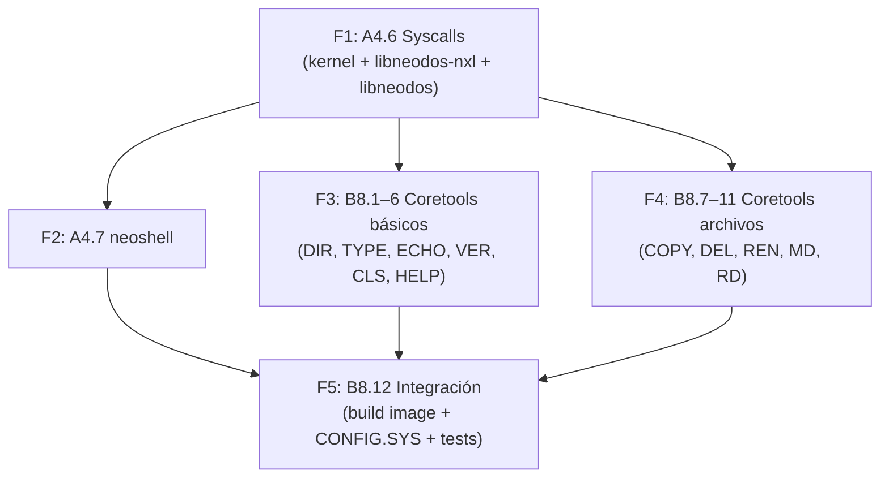

# neoshell — Ring 3 Shell Plan

> **Versión:** 1.0 (esbozo, implementación v0.44.5)
> **Dependencias:** A4.6 (syscalls), libneodos-nxl, libneodos, console.nxl
> **Ver también:** `docs/IMPROVEMENTS.md` items A4.6, A4.7, B8
>
> **Nota de implementación (v0.44.5):** El módulo `lineedit.rs` descrito abajo no fue
> implementado como un archivo separado. En su lugar, la history y TAB completion se
> delegaron a `console.nxl` (NXL slot 2, `0x1e080000`), cargada automáticamente vía
> `sys_loadlib` desde `libneodos::console`. La shell maneja el display (eco, cursor,
> backspace) directamente con `sys_write`, mientras que console.nxl provee la lógica
> reusable (history circular buffer, completion callback registry, read_byte).

---

## 1. Arquitectura General

La shell Ring 0 actual (`DosShell`) existe solo como bootstrap heredado y no debe exponer
comandos interactivos de usuario. **neoshell** es un binario `.NXE` (Rust `#![no_std]`) que
se ejecuta en Ring 3 y accede al sistema solo a través de syscalls (`INT 0x80`).

```
┌──────────────────────────────────────────────┐
│ Ring 0                                       │
│  DosShell (bootstrap only)                   │
│    → RUN C:\BIN\NEOSHELL.NXE (desde CONFIG)  │
│                                              │
│  Kernel (syscalls A4.6)                      │
│    sys_spawn │ sys_readdir │ sys_mkdir       │
│    sys_unlink │ sys_rmdir │ sys_rename       │
│    + sys_open modificado para directorios    │
├──────────────────────────────────────────────┤
│ Ring 3                                       │
│  ┌──────────┐   ┌────────────────┐           │
│  │ neoshell │──→│ coretools .NXE │           │
│  │ (thin)   │   │ DIR, TYPE,     │           │
│  │          │   │ COPY, DEL, etc │           │
│  │ dispatch │←──│ (sys_exit)     │           │
│  │ +lineedit│   └────────────────┘           │
│  └──────────┘                                │
│                                              │
│  libneodos (syscall wrappers via NXL ABI)    │
└──────────────────────────────────────────────┘
```

### 1.1 Principios de diseño

- **neoshell es thin**: no tiene comandos embebidos (excepto CD, CWD, EXIT, CLS, HELP,
  ECHO, SET). Cada comando es un `.NXE` independiente buscado en PATH.
- **coretools son independientes**: cualquier programa Ring 3 puede usarlos (no solo
  neoshell). Siguen el patrón Unix coreutils.
- **Piping natural**: cada coretool lee stdin (fd 0) y escribe stdout (fd 1). neoshell
  conecta procesos con `sys_pipe` + `sys_dup2` + `sys_spawn`.
- **La shell Ring 0 es bootstrap**: arranca, procesa CONFIG.SYS, lanza neoshell via
  `RUN`, y no ofrece comandos de operador. Cuando neoshell hace `EXIT`, el control vuelve
  al flujo de bootstrap, no a una shell interactiva Ring 0.

---

## 2. Syscalls (A4.6)

### 2.1 sys_spawn (RAX=7)

```
RBX = path_ptr      → puntero a ruta null-terminated (ej. "C:\BIN\DIR.NXE")
RCX = stdin_fd      → fd a mapear como stdin del hijo (0xFFFFFFFF = heredar)
RDX = stdout_fd     → fd a mapear como stdout del hijo (0xFFFFFFFF = heredar)
R8  = stderr_fd     → fd a mapear como stderr del hijo (0xFFFFFFFF = heredar)

Return: PID (u32 ≥ 0) o error negativo (< 0)
```

#### Comportamiento del handler

1. Copia path desde espacio usuario (max 256 bytes)
2. Resuelve path absoluto (si contiene `:`) o relativo al CWD del proceso actual
3. Lee el binario via VFS (max 64 KB)
4. Detecta ELF (`\x7fELF`) vs plano
5. `alloc_user_slot()` → slot en `0x400000`–`0x800000`
6. `alloc_heap_slot()` → 2 MB heap en `0x10000000`–`0x12000000`
7. Carga ELF (con `AddressSpace` validation) o copia plana a slot.code_base
8. `scheduler::add_ring3_process()`:
   - Crea EPROCESS (nuevo PID)
   - Crea KTHREAD con kernel stack 16 KB
   - Handle table: si se pasan fds (no 0xFFFFFFFF), duplica esos handles
     como fd 0/1/2. Si no, `HandleTable::with_defaults()` (stdin/stdout/stderr
     del padre, que a su vez son los del sistema).
   - CWD heredado del proceso padre
9. Encola thread a run queue
10. Devuelve PID

#### Uso desde neoshell

```rust
// Ejecución síncrona (esperar resultado)
fn run_sync(path: &str) -> Result<u32, i64> {
    let pid = sys_spawn(path, 0xFFFFFFFF, 0xFFFFFFFF, 0xFFFFFFFF)?;
    sys_waitpid(pid)?;
    Ok(pid)
}

// Pipe: cmd1 | cmd2
fn run_pipe(cmd1: &str, cmd2: &str) -> Result<(), i64> {
    let fds = sys_pipe()?;              // [read_fd, write_fd]
    let pid1 = sys_spawn(cmd1, 0xFFFFFFFF, fds[1], 0xFFFFFFFF)?;
    sys_close(fds[1])?;                 // cerrar write del padre
    let pid2 = sys_spawn(cmd2, fds[0], 0xFFFFFFFF, 0xFFFFFFFF)?;
    sys_close(fds[0])?;                 // cerrar read del padre
    sys_waitpid(pid1)?;
    sys_waitpid(pid2)?;
    Ok(())
}
```

### 2.2 sys_readdir (RAX=8)

```
RBX = fd           → handle de directorio (de sys_open)
RCX = buf_ptr      → buffer para recibir DirEntry

Return: 1 si leyó entrada, 0 si no hay más, negativo en error
```

#### DirEntry struct (retornado al usuario)

```rust
#[repr(C)]
pub struct DirEntry {
    pub inode: u32,
    pub name_len: u8,
    pub entry_type: u8,   // 1=file, 2=dir
    pub name: [u8; 249],  // null-padded
}
```

#### Modificación a sys_open

`handler_open` actualmente devuelve `EISDIR` si la ruta es un directorio.
Se modifica para que, si el path es un directorio, cree un handle
`HANDLE_DIR` (kind=9) en lugar de devolver error. El handle almacena
`(drive_idx, inode)` igual que HANDLE_FILE, pero el offset se usa como
índice de iteración para `readdir`.

```rust
pub const HANDLE_DIR: u8 = 9;
```

### 2.3 sys_mkdir (RAX=25)

```
RBX = path_ptr     → puntero a ruta null-terminated
Return: 0 en éxito, negativo en error
```

Delega en `vfs.mkdir()`: resuelve parent directory + crea entrada.

### 2.4 sys_unlink (RAX=26)

```
RBX = path_ptr     → puntero a ruta null-terminated
Return: 0 en éxito, negativo en error
```

Delega en `vfs.remove_file()`.

### 2.5 sys_rmdir (RAX=27)

```
RBX = path_ptr     → puntero a ruta null-terminated
Return: 0 en éxito, negativo en error
```

Delega en `vfs.remove_dir()`.

### 2.6 sys_rename (RAX=28)

```
RBX = old_path     → puntero a ruta origen
RCX = new_path     → puntero a ruta destino
Return: 0 en éxito, negativo en error
```

Delega en `vfs.rename()`.

---

## 3. neoshell (A4.7)

### 3.1 Estructura del proyecto

```
userbin/neoshell/
├── Cargo.toml                    # dependency: libneodos
├── .cargo/config.toml            # target x86_64-unknown-none, -Tuser.ld
├── user.ld                        # linker script (copiar de hello_lib)
└── src/
    ├── main.rs                    # _start, main loop, dispatch
    ├── lineedit.rs                # readline, history, TAB completion
    ├── builtins.rs                # CD, CWD, CLS, HELP, ECHO, SET, EXIT
    ├── dispatch.rs                # PATH resolution → sys_spawn + sys_waitpid
    └── env.rs                     # Environment variables (PATH, PROMPT)
```

### 3.2 Main loop (`_start` → main loop)

```
_start:
   1. init env: PATH="\\Programs", PROMPT="$P$G"
  2. print banner
  3. loop:
     a. print prompt (env PWD style o $P$G)
     b. readline():
        - sys_read(0, &buf, 1) → char by char
        - handle backspace (0x08): borrar último char
        - handle TAB (0x09): try_complete()
        - handle ↑ (0x01): history back
        - handle ↓ (0x02): history forward
        - handle \n (0x0D): execute line
     c. tokenize line (whitespace split, max 16 args)
     d. if line == "X:" → switch drive (sys_chdir(X:\))
     e. if built-in → execute (dispatch to builtins::exec)
     f. else → search PATH for cmd.NXE:
        for each dir in PATH.split(';'):
          path = format!("{}\\{}.NXE", dir, cmd)
          pid = sys_spawn(path, ...)
          if pid >= 0:
            sys_waitpid(pid)
            break
     g. if not found: print "Bad command or file name"
     h. add to history
```

### 3.3 Line editing (`lineedit.rs`)

```rust
pub struct LineEditor {
    buf: [u8; 256],
    pos: usize,
    history: Vec<String>,        // circular buffer 32
    history_pos: usize,
    utf8_rem: u8,               // remaining UTF-8 continuation bytes
    utf8_cp: u32,               // in-progress codepoint
}
```

- **Backspace**: `\x08` sobre el último char (si no UTF-8 continuation)
- **UTF-8**: multi-byte sequences (2-4 bytes) reconstruidas vía state machine
- **History**: circular 32, los nuevos al final, evict oldest
- **TAB completion**: `try_complete(word)`
  - Primera palabra: scan built-ins + PATH `.NXE` files
  - Argumentos: scan CWD files/dirs via `sys_open` + `sys_readdir`
  - Single match: replace + append space
  - Multiple: print options, redraw prompt + line

### 3.4 Built-ins (`builtins.rs`)

| Comando | Handler | Syscall |
|---------|---------|---------|
| `CD [path]` | `cmd_cd()` | `sys_chdir(path)` |
| `CWD` | `cmd_cwd()` | `sys_getcwd(buf, 256)` |
| `CLS` | `cmd_cls()` | `sys_write(1, "\x1b[2J\x1b[H", 6)` |
| `HELP [cmd]` | `cmd_help()` | Print built-ins + scan PATH for .NXE names |
| `ECHO [text]` | `cmd_echo()` | `sys_write(1, text, len)` |
| `SET [var[=val]]` | `cmd_set()` | In-memory env vars |
| `EXIT [code]` | `cmd_exit()` | `sys_exit(code)` |

### 3.5 Dispatch (`dispatch.rs`)

```rust
pub fn resolve_command(cmd: &str) -> Result<String, ()> {
    let path = env::get("PATH").unwrap_or("\\Programs");
    for dir in path.split(';') {
        let full = format!("{}\\{}.NXE", dir, cmd);
        // Try opening to check existence
        let fd = sys_open(&full);
        if let Ok(fd) = fd {
            sys_close(fd);
            return Ok(full);
        }
    }
    Err(())
}
```

For piping support (future B4.2):

```rust
pub fn execute_pipeline(cmds: &[&str]) -> Result<(), i64> {
    // ... parse, sys_pipe, sys_spawn with fd remapping, sys_waitpid
}
```

### 3.6 Environment (`env.rs`)

```rust
pub struct Environment {
    vars: [(String, String); 32],
    count: usize,
}

impl Environment {
    pub fn init() -> Self {
        let mut env = Self::new();
        env.set("PATH", "\\Programs");
        env.set("PROMPT", "$P$G");
        env.set("SYSTEMDRIVE", "C");
        env
    }

    // $P$G expansion: $P = current dir, $G = ">"
    // "C:\>" if CWD is C:\
    pub fn format_prompt(&self) -> String { ... }
}
```

### 3.7 Build and integration

**Cargo.toml:**
```toml
[package]
name = "neoshell"
version = "0.1.0"
edition = "2021"

[dependencies]
libneodos = { path = "../../libneodos" }

[profile.release]
panic = "abort"
opt-level = 3
lto = true
debug = false
```

**CONFIG.SYS** se modifica para incluir al final:
```
RUN C:\BIN\NEOSHELL.NXE
```

**create_neodos_image.py** se modifica para compilar y copiar:
```
neoshell/target/release/neoshell → C:\BIN\NEOSHELL.NXE
```

---

## 4. Coretools (B8)

### 4.1 Estructura común

Cada coretool es un proyecto Rust minimalista:

```
userbin/coredir/
├── Cargo.toml
├── .cargo/config.toml      # = mismo template
├── user.ld                  # = mismo linker script
└── src/
    └── main.rs              # _start → lógica del comando
```

Template de `main.rs`:
```rust
#![no_std]
#![no_main]

use libneodos::{println, syscall, io};

#[no_mangle]
pub extern "C" fn _start() -> ! {
    // parse args if needed (future: via syscall)
    // do work
    // exit
    syscall::sys_exit(0)
}
```

### 4.2 Lista de coretools

| ID | Binario | Proyecto | Syscalls | Descripción |
|----|---------|----------|----------|-------------|
| B8.1 | `DIR.NXE` | `userbin/coredir/` | `sys_readdir` | Lista directorio, columnas, `/W`, `/P` |
| B8.2 | `TYPE.NXE` | `userbin/coretype/` | `sys_open`+`sys_readfile` | Muestra archivo, buffer 512 B |
| B8.3 | `ECHO.NXE` | `userbin/coreecho/` | `sys_write` | Imprime args a stdout |
| B8.4 | `VER.NXE` | `userbin/corever/` | `sys_write` | Versión del sistema |
| B8.5 | `CLS.NXE` | `userbin/corecls/` | `sys_write` | ANSI clear screen |
| B8.6 | `HELP.NXE` | `userbin/corehelp/` | `sys_readdir` | Lista `C:\BIN\*.NXE` |
| B8.7 | `COPY.NXE` | `userbin/corecopy/` | `sys_open`+`read`+`writefile` | Copia archivos |
| B8.8 | `DEL.NXE` | `userbin/coredel/` | `sys_unlink` | Elimina archivo |
| B8.9 | `REN.NXE` | `userbin/coreren/` | `sys_rename` | Renombra |
| B8.10 | `MD.NXE` | `userbin/coremd/` | `sys_mkdir` | Crea directorio |
| B8.11 | `RD.NXE` | `userbin/corerd/` | `sys_rmdir` | Elimina directorio |

### 4.3 Coretool: DIR.NXE (detalle)

```
C:\> DIR [path] [/W] [/P]

- Sin args: lista CWD
- Path: lista directorio especificado
- /W: wide format (solo nombres, 5 columnas)
- /P: pause cada pantalla (24 líneas)
```

```rust
// Pseudocódigo de DIR.NXE
fn main() {
    let path = args.get(0).unwrap_or(".");
    let wide = args.contains("/W");
    let pause = args.contains("/P");

    let full_path = resolve_absolute_path(path);
    let fd = sys_open(&full_path).expect("Path not found");

    let mut buf = [0u8; 256 + 4];  // DirEntry size
    let mut count = 0;
    let mut lines = 0;
    while sys_readdir(fd, &mut buf) == 1 {
        let entry = DirEntry::from_bytes(&buf);
        if entry.name_len == 0 || entry.name[0] == b'.' { continue; }
        if wide {
            print!("{:<16}", entry.name_str());
        } else {
            let prefix = if entry.entry_type == 2 { "[DIR] " } else { "      " };
            println!("{} {}", prefix, entry.name_str());
        }
        count += 1;
        if pause {
            lines += 1;
            if lines >= 24 {
                print!("Press any key...");
                let _ = sys_read(0, &mut [0u8; 1], 1);
                lines = 0;
            }
        }
    }
    println!("{} file(s)", count);
    sys_close(fd);
}
```

### 4.4 Coretool: TYPE.NXE (detalle)

```
C:\> TYPE <file>
```

Lee el archivo en bloques de 512 bytes y escribe a stdout:

```rust
fn main() {
    let path = args.get(0).expect("Filename required");
    let full_path = resolve_absolute_path(path);
    let fd = sys_open(&full_path).expect("File not found");
    let mut buf = [0u8; 512];
    loop {
        let n = sys_readfile(fd, &mut buf).expect("Read error");
        if n == 0 { break; }
        sys_write(1, &buf[..n]).ok();
    }
    sys_close(fd);
}
```

### 4.5 Build script integration

En `scripts/create_neodos_image.py` se añade:

```python
CORETOOLS = [
    ("coredir", "DIR.NXE"),
    ("coretype", "TYPE.NXE"),
    ("coreecho", "ECHO.NXE"),
    ("corever", "VER.NXE"),
    ("corecls", "CLS.NXE"),
    ("corehelp", "HELP.NXE"),
    ("corecopy", "COPY.NXE"),
    ("coredel", "DEL.NXE"),
    ("coreren", "REN.NXE"),
    ("coremd", "MD.NXE"),
    ("corerd", "RD.NXE"),
]

def build_coretools():
    for dirname, outname in CORETOOLS:
        subprocess.run(["cargo", "build", "--release"],
                      cwd=f"userbin/{dirname}", check=True)
        shutil.copy(f"userbin/{dirname}/target/x86_64-unknown-none/release/{dirname}",
                   f"neofs_root/BIN/{outname}")
```

---

## 5. Plan de implementación por fases

### Fase 1: Kernel syscalls (A4.6)

**Archivos a modificar:**

| Archivo | Cambio |
|---------|--------|
| `neodos-kernel/src/syscall/mod.rs` | Añadir `Spawn=7`, `ReadDir=8`, `MkDir=25`, `Unlink=26`, `RmDir=27`, `Rename=28` a `SyscallNum`. Añadir 6 handlers. |
| `neodos-kernel/src/syscall/table.rs` | Registrar en SSDT |
| `neodos-kernel/src/handle.rs` | Añadir `HANDLE_DIR = 9` |
| `neodos-kernel/src/syscall/mod.rs` (handler_open) | Permitir abrir directorios → `HANDLE_DIR` |
| `neodos-kernel/src/testing.rs` | Registrar nuevos tests |

**Handler detalle:**
- `handler_spawn`: copia path de usuario → resuelve VFS → lee binario → alloc slot → `add_ring3_process` → devuelve PID
- `handler_readdir`: valida fd es `HANDLE_DIR` → llama a `vfs.readdir(drive, inode, offset)` → copia `DirEntry` a usuario → incrementa offset → devuelve 1 o 0
- `handler_mkdir/unlink/rmdir/rename`: copia paths de usuario → delega en VFS

**libneodos-nxl (libneodos-nxl/src/main.rs):**
- Añadir 6 funciones `extern "C"`: `nxl_sys_spawn`, `nxl_sys_readdir`, `nxl_sys_mkdir`, `nxl_sys_unlink`, `nxl_sys_rmdir`, `nxl_sys_rename`
- Cada una llama a `syscall_n()` con `INT 0x80`
- Extender `AbiTable` con los 6 function pointers

**libneodos (libneodos/src/syscall.rs):**
```rust
pub fn sys_spawn(path: &str, stdin_fd: u32, stdout_fd: u32, stderr_fd: u32) -> Result<u32, i64>
pub fn sys_readdir(fd: u8, buf: &mut [u8]) -> Result<usize, i64>
pub fn sys_mkdir(path: &str) -> Result<(), i64>
pub fn sys_unlink(path: &str) -> Result<(), i64>
pub fn sys_rmdir(path: &str) -> Result<(), i64>
pub fn sys_rename(old_path: &str, new_path: &str) -> Result<(), i64>
```

**libneodos (libneodos/src/export.rs):** Actualizar `AbiTable` mirror.

**Tests kernel (6):**
| Test | Descripción |
|------|-------------|
| `spawn_hello_binary` | sys_spawn("C:\BIN\HELLO.NXE", -1, -1, -1) → PID ok |
| `spawn_with_fd_redirection` | sys_spawn con pipe fds redirigidos |
| `readdir_list_root` | sys_open("C:\") → sys_readdir → entradas |
| `mkdir_rmdir_roundtrip` | sys_mkdir + sys_rmdir |
| `unlink_file` | sys_unlink file existente |
| `rename_file` | sys_rename old→new |

### Fase 2: neoshell (A4.7)

Ver sección 3 para detalle completo.

1. Scaffold: `userbin/neoshell/` con Cargo.toml, config, user.ld
2. `env.rs`: Environment struct con init, get, set, format_prompt
3. `lineedit.rs`: LineEditor con backspace, UTF-8, history, TAB
4. `builtins.rs`: CD, CWD, CLS, HELP, ECHO, SET, EXIT
5. `dispatch.rs`: PATH resolution + sys_spawn + sys_waitpid
6. `main.rs`: main loop que integra todo
7. Build: compilar con `cargo build --release`

### Fase 3: Coretools (B8.1–B8.6)

Primer lote (no requieren gestión de archivos):
- `DIR.NXE`: `sys_open` + `sys_readdir`
- `TYPE.NXE`: `sys_open` + `sys_readfile`
- `ECHO.NXE`: `sys_write`
- `VER.NXE`: `sys_write`
- `CLS.NXE`: `sys_write`
- `HELP.NXE`: `sys_readdir`

### Fase 4: Coretools archivos (B8.7–B8.11)

Segundo lote (operaciones de archivos):
- `COPY.NXE`: `ob_query_info(ReadContent)` + `ob_set_info(WriteContent)`
- `DEL.NXE`: `ob_destroy`
- `REN.NXE`: `ob_set_info(VfsRename)`
- `MD.NXE`: `ob_create(Directory)`
- `RD.NXE`: `ob_destroy`

### Fase 5: Integración (B8.12)

- Modificar `scripts/create_neodos_image.py` para compilar y copiar todos los .NXE
- Añadir `RUN C:\BIN\NEOSHELL.NXE` a CONFIG.SYS
- Tests en `auto_test.py`
- Limpiar y regenerar imagen:
  ```bash
  bash scripts/build.sh --neodos-image
  python3 scripts/auto_test.py
  ```

---

## 6. Mapa de archivos completo

```
neodos-kernel/src/
├── syscall/mod.rs           # 6 nuevos handlers + SyscallNum entries
├── syscall/table.rs         # SSDT registros
├── handle.rs                # HANDLE_DIR = 9
├── testing.rs               # 6 nuevos tests registrados

libneodos-nxl/src/
└── main.rs                  # 6 extern "C" wrappers + AbiTable

libneodos/src/
├── syscall.rs               # 6 safe Rust wrappers
├── export.rs                # AbiTable mirror
└── fs.rs                    # (opcional) DirEntry struct + dir helpers

userbin/
├── neoshell/
│   ├── Cargo.toml
│   ├── .cargo/config.toml
│   ├── user.ld
│   └── src/
│       ├── main.rs
│       ├── lineedit.rs
│       ├── builtins.rs
│       ├── dispatch.rs
│       └── env.rs
├── coredir/src/main.rs
├── coretype/src/main.rs
├── coreecho/src/main.rs
├── corever/src/main.rs
├── corecls/src/main.rs
├── corehelp/src/main.rs
├── corecopy/src/main.rs
├── coredel/src/main.rs
├── coreren/src/main.rs
├── coremd/src/main.rs
└── corerd/src/main.rs

scripts/
└── create_neodos_image.py   # build & copy neoshell + coretools

docs/
├── IMPROVEMENTS.md          # A4.6, A4.7, B8
└── NEOSHELL_PLAN.md         # este archivo
```

---

## 7. Dependencias entre fases


